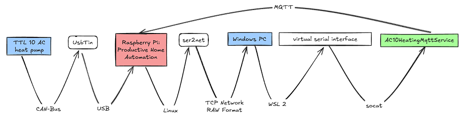
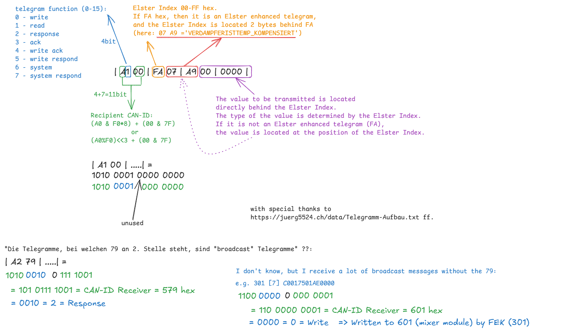

# Tecalor/Stiebel Eltron Heatpump Bridge
=============================================

## Beschreibung
---------------

Dieser Code implementiert eine Schnittstelle zu einer Tecalor/Stiebel Eltron Wärmepumpe über den CAN-Bus. Folgende Schnittstellen werden unterstützt:

* USBtin (Version HW10, SW00 - siehe Fischl.de) mit dem Protokoll von LAWICEL CANUSB
* Tecalor TTL 10 AC (Stibel Eltron WPL 10 AC) mit FEK und WPM3

Die Kommunikation mit der Wärmepumpe erfolgt über den CAN-Bus, sowohl lesend als auch schreibend. Die Ergebnisse werden im Speicher des HeatingMqttService gehalten und sofort an einen MQTT-Message-Broker weitergeleitet. Das Wording lehnt sich dabei stark an die FHEM-Wärmepumpen-Implementierung an (siehe auch unten). Durch die MQTT-Anbindung sind auch Integrationen in andere Hausautomatisierungssysteme möglich. Der HeatingMqttService ist ein .NET 8 Linux systemd Service und kann später neben FHEM betrieben werden.

### Testaufbau und Entwicklung
Um im Echtbetrieb zu entwickeln, ohne mein FHEM-System zu beschädigen, habe ich die CAN-Bus-Daten an meinen PC weitergeleitet.



Dieses Projekt wurde in Zusammenarbeit mit einer Künstlichen Intelligenz entwickelt, um die Vorteile des Extreme Programming in Kombination mit KI-Tools wie Codeium und Copilot zu erproben. Die KI-Tools werden genutzt, um Git, GitHub, VS Code sowie Übersetzungen zwischen Programmiersprachen und die Korrektur von Englisch nach Deutsch (und umgekehrt) zu unterstützen. Eine ausgezeichnete Möglichkeit, moderne Technologien zu integrieren.


## Quellen
----------

Dieses Programm basiert auf den Arbeiten von:

* Jürg <http://juerg5524.ch/>
* Immi (THZ-Modul)
* Radiator
* Robots <https://github.com/robots/Elster/>


## Telegrammaufbau
----------



## Warnung
----------
Die Verwendung des Codes erfolgt auf eigene Gefahr. Es wird keine Gewährleistung für die Richtigkeit oder Vollständigkeit der Software übernommen. Der Autor haftet nicht für Schäden, die durch die Verwendung dieser Software entstehen, insbesondere nicht für Schäden an der Wärmepumpe. Also aufpassen, der nächste Winter wird kommen.

Use of this code is at your own risk. No warranty is given for the correctness or completeness of the software. The author is not liable for any damages that may arise from the use of this software, particularly not for damages to the heat pump. So be careful, winter is coming.

## Installation
-------------
.net 8.0 installieren 
```
wget https://dot.net/v1/dotnet-install.sh -O dotnet-install.sh
chmod +x ./dotnet-install.sh
./dotnet-install.sh --version latest --runtime aspnetcore

echo 'export DOTNET_ROOT=$HOME/.dotnet' >> ~/.bashrc
echo 'export PATH=$PATH:$DOTNET_ROOT:$DOTNET_ROOT/tools' >> ~/.bashrc
```

Die Konfiguration befindet sich normalerweise in der `appsettings.json` Datei. Konfigurationen können auch über den Befehl `dotnet run --HeatingAdapterConfig:PortName="/dev/ttyACM0"` gesetzt werden. Das Programm basiert auf Microsoft .NET Core 8, was eine Voraussetzung ist.

Die Datei [HeatingDaemon/HeatingDaemon.service](HeatingDaemon/HeatingDaemon.service) muss in das Verzeichnis `/etc/systemd/system/` abgelegt werden.

Mit den Befehlen:

	sudo systemctl daemon-reload
	sudo systemctl enable HeatingDaemon.service
	sudo systemctl start HeatingDaemon.service

kann der Service aktiviert und gestartet werden. Log-Daten können mit dem Befehl:

	sudo journalctl -u HeatingDaemon

angeschaut werden.


## Konfiguration
In der `appsettings.json` Datei kann eine passive Abfrage beispielsweise konfiguriert werden, die ausgelöst wird, wenn der Boiler ein Telegramm an die FES_COMFORT sendet:
```
"HeatingMqttServiceConfig": {
    "CyclicReadingsQuery": [
      {
        {
        "ReadingName": "T_Aussentemperatur",
        "SenderCanID": "Boiler",
        "ReceiverCanID": "FES_COMFORT",
        "Function": "GetElsterValue",
        "ScheduleType": "Passive",
        "IntervalInSeconds": 0,
        "SendCondition": "OnValueChange",
        "ElsterIndex": "AUSSENTEMP"
        },
  ...
```

| Key |Beschreibung   |
|---|---|
|ReadingName |Text, der als Name des Readings verwendet wird, z.B. in FHEM oder im MQTT-Topic|
|ReceiverCanID |CAN-ID des Empfaengermoduls, an die das Telegram gesendet wird. Kann eine Hex-Zahl oder ein vordefinierter Modul-Bezeichner sein|
|Function|Nur GetElsterValue, um den Elster-Wert abzufragen und zu erhalten|
|ScheduleType|Angabe, wann das Telegram ausgewertet werden soll. Siehe Tabelle ScheduleType|


|Vordefinierte Module-Bezeichner| Hex-Wert|Beschreibung
|---|---|----|
|Direct|0x000|Direkte Steuerung, wenn z.B ein FEK installiert ist. Kaum abfragen möglich, aber z.b. die Fehlerliste|
|FES_COMFORT|0x100|FES-Comfort-Modul, auch TCR-Comfort genannt. Hier ist das Display vom WPM |
|Boiler|0x180|Boiler-Modul|
|AtezModule|0x280|Vermutlich Solar-Heizmodul für Warmwasser|
|RemoteControl|0x301|Heizungs-Fernversteller oder Fernbedienung (FEK bei Stiebel Eltron, FET bei Tecalor) - Heizkreis 1|
|RemoteControl|0x302|Heizungs-Fernversteller oder Fernbedienung (FEK bei Stiebel Eltron, FET bei Tecalor) - Heizkreis 2|
|RemoteControl_Broadcast|0x379|Telegram mit Informationen für alle Fernbedienungen bzw. für alle Heizkreise|
|RoomThermostat|0x400|Raumtermostat. Ich vermute den Heizungs-Fernversteller FE7|
|Manager|0x480|Der Manager|
|HeatingModule|0x500|Heizungskontroll-Modul|
|BusCoupler|0x580|Vermutlich das Internet-Service-Gateway (ISG)|
|Mixer|0x601|Mischer für HK1|
|Mixer|0x601|Mischer für HK2|
|Mixer|0x601|Mischer für HK3|
|Mixer_Broadcast|0x679|Telegram mit Informationen für alle Mischer bzw. für alle Heizkreise|
|ComfortSoft|0x680|Anschluss über ein PC mit der Software ComfortSoft PC (ComfortSoft). Warnung: Nicht mit WPM3 nutzen|
|ExternalDevice|0x700|Externes Modul. Wird für diese als Standard für diese Software verwendet|
|Dcf|0x780|DCF-Modul, falls vorhanden um Winter und Sommerzeit Funktion zu realisieren|

|ScheduleType|Bescheibung|
|---|---|
|AtStartup|Die Leseabfrage wird beim Start der Anwendung einamlig ausgeführt|
|Periodic|Die Leseabfrage wird periodisch ausgeführt. Ein Intervall in Sekunden ist erforderlich|
|Passive|Die Leseabfrage wird nicht ausgeführt, sondern nur Telegramme, die durch anderer Busteilnehmen erzeugt wurden, werden verarbeitet|

## Vorschläge und offene Aufgaben
----------------

- [x] Implementierung des Lesens von Nachrichten auf dem Bus, die passiv gesendet werden
- [x] Implementieren von Schreiben auf den Bus und Abfragen von bestimmten Elster-Werten
- [x] ElsterValue aus einem ElsterCanFrame als Eigenschalft zur Verfügung stellen
- [x] Zeitstempel beim Protokollieren
- [x] Implementieren eines Bus-Scans pro Module / aller Module
- [x] Implementieren von einer Konfigurationsmöglichkeit, die Readingname, SenderCanID, Funktion oder ElsterValue und Abfragezyklus übernimmt. 
- [x] Implementation dieser zyklischen Abfragefunktion. Funktionen sind ggf. ausgewertete ElsterValue-Werte in Text. Ohne zyklische Abfragen werden passive Telegramme ausgewertet, also die, die so oder so gesendet werden.
- [x] Implementieren der Konfigurationen für MQTT-Ausleitung und zyklisches Abfragen von bestimmten Werten
- [x] Deployment auf FHEM 
- [ ] Framework-Dependent Deployment (FDD):dotnet publish -c Release -r linux-arm --self-contained false /p:PublishSingleFile=true /p:DebugType=none
- [ ] Implementieren der Sammelfehler- und Fehlerlisten-Funktion
- [ ] Fehlermeldung an ComfortSoft sollten ausgewerten werden: RemoteControl ->Write ComfortSoft FEHLERMELDUNG = 20805
- [ ] Zu prüfen: Werden drei CR gesendet nach dem öffnen um den internen USBtin-Puffer zu leeren
- [ ] Zu prüfen: Werden alle 300 - 500 ms F gesendet um auf Fehler zu prüfen--> Sollte unabhängig vom Bell-Error ermittelt werden.
- [ ] WP_DHC_Stufe implementieren (Relais)
- [ ] Implementieren der FEK-Funktionen: Setzen der Heizkurve, Raumeinfluss und Heizkuvenfußpunkt(vermutlich unmöglich)
- [ ] Implementieren der WPM-Funktionen: Auslesen der Temperaturen, Umschaltung auf Sommerbetrieb
- [ ] Implementieren der Warmwassersteuerung: Temperaturfestlegung für Extra Warmwasser (WE), Zeitpunktfestlegung (Wenn wärmster Zeitpunkt und angeschlossen an Heizungsvorgang)

## Untersuchungen 22.12.24 - Setzen der Heizkurve auf 0.2 von der FEK
Eine Anpassung an der FEK (RemoteControl) für HK1 zeigt keinerlei Kommunikation auf dem Bus. Dies legt die Vermutung nahe, dass die FEK die vollständige Steuerung des HK1 übernimmt. Konkret wurde die Heizkurve auf 0.2 festgelegt. Da entweder der WPM die Steuerung des HKs übernimmt und nach der Installation der FEK alle Einstellungen bezüglich der Heizkurve aus diesem verschwunden sind, verwaltet und steuert nun wahrscheinlich die FEK alle Parameter und sendet nur die Ergebnisse an die anderen Module. Es ist fraglich, ob es überhaupt möglich ist, die Werte der FEK bezüglich der Heizkurve auszulesen oder diese extern zu schreiben. Letzteres wäre nur möglich, wenn mehrere FEKs erlaubt sind. 

Schlussfolgerung: Zunächst muss das Abfragen und Beschreiben des Busses umgesetzt und ein Scan auf die FEK durchgeführt werden.
[20241222_Heizkurve.log](audits/20241222_Heizkurve.log)


## Untersuchungen 30.12.24 - Neustart der Steuerung (stromlos)
Eigentlich sollte die Heizung auf der FEK in den Ferienbetrieb wechseln, tut sie aber nicht. Test, ob sie nach Neustart tut. Dabei wurde der Neustart aufgezeichnet.

Ergebnis: Die Heizung wechselt nicht in den Ferienbetrieb. Das Koffersymbol fehlt in der Anzeige der FEK. Es ist nicht ausgeschlossen, dass es sich um einen Bug der Tecalor TTL 10 AC handelt. Auch in den Ferientagen hat sich der Ferienbetrieb nicht eingeschaltet. Es könnte auch sein, dass die FEK die Einstellungen am WPM ignoriert, da sie die Steuerung der Heizung übernimmt.
[20241230_NeustartWPM.log](audits/20241230_NeustartWPM.log)

## Untersuchung 05.01.25 - Scan der gültigen CAN-IDs

In meiner Anlage gibt es ein Modul mit der CanId = 0x100. Dieses Modul konnte ich bisher in keiner
Implementierung im Internet finden. Laut dem Display meiner Wärmepumpe handelt es sich um ein FES.
Auf der Homepage von Stiebel Eltron wird ein FES Komfort als Zubehör angeboten, was darauf hindeutet,
dass es sich um mein neues Bedienteil mit Touchwheel handelt.

Warum musste ich das FEK für die Kühlung installieren, und warum wurde das FES im Keller montiert
und nicht in der Wohnung, obwohl das FES auch die Feuchtemessung durchführen kann?

So werden die Busteilnehmer laut WPM3-Display dargestellt:
| # |Busteilnehmer   |Software   |
|---|---|---|
|01.   |WPM3   |390-02   |
|02.   |FES   |392-03   |
|03.   |FEK   |195-06   |
|04.   |WP1   |243-10   |   


```
      scan on CAN-id: 700
      list of valid can id's:
      
        000 (C306 = 195-06)
        100 (8000 = 128-00)
        180 (8000 = 128-00)
        301 (C306 = 195-06)
        302 (8000 = 128-00)
        480 (8000 = 128-00)
        500 (4310 = 67-16)
        601 (8000 = 128-00)
        602 (8000 = 128-00)
        680 (8000 = 128-00)
```

## Untersuchung 17.01.25 - PROGRAMMSCHALTER/Betriebsart zwischen FEK und FES
Bei der Übergabe von der Betriebsart zwischen FEK und FES gibt es ein Problem: Wenn an der FEK eine Betriebsart ausgewählt wird, 
wird dies nicht an die FES oder an andere Busteilnehmer weitergegeben. Dazu eine Beobachtung:
- An der FEK wird eine Betriebsart ausgewählt, aber kein Telegram wird an die FES oder an einen andere Busteilnehmer gesendet.
- An der FES wird eine Betriebsart ausgewählt, dann wird das Telegram von der FES an die anderen Busteilnehmer gesendet, aber nicht an das FEK.
Es ist also möglich, dass am FEK und FES unterschiedliche Betriebsarteinstellungen vorliegen, was definitiv nicht so sein sollte.

Es ist jedoch festzustellen, dass die Heizung tatsächlich das Programm von der FEK verwendet.
