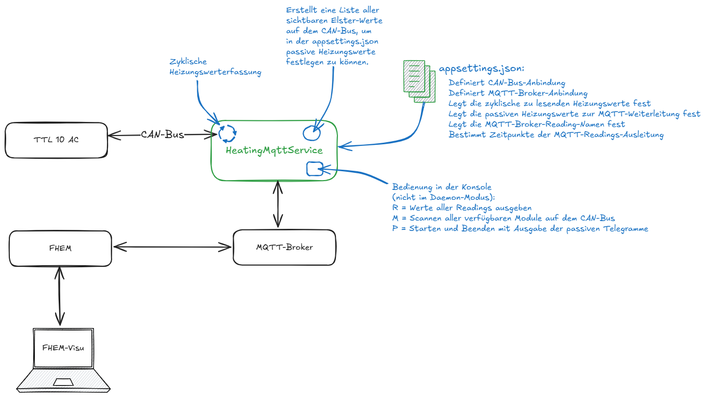

# Tecalor/Stiebel Eltron Heatpump Bridge
---------------
## Beschreibung
Dieser Code implementiert eine Schnittstelle zu einer Tecalor/Stiebel Eltron Wärmepumpe über den CAN-Bus. Folgende Schnittstellen werden unterstützt:

* USBtin (Version HW10, SW00 - siehe Fischl.de) mit dem Protokoll von LAWICEL CANUSB
* Tecalor TTL 10 AC (Stibel Eltron WPL 10 AC) mit FEK und WPM3

Die Kommunikation mit der Wärmepumpe erfolgt über den CAN-Bus, sowohl lesend als auch schreibend. Die Ergebnisse werden im Speicher des HeatingMqttService gehalten und sofort an einen MQTT-Message-Broker weitergeleitet. Das Wording lehnt sich dabei stark an die FHEM-Wärmepumpen-Implementierung an (siehe auch unten). Durch die MQTT-Anbindung sind auch Integrationen in andere Hausautomatisierungssysteme möglich. Der HeatingMqttService ist ein .NET 8 Linux systemd Service und kann später neben FHEM betrieben werden.



## FHEM
[Installation und Visualisierung in FHEM](doc/fhem.md)

### Quellen
Dieses Programm basiert auf den Arbeiten von:
* Jürg <http://juerg5524.ch/>
* Immi (THZ-Modul)
* Radiator
* Robots <https://github.com/robots/Elster/>
  
## Warnung
Die Verwendung des Codes erfolgt auf eigene Gefahr. Es wird keine Gewährleistung für die Richtigkeit oder Vollständigkeit der Software übernommen. Der Autor haftet nicht für Schäden, die durch die Verwendung dieser Software entstehen, insbesondere nicht für Schäden an der Wärmepumpe. Also aufpassen, der nächste Winter wird kommen.

Use of this code is at your own risk. No warranty is given for the correctness or completeness of the software. The author is not liable for any damages that may arise from the use of this software, particularly not for damages to the heat pump. So be careful, winter is coming.

# Testaufbau und Entwicklung
---------------
Um im Echtbetrieb zu entwickeln, ohne mein FHEM-System zu beschädigen, habe ich die CAN-Bus-Daten an meinen PC weitergeleitet.


Dieses Projekt wurde in Zusammenarbeit mit einer Künstlichen Intelligenz entwickelt, um die Vorteile des Extreme Programming in Kombination mit KI-Tools wie Codeium und Copilot zu erproben. Die KI-Tools werden genutzt, um Git, GitHub, VS Code sowie Übersetzungen zwischen Programmiersprachen und die Korrektur von Englisch nach Deutsch (und umgekehrt) zu unterstützen. Eine ausgezeichnete Möglichkeit, moderne Technologien zu integrieren.

## Vorschläge und offene Aufgaben

- [x] Implementierung des Lesens von Nachrichten auf dem Bus, die passiv gesendet werden
- [x] Implementieren von Schreiben auf den Bus und Abfragen von bestimmten Elster-Werten
- [x] ElsterValue aus einem ElsterCanFrame als Eigenschalft zur Verfügung stellen
- [x] Zeitstempel beim Protokollieren
- [x] Implementieren eines Bus-Scans pro Module / aller Module
- [x] Implementieren von einer Konfigurationsmöglichkeit, die Readingname, SenderCanID, Funktion oder ElsterValue und Abfragezyklus übernimmt. 
- [x] Implementation dieser zyklischen Abfragefunktion. Funktionen sind ggf. ausgewertete ElsterValue-Werte in Text. Ohne zyklische Abfragen werden passive Telegramme ausgewertet, also die, die so oder so gesendet werden.
- [x] Implementieren der Konfigurationen für MQTT-Ausleitung und zyklisches Abfragen von bestimmten Werten
- [x] Deployment auf FHEM 
- [x] Sammeln aller passiven Werte auf dem Bus
- [x] Framework-Dependent Deployment (FDD):dotnet publish -c Release -r linux-arm --self-contained false /p:PublishSingleFile=true /p:DebugType=none
- [x] module_scan als Parameter implementieren und in readme dokumentieren
- [x] Passive Telegramme per Parameter für einen bestimmten Zeitraum starten und in readme dokumentieren
- [x] Can_Scan Module auf gültige Elster-Werte
- [ ] Implementieren der Sammelfehler- und Fehlerlisten-Funktion
- [ ] Fehlermeldung an ComfortSoft sollten ausgewerten werden: RemoteControl ->Write ComfortSoft FEHLERMELDUNG = 20805
- [ ] Zu prüfen: Werden drei CR gesendet nach dem öffnen um den internen USBtin-Puffer zu leeren
- [ ] Zu prüfen: Werden alle 300 - 500 ms F gesendet um auf Fehler zu prüfen--> Sollte unabhängig vom Bell-Error ermittelt werden.
- [ ] WP_DHC_Stufe implementieren (Relais)
- [ ] Implementieren der FEK-Funktionen: Setzen der Heizkurve, Raumeinfluss und Heizkuvenfußpunkt(vermutlich unmöglich)
- [ ] Implementieren der WPM-Funktionen: Auslesen der Temperaturen, Umschaltung auf Sommerbetrieb
- [ ] Implementieren der Warmwassersteuerung: Temperaturfestlegung für Extra Warmwasser (WE), Zeitpunktfestlegung (Wenn wärmster Zeitpunkt und angeschlossen an Heizungsvorgang)

## Telegrammaufbau


## Installation
.net 8.0 installieren 
```
wget https://dot.net/v1/dotnet-install.sh -O dotnet-install.sh
chmod +x ./dotnet-install.sh
./dotnet-install.sh --version latest --runtime aspnetcore

echo 'export DOTNET_ROOT=$HOME/.dotnet' >> ~/.bashrc
echo 'export PATH=$PATH:$DOTNET_ROOT:$DOTNET_ROOT/tools' >> ~/.bashrc
```

Die Konfiguration befindet sich normalerweise in der `appsettings.json` Datei. Konfigurationen können auch über den Befehl `dotnet run --HeatingAdapterConfig:PortName="/dev/ttyACM0"` gesetzt werden. Das Programm basiert auf Microsoft .NET Core 8, was eine Voraussetzung ist.

Die Datei [HeatingDaemon/HeatingDaemon.service](HeatingDaemon/HeatingDaemon.service) muss in das Verzeichnis `/etc/systemd/system/` abgelegt werden.

Mit den Befehlen:

	sudo systemctl daemon-reload
	sudo systemctl enable HeatingDaemon.service
	sudo systemctl start HeatingDaemon.service

kann der Service aktiviert und gestartet werden. Log-Daten können mit dem Befehl:

	sudo journalctl -u HeatingDaemon

angeschaut werden.

Für die spätere Konfiguration sind die folgenden Parameter des HeatingDaemon sehr nützlich. Dabei wird nicht der Daemon gestartet, sondern das Programm HeatingMqttService direkt. Dieses beendet sich auch, nachdem die Parameter verarbeitet wurden. Die Konfiguration aus der appsettings.json ist auch bei den Parametern wirksam, z.B. die Konfiguration für den standard sender can id.


Der Parameter `modules_scan` dient zum Scannen der verfügbaren Module der Heizungsanlage:
```
HeatingMqttService --modules_scan=[SenderCanID]

   SenderCanID: optional, default is standard CanId from appsettings.json. Hex-Value or module name (e.g. 700 or ExternalDevice

Example: HeatingMqttService --modules_scan=default         (scan all modules with default sender can id)
OR       HeatingMqttService --modules_scan=700             (use 700 as sender can id to scan all modules)
OR       HeatingMqttService --modules_scan=ExternalDevice  (use 700 as sender can id to scan all modules)
```
<details><summary>Ausgabe von modules_scan</summary>

```
info: HeatingDaemon.HeatingAdapter[0] scan on CAN-id: 700
info: HeatingDaemon.HeatingAdapter[0] list of valid can id's:
info: HeatingDaemon.HeatingAdapter[0]
info: HeatingDaemon.HeatingAdapter[0]
info: HeatingDaemon.HeatingAdapter[0]   000 (C306 = 195-06)
info: HeatingDaemon.HeatingAdapter[0]   100 (8000 = 392-03)
info: HeatingDaemon.HeatingAdapter[0]   180 (8000 = 128-00)
info: HeatingDaemon.HeatingAdapter[0]   301 (C306 = 195-06)
info: HeatingDaemon.HeatingAdapter[0]   302 (8000 = 128-00)
info: HeatingDaemon.HeatingAdapter[0]   480 (8000 = 128-00)
info: HeatingDaemon.HeatingAdapter[0]   500 (4310 = 67-16)
info: HeatingDaemon.HeatingAdapter[0]   601 (8000 = 128-00)
info: HeatingDaemon.HeatingAdapter[0]   602 (8000 = 128-00)
info: HeatingDaemon.HeatingAdapter[0]   680 (8000 = 128-00)
info: HeatingDaemon.HeatingAdapter[0]
info: HeatingDaemon.HeatingAdapter[0] Scanning for Elster modules finished
info: HeatingDaemon.HeatingAdapter[0] Found Elster module:          Direct (000) = Device-ID:   C306 | SW-Nr: N/A    | SW-Ver: N/A
info: HeatingDaemon.HeatingAdapter[0] Found Elster module:     FES_COMFORT (100) = Device-ID:   8000 | SW-Nr: 392    | SW-Ver: 3
info: HeatingDaemon.HeatingAdapter[0] Found Elster module:          Boiler (180) = Device-ID:   8000 | SW-Nr: N/A    | SW-Ver: N/A
info: HeatingDaemon.HeatingAdapter[0] Found Elster module:   RemoteControl (301) = Device-ID:   C306 | SW-Nr: N/A    | SW-Ver: N/A
info: HeatingDaemon.HeatingAdapter[0] Found Elster module:  RemoteControl2 (302) = Device-ID:   8000 | SW-Nr: N/A    | SW-Ver: N/A
info: HeatingDaemon.HeatingAdapter[0] Found Elster module:         Manager (480) = Device-ID:   8000 | SW-Nr: N/A    | SW-Ver: N/A
info: HeatingDaemon.HeatingAdapter[0] Found Elster module:   HeatingModule (500) = Device-ID:   4310 | SW-Nr: N/A    | SW-Ver: N/A
info: HeatingDaemon.HeatingAdapter[0] Found Elster module:           Mixer (601) = Device-ID:   8000 | SW-Nr: N/A    | SW-Ver: N/A
info: HeatingDaemon.HeatingAdapter[0] Found Elster module:          Mixer2 (602) = Device-ID:   8000 | SW-Nr: N/A    | SW-Ver: N/A
info: HeatingDaemon.HeatingAdapter[0] Found Elster module:     ComfortSoft (680) = Device-ID:   8000 | SW-Nr: N/A    | SW-Ver: N/A
```
</details>


Mit dem Parameter `msg_scan` können alle passiven CAN-Telegramme, also Telegramme die permanent zwischen den einzelnen Modulen der Heizungsanlage gesendet werden,
gesammelt und am Ende mit ihrer Häufigkeit protokolliert werden. Diese Telegramme können auch über den MQTT-Broker ausgeleitet werden, ohne den CAN-Bus mit
weiteren Anfragen zu belasten. Stattdessen können diese Telegramme mit dem ScheduleType `Passive` in der appsettings.json angegeben werden. Um alle passiven Telegramme zu erfassen,
muss eine bestimmte Zeit lang gesammelt werden, standardmäßig 10 Stunden, was aber auch per Parameter geändert werden kann.

```
Syntax:
HeatingMqttService --msg_scan=[timespan]

   timespan: optional, collection time span in ISO 8601 format (e.g. PT10h)

Example: HeatingMqttService --msg_scan=PT10h        (collect all telegrams with an elster value for 10 hours)
OR       HeatingMqttService --msg_scan=             (collect all telegrams with an elster value for 10 hours)

```
<details><summary>Ausgabe von msg_scan</summary>

```
info: HeatingDaemon.HeatingAdapter[0] Passive Elster Telegrams:
info: HeatingDaemon.HeatingAdapter[0]   30x  RemoteControl ->Write on ComfortSoft FEHLERMELDUNG 20805 (0x5145)
info: HeatingDaemon.HeatingAdapter[0]   25x  RemoteControl ->Respond on ExternalDevice RAUMSOLLTEMP_I 19.9
info: HeatingDaemon.HeatingAdapter[0]   24x  RemoteControl ->Respond on ExternalDevice RAUMSOLLTEMP_NACHT 18.0
info: HeatingDaemon.HeatingAdapter[0]   6x  Boiler ->Write on HeatingModule_Broadcast AUSSENTEMP 4.2
info: HeatingDaemon.HeatingAdapter[0]   6x  Boiler ->Write on HeatingModule_Broadcast HILFSKESSELSOLL 23.7
info: HeatingDaemon.HeatingAdapter[0]   3x  HeatingModule ->Respond on Manager SOFTWARE_NUMMER 67 (0x0043)
info: HeatingDaemon.HeatingAdapter[0]   3x  HeatingModule ->Respond on Manager WPVORLAUFIST 24.4
info: HeatingDaemon.HeatingAdapter[0]   3x  Manager ->Write on HeatingModule HEIZSYSTEMTEMP_GEWICHTET 220 (0x00DC)
info: HeatingDaemon.HeatingAdapter[0]   3x  HeatingModule ->Respond on Manager RUECKLAUFISTTEMP 19.0
info: HeatingDaemon.HeatingAdapter[0]   3x  Manager ->Write on HeatingModule INTEGRAL_REGELABWEICHUNG_RELATIV 0 (0x0000)
info: HeatingDaemon.HeatingAdapter[0]   3x  HeatingModule ->Respond on Manager VERDICHTER 0.8
info: HeatingDaemon.HeatingAdapter[0]   3x  Boiler ->Respond on FES_COMFORT RUECKLAUFISTTEMP 22.0
info: HeatingDaemon.HeatingAdapter[0]   3x  Manager ->Write on HeatingModule SPEICHERBEDARF 0 (0x0000)
info: HeatingDaemon.HeatingAdapter[0]   2x  RemoteControl ->Respond on ExternalDevice PROGRAMMSCHALTER Tagbetrieb
info: HeatingDaemon.HeatingAdapter[0]   2x  FES_COMFORT ->Respond on ExternalDevice PROGRAMMSCHALTER Absenkbetrieb
info: HeatingDaemon.HeatingAdapter[0]   2x  Boiler ->Respond on FES_COMFORT AUSSENTEMP 4.2
info: HeatingDaemon.HeatingAdapter[0]   2x  Boiler ->Respond on FES_COMFORT SPEICHERISTTEMP 46.8
info: HeatingDaemon.HeatingAdapter[0]   1x  RemoteControl ->Respond on ExternalDevice SOFTWARE_NUMMER 195 (0x00C3)
info: HeatingDaemon.HeatingAdapter[0]   1x  RemoteControl ->Respond on ExternalDevice SOFTWARE_VERSION 6 (0x0006)
info: HeatingDaemon.HeatingAdapter[0]   1x  RemoteControl ->Write on Mixer FEUCHTE 40.8
info: HeatingDaemon.HeatingAdapter[0]   1x  RemoteControl ->Write on Mixer RAUMISTTEMP 20.0
info: HeatingDaemon.HeatingAdapter[0]   1x  Boiler ->Respond on RemoteControl GERAETE_ID 128-00
info: HeatingDaemon.HeatingAdapter[0]   1x  Boiler ->Write on RemoteControl_Broadcast MAX_HYSTERESE 0
```
</details>


Mit dem Parameter `can_scan` können die einzelnen Module (oder bestimmte Werte) der Heizungsanlage abgefragt werden, 
um zu ermitteln auf welche Elster-Index-Werte diese reagiert.
Für einen kompletten scan von einem Modul ist eine Umleitung in eine Datei zweckmäßig, z.B. `HeatingMqttService --can_scan RemoteControl > RemoteControl.log`
Ein Scan für ein Modul dauert etwa 4 Minuten. Im schlimmsten Fall, wenn keine Antworten von einem Modul kommen und drei mal probiert wird pro Wert, kann es bis zu 2 Stunden dauern.

```
HeatingMqttService --can_scan=[SenderCanID] ReceiverCanID[.ElsterIndex[.NewElsterValue]]

   SenderCanID: optional, default is standard CanId from appsettings.json. Hex-Value or module name (e.g. 700 or ExternalDevice)
   ReceiverCanID: mandatory, hex-Value or module name (e.g. 301 or RemoteControl)
   ElsterIndex: optional to read or write a single value. Hex-Value or elster index name (e.g. 000b or GERAETE_ID)
   NewElsterValue: optional to write a single value. Hex-Value (e.g. 0f00)

Example: HeatingMqttService --can_scan=180               (scan all elster indices from 0000 to 1fff)
OR       HeatingMqttService --can_scan=700 180           (use 700 as sender can id to scan all elster indices
OR       HeatingMqttService --can_scan=700 180.0126      (read minutes at elster index 0126)
OR       HeatingMqttService --can_scan=700 180.0126.0f00 (set minutes to 15)
OR       HeatingMqttService --can_scan=700 Boiler.MINUTE (read minutes at elster index 0126)
```
<details><summary>Ausgabe von module_scan für RemoteControl</summary>

```
info: HeatingDaemon.HeatingAdapter[0] ------------------------------------------
info: HeatingDaemon.HeatingAdapter[0] Read all Elster Values on RemoteControl
info: HeatingDaemon.HeatingAdapter[0]   { 0x301, 0x0001, 0x5145)},  // FEHLERMELDUNG: 20805 (0x5145) 
info: HeatingDaemon.HeatingAdapter[0]   { 0x301, 0x0002, 0x00F2)},  // KESSELSOLLTEMP: 24.2 
info: HeatingDaemon.HeatingAdapter[0]   { 0x301, 0x0004, 0x00F2)},  // VORLAUFSOLLTEMP: 24.2 
info: HeatingDaemon.HeatingAdapter[0]   { 0x301, 0x0005, 0x00C7)},  // RAUMSOLLTEMP_I: 19.9 
info: HeatingDaemon.HeatingAdapter[0]   { 0x301, 0x0006, 0x00C7)},  // RAUMSOLLTEMP_II: 19.9 
info: HeatingDaemon.HeatingAdapter[0]   { 0x301, 0x0007, 0x00C7)},  // RAUMSOLLTEMP_III: 19.9 
info: HeatingDaemon.HeatingAdapter[0]   { 0x301, 0x0008, 0x00B4)},  // RAUMSOLLTEMP_NACHT: 18.0 
info: HeatingDaemon.HeatingAdapter[0]   { 0x301, 0x0009, 0x0515)},  // UHRZEIT: 21:05 
info: HeatingDaemon.HeatingAdapter[0]   { 0x301, 0x000A, 0x0802)},  // DATUM: 08.02. 
info: HeatingDaemon.HeatingAdapter[0]   { 0x301, 0x000B, 0xC306)},  // GERAETE_ID: 195-06 
info: HeatingDaemon.HeatingAdapter[0]   { 0x301, 0x0010, 0x0400)},  // GERAETEKONFIGURATION: 1024 (0x0400) 
info: HeatingDaemon.HeatingAdapter[0]   { 0x301, 0x0011, 0x00CB)},  // RAUMISTTEMP: 20.3 
info: HeatingDaemon.HeatingAdapter[0]   { 0x301, 0x0012, 0x00CA)},  // VERSTELLTE_RAUMSOLLTEMP: 20.2 
info: HeatingDaemon.HeatingAdapter[0]   { 0x301, 0x0013, 0x0258)},  // EINSTELL_SPEICHERSOLLTEMP: 60.0 
info: HeatingDaemon.HeatingAdapter[0]   { 0x301, 0x001F, 0x0190)},  // WASSERDRUCK: 400 (0x0190) 
info: HeatingDaemon.HeatingAdapter[0]   { 0x301, 0x0020, 0x015E)},  // MIN_TEMP_KESSEL: 35.0 
info: HeatingDaemon.HeatingAdapter[0]   { 0x301, 0x0021, 0x0000)},  // ANFAHRTEMP: 0.0 
info: HeatingDaemon.HeatingAdapter[0]   { 0x301, 0x0022, 0x0032)},  // HYSTERESEZEIT: 5.0 
info: HeatingDaemon.HeatingAdapter[0]   { 0x301, 0x0023, 0x0000)},  // MAX_HYSTERESE: 0 
info: HeatingDaemon.HeatingAdapter[0]   { 0x301, 0x0024, 0x0100)},  // PPL: 256 (0x0100) 
info: HeatingDaemon.HeatingAdapter[0]   { 0x301, 0x0025, 0x0000)},  // SPEICHERSPERRE: 0 (0x0000) 
info: HeatingDaemon.HeatingAdapter[0]   { 0x301, 0x0026, 0x0014)},  // SPERRZEIT: 20 (0x0014) 
info: HeatingDaemon.HeatingAdapter[0]   { 0x301, 0x0027, 0x0352)},  // HYSTERESE2: 850 (0x0352) 
info: HeatingDaemon.HeatingAdapter[0]   { 0x301, 0x0028, 0x015E)},  // MAX_TEMP_KESSEL: 35.0 
info: HeatingDaemon.HeatingAdapter[0]   { 0x301, 0x0029, 0x0A00)},  // MAX_TEMP_HZK: 256.0 
info: HeatingDaemon.HeatingAdapter[0]   { 0x301, 0x002A, 0x1E00)},  // KP: 7680 (0x1E00) 
info: HeatingDaemon.HeatingAdapter[0]   { 0x301, 0x002B, 0x7800)},  // TN: 120 
info: HeatingDaemon.HeatingAdapter[0]   { 0x301, 0x002D, 0x00C8)},  // MODGRAD: 200 (0x00C8) 
info: HeatingDaemon.HeatingAdapter[0]   { 0x301, 0x002F, 0x0000)},  // STAENDIGE_MINIMALBEGRENZUNG: 0 (0x0000) 
info: HeatingDaemon.HeatingAdapter[0]   { 0x301, 0x0058, 0x0000)},  // MISCHER_ZU: 0 
info: HeatingDaemon.HeatingAdapter[0]   { 0x301, 0x0059, 0x0000)},  // HEIZKREIS_STATUS: 0 
info: HeatingDaemon.HeatingAdapter[0]   { 0x301, 0x006E, 0x0200)},  // HEIZKREIS_STATUS_PROGSTELL: 512 (0x0200) 
info: HeatingDaemon.HeatingAdapter[0]   { 0x301, 0x0075, 0x01A1)},  // FEUCHTE: 41.7 
info: HeatingDaemon.HeatingAdapter[0]   { 0x301, 0x0081, 0x0000)},  // ECO_AKZEPTANZ_RAUM: 0 (0x0000) 
info: HeatingDaemon.HeatingAdapter[0]   { 0x301, 0x00FE, 0x0100)},  // INITIALISIERUNG: 1 
info: HeatingDaemon.HeatingAdapter[0]   { 0x301, 0x0103, 0x0000)},  // AUFHEIZOPTIMIERUNG: 0 (0x0000) 
info: HeatingDaemon.HeatingAdapter[0]   { 0x301, 0x0109, 0xEF00)},  // RAUMFUEHLERKORREKTUR: -4352 (0xEF00) 
info: HeatingDaemon.HeatingAdapter[0]   { 0x301, 0x010C, 0x0000)},  // AUSSENTEMPVERZOEGERUNG: 0.0 
info: HeatingDaemon.HeatingAdapter[0]   { 0x301, 0x010D, 0x03E8)},  // CODENUMMER: 1000 (0x03E8) 
info: HeatingDaemon.HeatingAdapter[0]   { 0x301, 0x010E, 0x0014)},  // HEIZKURVE: 0.20 
info: HeatingDaemon.HeatingAdapter[0]   { 0x301, 0x010F, 0x0500)},  // RAUMEINFLUSS: 1280 (0x0500) 
info: HeatingDaemon.HeatingAdapter[0]   { 0x301, 0x0110, 0x0800)},  // MAX_VORVERLEGUNG: 2048 (0x0800) 
info: HeatingDaemon.HeatingAdapter[0]   { 0x301, 0x0111, 0x0032)},  // HZK_KURVENABSTAND: 5.0 
info: HeatingDaemon.HeatingAdapter[0]   { 0x301, 0x0112, 0x0300)},  // PROGRAMMSCHALTER: Tagbetrieb 
info: HeatingDaemon.HeatingAdapter[0]   { 0x301, 0x0113, 0x0000)},  // SPRACHE: 0 
info: HeatingDaemon.HeatingAdapter[0]   { 0x301, 0x0115, 0x0000)},  // HEIZKURVENADAPTION: 0 (0x0000) 
info: HeatingDaemon.HeatingAdapter[0]   { 0x301, 0x0116, 0x00BE)},  // HEIZGRENZE_TAG: 190 (0x00BE) 
info: HeatingDaemon.HeatingAdapter[0]   { 0x301, 0x0117, 0x0064)},  // HEIZGRENZE_NACHT: 100 (0x0064) 
info: HeatingDaemon.HeatingAdapter[0]   { 0x301, 0x0119, 0x0800)},  // AUSWAHL_STANDARDTEMP: 204.8 
info: HeatingDaemon.HeatingAdapter[0]   { 0x301, 0x011B, 0x0100)},  // FERIENANFANG_TAG: 1 
info: HeatingDaemon.HeatingAdapter[0]   { 0x301, 0x011C, 0x0100)},  // FERIENANFANG_MONAT: 1 
info: HeatingDaemon.HeatingAdapter[0]   { 0x301, 0x011D, 0x0200)},  // FERIENANFANG_JAHR: 2 
info: HeatingDaemon.HeatingAdapter[0]   { 0x301, 0x011E, 0x0000)},  // FERIENENDE_TAG: 0 
info: HeatingDaemon.HeatingAdapter[0]   { 0x301, 0x011F, 0x0100)},  // FERIENENDE_MONAT: 1 
info: HeatingDaemon.HeatingAdapter[0]   { 0x301, 0x0120, 0x0200)},  // FERIENENDE_JAHR: 2 
info: HeatingDaemon.HeatingAdapter[0]   { 0x301, 0x0121, 0x0600)},  // WOCHENTAG: 6 
info: HeatingDaemon.HeatingAdapter[0]   { 0x301, 0x0122, 0x0800)},  // TAG: 8 
info: HeatingDaemon.HeatingAdapter[0]   { 0x301, 0x0123, 0x0200)},  // MONAT: 2 
info: HeatingDaemon.HeatingAdapter[0]   { 0x301, 0x0124, 0x1900)},  // JAHR: 25 
info: HeatingDaemon.HeatingAdapter[0]   { 0x301, 0x0125, 0x1500)},  // STUNDE: 21 
info: HeatingDaemon.HeatingAdapter[0]   { 0x301, 0x0126, 0x0500)},  // MINUTE: 5 
info: HeatingDaemon.HeatingAdapter[0]   { 0x301, 0x012B, 0x0032)},  // MIN_TEMP_HZK: 5.0 
info: HeatingDaemon.HeatingAdapter[0]   { 0x301, 0x012E, 0x0000)},  // AUSSCHALTZEITOPTI: 0 (0x0000) 
info: HeatingDaemon.HeatingAdapter[0]   { 0x301, 0x013D, 0x0096)},  // ABWESENHEITSTEMP: 15.0 
info: HeatingDaemon.HeatingAdapter[0]   { 0x301, 0x013E, 0x0258)},  // EINSTELL_SPEICHERSOLLTEMP3: 60.0 
info: HeatingDaemon.HeatingAdapter[0]   { 0x301, 0x0141, 0x0000)},  // HZK_MODE: 0 (0x0000) 
info: HeatingDaemon.HeatingAdapter[0]   { 0x301, 0x0178, 0x0001)},  // BUSKENNUNG: 1 (0x0001) 
info: HeatingDaemon.HeatingAdapter[0]   { 0x301, 0x018F, 0x0000)},  // MISCHERPARAMETER: 0 (0x0000) 
info: HeatingDaemon.HeatingAdapter[0]   { 0x301, 0x0199, 0x00C3)},  // SOFTWARE_NUMMER: 195 (0x00C3) 
info: HeatingDaemon.HeatingAdapter[0]   { 0x301, 0x019A, 0x0006)},  // SOFTWARE_VERSION: 6 (0x0006) 
info: HeatingDaemon.HeatingAdapter[0]   { 0x301, 0x019D, 0x0000)},  // MISCHERPARAMETER_ZU: 0 (0x0000) 
info: HeatingDaemon.HeatingAdapter[0]   { 0x301, 0x01A1, 0x0000)},  // PC_CODENUMMER: 0 (0x0000) 
info: HeatingDaemon.HeatingAdapter[0]   { 0x301, 0x0A00, 0x0028)},  // AUSSEN_FROSTTEMP: 4.0 
info: HeatingDaemon.HeatingAdapter[0]   { 0x301, 0x0A06, 0x0258)},  // EINSTELL_SPEICHERSOLLTEMP2: 60.0 
info: HeatingDaemon.HeatingAdapter[0]   { 0x301, 0x0A1F, 0x0000)},  // ZEITMASTER: 0 (0x0000) 
info: HeatingDaemon.HeatingAdapter[0]   { 0x301, 0x1410, 0x0060)},  // HEIZPROG_1_MO: 00:00-24:00 
info: HeatingDaemon.HeatingAdapter[0]   { 0x301, 0x1411, 0x8080)},  // HEIZPROG_1_MO_SCHALT_2: not used time domain 
info: HeatingDaemon.HeatingAdapter[0]   { 0x301, 0x1412, 0x8080)},  // HEIZPROG_1_MO_SCHALT_3: not used time domain 
info: HeatingDaemon.HeatingAdapter[0]   { 0x301, 0x1420, 0x0060)},  // HEIZPROG_1_DI: 00:00-24:00 
info: HeatingDaemon.HeatingAdapter[0]   { 0x301, 0x1421, 0x8080)},  // HEIZPROG_1_DI_SCHALT_2: not used time domain 
info: HeatingDaemon.HeatingAdapter[0]   { 0x301, 0x1422, 0x8080)},  // HEIZPROG_1_DI_SCHALT_3: not used time domain 
info: HeatingDaemon.HeatingAdapter[0]   { 0x301, 0x1430, 0x0060)},  // HEIZPROG_1_MI: 00:00-24:00 
info: HeatingDaemon.HeatingAdapter[0]   { 0x301, 0x1431, 0x8080)},  // HEIZPROG_1_MI_SCHALT_2: not used time domain 
info: HeatingDaemon.HeatingAdapter[0]   { 0x301, 0x1432, 0x8080)},  // HEIZPROG_1_MI_SCHALT_3: not used time domain 
info: HeatingDaemon.HeatingAdapter[0]   { 0x301, 0x1440, 0x0060)},  // HEIZPROG_1_DO: 00:00-24:00 
info: HeatingDaemon.HeatingAdapter[0]   { 0x301, 0x1441, 0x8080)},  // HEIZPROG_1_DO_SCHALT_2: not used time domain 
info: HeatingDaemon.HeatingAdapter[0]   { 0x301, 0x1442, 0x8080)},  // HEIZPROG_1_DO_SCHALT_3: not used time domain 
info: HeatingDaemon.HeatingAdapter[0]   { 0x301, 0x1450, 0x0060)},  // HEIZPROG_1_FR: 00:00-24:00 
info: HeatingDaemon.HeatingAdapter[0]   { 0x301, 0x1451, 0x8080)},  // HEIZPROG_1_FR_SCHALT_2: not used time domain 
info: HeatingDaemon.HeatingAdapter[0]   { 0x301, 0x1452, 0x8080)},  // HEIZPROG_1_FR_SCHALT_3: not used time domain 
info: HeatingDaemon.HeatingAdapter[0]   { 0x301, 0x1460, 0x0060)},  // HEIZPROG_1_SA: 00:00-24:00 
info: HeatingDaemon.HeatingAdapter[0]   { 0x301, 0x1461, 0x8080)},  // HEIZPROG_1_SA_SCHALT_2: not used time domain 
info: HeatingDaemon.HeatingAdapter[0]   { 0x301, 0x1462, 0x8080)},  // HEIZPROG_1_SA_SCHALT_3: not used time domain 
info: HeatingDaemon.HeatingAdapter[0]   { 0x301, 0x1470, 0x0060)},  // HEIZPROG_1_SO: 00:00-24:00 
info: HeatingDaemon.HeatingAdapter[0]   { 0x301, 0x1471, 0x8080)},  // HEIZPROG_1_SO_SCHALT_2: not used time domain 
info: HeatingDaemon.HeatingAdapter[0]   { 0x301, 0x1472, 0x8080)},  // HEIZPROG_1_SO_SCHALT_3: not used time domain 
info: HeatingDaemon.HeatingAdapter[0]   { 0x301, 0x1510, 0x1820)},  // HEIZPROG_2_MO: 06:00-08:00 
info: HeatingDaemon.HeatingAdapter[0]   { 0x301, 0x1511, 0x4058)},  // HEIZPROG_2_MO_SCHALT_2: 16:00-22:00 
info: HeatingDaemon.HeatingAdapter[0]   { 0x301, 0x1512, 0x8080)},  // HEIZPROG_2_MO_SCHALT_3: not used time domain 
info: HeatingDaemon.HeatingAdapter[0]   { 0x301, 0x1520, 0x1820)},  // HEIZPROG_2_DI: 06:00-08:00 
info: HeatingDaemon.HeatingAdapter[0]   { 0x301, 0x1521, 0x4058)},  // HEIZPROG_2_DI_SCHALT_2: 16:00-22:00 
info: HeatingDaemon.HeatingAdapter[0]   { 0x301, 0x1522, 0x8080)},  // HEIZPROG_2_DI_SCHALT_3: not used time domain 
info: HeatingDaemon.HeatingAdapter[0]   { 0x301, 0x1530, 0x1820)},  // HEIZPROG_2_MI: 06:00-08:00 
info: HeatingDaemon.HeatingAdapter[0]   { 0x301, 0x1531, 0x4058)},  // HEIZPROG_2_MI_SCHALT_2: 16:00-22:00 
info: HeatingDaemon.HeatingAdapter[0]   { 0x301, 0x1532, 0x8080)},  // HEIZPROG_2_MI_SCHALT_3: not used time domain 
info: HeatingDaemon.HeatingAdapter[0]   { 0x301, 0x1540, 0x1820)},  // HEIZPROG_2_DO: 06:00-08:00 
info: HeatingDaemon.HeatingAdapter[0]   { 0x301, 0x1541, 0x4058)},  // HEIZPROG_2_DO_SCHALT_2: 16:00-22:00 
info: HeatingDaemon.HeatingAdapter[0]   { 0x301, 0x1542, 0x8080)},  // HEIZPROG_2_DO_SCHALT_3: not used time domain 
info: HeatingDaemon.HeatingAdapter[0]   { 0x301, 0x1550, 0x1820)},  // HEIZPROG_2_FR: 06:00-08:00 
info: HeatingDaemon.HeatingAdapter[0]   { 0x301, 0x1551, 0x4058)},  // HEIZPROG_2_FR_SCHALT_2: 16:00-22:00 
info: HeatingDaemon.HeatingAdapter[0]   { 0x301, 0x1552, 0x8080)},  // HEIZPROG_2_FR_SCHALT_3: not used time domain 
info: HeatingDaemon.HeatingAdapter[0]   { 0x301, 0x1560, 0x1C5C)},  // HEIZPROG_2_SA: 07:00-23:00 
info: HeatingDaemon.HeatingAdapter[0]   { 0x301, 0x1561, 0x8080)},  // HEIZPROG_2_SA_SCHALT_2: not used time domain 
info: HeatingDaemon.HeatingAdapter[0]   { 0x301, 0x1562, 0x8080)},  // HEIZPROG_2_SA_SCHALT_3: not used time domain 
info: HeatingDaemon.HeatingAdapter[0]   { 0x301, 0x1570, 0x1C5C)},  // HEIZPROG_2_SO: 07:00-23:00 
info: HeatingDaemon.HeatingAdapter[0]   { 0x301, 0x1571, 0x8080)},  // HEIZPROG_2_SO_SCHALT_2: not used time domain 
info: HeatingDaemon.HeatingAdapter[0]   { 0x301, 0x1572, 0x8080)},  // HEIZPROG_2_SO_SCHALT_3: not used time domain 
info: HeatingDaemon.HeatingAdapter[0]   { 0x301, 0xFDC8, 0x0000)},  // BETRIEBSART_HZK_PUMPE: 0 
info: HeatingDaemon.HeatingAdapter[0]   { 0x301, 0xFDC9, 0x0000)},  // ANNAHME_LEISTUNGSZWANG: 0 (0x0000) 
info: HeatingDaemon.HeatingAdapter[0]   { 0x301, 0xFDDE, 0x1900)},  // TAG_SOMMER_BEGIN: 6400 (0x1900) 
info: HeatingDaemon.HeatingAdapter[0]   { 0x301, 0xFDDF, 0x0300)},  // MONAT_SOMMER_BEGIN: 768 (0x0300) 
info: HeatingDaemon.HeatingAdapter[0]   { 0x301, 0xFDE0, 0x1900)},  // TAG_SOMMER_ENDE: 6400 (0x1900) 
info: HeatingDaemon.HeatingAdapter[0]   { 0x301, 0xFDE1, 0x0A00)},  // MONAT_SOMMER_ENDE: 2560 (0x0A00) 
info: HeatingDaemon.HeatingAdapter[0] ------------------------------------------
```
</details>

<details><summary>Ausgabe von module_scan für FES_COMFORT</summary>

```
info: HeatingDaemon.HeatingAdapter[0] ------------------------------------------
info: HeatingDaemon.HeatingAdapter[0] Read all Elster Values on FES_COMFORT
info: HeatingDaemon.HeatingAdapter[0]   { 0x100, 0x0005, 0x00C8)},  // RAUMSOLLTEMP_I: 20.0 
info: HeatingDaemon.HeatingAdapter[0]   { 0x100, 0x0008, 0x00C8)},  // RAUMSOLLTEMP_NACHT: 20.0 
info: HeatingDaemon.HeatingAdapter[0]   { 0x100, 0x0028, 0x01F4)},  // MAX_TEMP_KESSEL: 50.0 
info: HeatingDaemon.HeatingAdapter[0]   { 0x100, 0x002B, 0x1E00)},  // TN: 30 
info: HeatingDaemon.HeatingAdapter[0]   { 0x100, 0x00FE, 0x0100)},  // INITIALISIERUNG: 1 
info: HeatingDaemon.HeatingAdapter[0]   { 0x100, 0x010E, 0x0000)},  // HEIZKURVE: 0.00 
info: HeatingDaemon.HeatingAdapter[0]   { 0x100, 0x0112, 0x0300)},  // PROGRAMMSCHALTER: Tagbetrieb 
info: HeatingDaemon.HeatingAdapter[0]   { 0x100, 0x0199, 0x0188)},  // SOFTWARE_NUMMER: 392 (0x0188) 
info: HeatingDaemon.HeatingAdapter[0]   { 0x100, 0x019A, 0x0003)},  // SOFTWARE_VERSION: 3 (0x0003) 
info: HeatingDaemon.HeatingAdapter[0]   { 0x100, 0x024E, 0x0000)},  // DEBUG_MEMORY_POINTER: 0 (0x0000) 
info: HeatingDaemon.HeatingAdapter[0]   { 0x100, 0x024F, 0x0021)},  // DEBUG_MEMORY_WERT_INT8: 33 (0x0021) 
info: HeatingDaemon.HeatingAdapter[0]   { 0x100, 0x0250, 0x0621)},  // DEBUG_MEMORY_WERT_INT16: 1569 (0x0621) 
info: HeatingDaemon.HeatingAdapter[0]   { 0x100, 0x0655, 0x0001)},  // TEST_OBJEKT_21: 1 (0x0001) 
info: HeatingDaemon.HeatingAdapter[0]   { 0x100, 0x066F, 0x0032)},  // TEST_OBJEKT_47: 50 (0x0032) 
info: HeatingDaemon.HeatingAdapter[0]   { 0x100, 0x0670, 0x0032)},  // TEST_OBJEKT_48: 50 (0x0032) 
info: HeatingDaemon.HeatingAdapter[0]   { 0x100, 0x067A, 0x0000)},  // TEST_OBJEKT_58: 0 (0x0000) 
info: HeatingDaemon.HeatingAdapter[0]   { 0x100, 0x0693, 0x0000)},  // TEST_OBJEKT_83: 0 (0x0000) 
info: HeatingDaemon.HeatingAdapter[0]   { 0x100, 0x06DD, 0x0384)},  // TEST_OBJEKT_157: 900 (0x0384) 
info: HeatingDaemon.HeatingAdapter[0]   { 0x100, 0x06EF, 0x0064)},  // TEST_OBJEKT_175: 100 (0x0064) 
info: HeatingDaemon.HeatingAdapter[0]   { 0x100, 0x06F5, 0x0032)},  // TEST_OBJEKT_181: 50 (0x0032) 
info: HeatingDaemon.HeatingAdapter[0]   { 0x100, 0x06F6, 0x0096)},  // TEST_OBJEKT_182: 150 (0x0096) 
info: HeatingDaemon.HeatingAdapter[0]   { 0x100, 0x0700, 0x0032)},  // TEST_OBJEKT_192: 50 (0x0032) 
info: HeatingDaemon.HeatingAdapter[0]   { 0x100, 0x0B9A, 0x0013)},  // FEHLERSPEICHER_FELDINDEX: 19 (0x0013) 
info: HeatingDaemon.HeatingAdapter[0]   { 0x100, 0x1411, 0x0000)},  // HEIZPROG_1_MO_SCHALT_2: 00:00-00:00 
info: HeatingDaemon.HeatingAdapter[0]   { 0x100, 0x1420, 0x0000)},  // HEIZPROG_1_DI: 00:00-00:00 
info: HeatingDaemon.HeatingAdapter[0]   { 0x100, 0x1421, 0x0000)},  // HEIZPROG_1_DI_SCHALT_2: 00:00-00:00 
info: HeatingDaemon.HeatingAdapter[0]   { 0x100, 0x1430, 0x0000)},  // HEIZPROG_1_MI: 00:00-00:00 
info: HeatingDaemon.HeatingAdapter[0]   { 0x100, 0x1432, 0x0000)},  // HEIZPROG_1_MI_SCHALT_3: 00:00-00:00 
info: HeatingDaemon.HeatingAdapter[0]   { 0x100, 0x1441, 0x0000)},  // HEIZPROG_1_DO_SCHALT_2: 00:00-00:00 
info: HeatingDaemon.HeatingAdapter[0]   { 0x100, 0x1451, 0x0000)},  // HEIZPROG_1_FR_SCHALT_2: 00:00-00:00 
info: HeatingDaemon.HeatingAdapter[0]   { 0x100, 0x1452, 0x0000)},  // HEIZPROG_1_FR_SCHALT_3: 00:00-00:00 
info: HeatingDaemon.HeatingAdapter[0]   { 0x100, 0x1461, 0x0000)},  // HEIZPROG_1_SA_SCHALT_2: 00:00-00:00 
info: HeatingDaemon.HeatingAdapter[0]   { 0x100, 0x1470, 0x0000)},  // HEIZPROG_1_SO: 00:00-00:00 
info: HeatingDaemon.HeatingAdapter[0]   { 0x100, 0x1490, 0x0000)},  // HEIZPROG_1_SA_SO: 0 (0x0000) 
info: HeatingDaemon.HeatingAdapter[0]   { 0x100, 0x1491, 0x0000)},  // HEIZPROG_1_SA_SO_SCHALT_2: 0 (0x0000) 
info: HeatingDaemon.HeatingAdapter[0]   { 0x100, 0x14A0, 0x0000)},  // HEIZPROG_1_MO_SO: 0 (0x0000) 
info: HeatingDaemon.HeatingAdapter[0]   { 0x100, 0x14A1, 0x0000)},  // HEIZPROG_1_MO_SO_SCHALT_2: 0 (0x0000) 
info: HeatingDaemon.HeatingAdapter[0]   { 0x100, 0x14A2, 0x0000)},  // HEIZPROG_1_MO_SO_SCHALT_3: 0 (0x0000) 
info: HeatingDaemon.HeatingAdapter[0]   { 0x100, 0x1711, 0x0000)},  // W_WASSERPROG_1_MO_SCHALT_2: 00:00-00:00 
info: HeatingDaemon.HeatingAdapter[0]   { 0x100, 0x1720, 0x0000)},  // W_WASSERPROG_1_DI: 00:00-00:00 
info: HeatingDaemon.HeatingAdapter[0]   { 0x100, 0x1722, 0x0000)},  // W_WASSERPROG_1_DI_SCHALT_3: 00:00-00:00 
info: HeatingDaemon.HeatingAdapter[0]   { 0x100, 0x1730, 0x0000)},  // W_WASSERPROG_1_MI: 00:00-00:00 
info: HeatingDaemon.HeatingAdapter[0]   { 0x100, 0x1731, 0x0000)},  // W_WASSERPROG_1_MI_SCHALT_2: 00:00-00:00 
info: HeatingDaemon.HeatingAdapter[0]   { 0x100, 0x1732, 0x0000)},  // W_WASSERPROG_1_MI_SCHALT_3: 00:00-00:00 
info: HeatingDaemon.HeatingAdapter[0]   { 0x100, 0x1751, 0x0000)},  // W_WASSERPROG_1_FR_SCHALT_2: 00:00-00:00 
info: HeatingDaemon.HeatingAdapter[0]   { 0x100, 0x1752, 0x0000)},  // W_WASSERPROG_1_FR_SCHALT_3: 00:00-00:00 
info: HeatingDaemon.HeatingAdapter[0]   { 0x100, 0x1760, 0x0000)},  // W_WASSERPROG_1_SA: 00:00-00:00 
info: HeatingDaemon.HeatingAdapter[0]   { 0x100, 0x1761, 0x0000)},  // W_WASSERPROG_1_SA_SCHALT_2: 00:00-00:00 
info: HeatingDaemon.HeatingAdapter[0]   { 0x100, 0x1770, 0x0000)},  // W_WASSERPROG_1_SO: 00:00-00:00 
info: HeatingDaemon.HeatingAdapter[0]   { 0x100, 0x1771, 0x0000)},  // W_WASSERPROG_1_SO_SCHALT_2: 00:00-00:00 
info: HeatingDaemon.HeatingAdapter[0]   { 0x100, 0x1780, 0x0000)},  // W_WASSERPROG_1_MO_FR: 0 (0x0000) 
info: HeatingDaemon.HeatingAdapter[0]   { 0x100, 0x1782, 0x0000)},  // W_WASSERPROG_1_MO_FR_SCHALT_3: 0 (0x0000) 
info: HeatingDaemon.HeatingAdapter[0]   { 0x100, 0x1790, 0x0000)},  // W_WASSERPROG_1_SA_SO: 0 (0x0000) 
info: HeatingDaemon.HeatingAdapter[0]   { 0x100, 0x1791, 0x0000)},  // W_WASSERPROG_1_SA_SO_SCHALT_2: 0 (0x0000) 
info: HeatingDaemon.HeatingAdapter[0]   { 0x100, 0x1792, 0x0000)},  // W_WASSERPROG_1_SA_SO_SCHALT_3: 0 (0x0000) 
info: HeatingDaemon.HeatingAdapter[0]   { 0x100, 0x17A0, 0x0000)},  // W_WASSERPROG_1_MO_SO: 0 (0x0000) 
info: HeatingDaemon.HeatingAdapter[0]   { 0x100, 0x17A2, 0x0000)},  // W_WASSERPROG_1_MO_SO_SCHALT_3: 0 (0x0000) 
info: HeatingDaemon.HeatingAdapter[0] ------------------------------------------

```
</details>

<details><summary>Ausgabe von module_scan für HeatingModule</summary>

```
info: HeatingDaemon.HeatingAdapter[0] ------------------------------------------
info: HeatingDaemon.HeatingAdapter[0] Read all Elster Values on HeatingModule
info: HeatingDaemon.HeatingAdapter[0]   { 0x500, 0x0001, 0x0000)},  // FEHLERMELDUNG: 0 (0x0000) 
info: HeatingDaemon.HeatingAdapter[0]   { 0x500, 0x000B, 0x4310)},  // GERAETE_ID: 67-16 
info: HeatingDaemon.HeatingAdapter[0]   { 0x500, 0x000C, 0x000F)},  // AUSSENTEMP: 1.5 
info: HeatingDaemon.HeatingAdapter[0]   { 0x500, 0x0014, 0x00E2)},  // VERDAMPFERTEMP: -30 
info: HeatingDaemon.HeatingAdapter[0]   { 0x500, 0x0016, 0x00A6)},  // RUECKLAUFISTTEMP: 16.6 
info: HeatingDaemon.HeatingAdapter[0]   { 0x500, 0x005A, 0x8100)},  // SPEICHER_STATUS: -127 
info: HeatingDaemon.HeatingAdapter[0]   { 0x500, 0x0060, 0x0000)},  // SCHALTFKT_IWS: 0 (0x0000) 
info: HeatingDaemon.HeatingAdapter[0]   { 0x500, 0x0061, 0x0000)},  // ABTAUUNGAKTIV: 0 (0x0000) 
info: HeatingDaemon.HeatingAdapter[0]   { 0x500, 0x0067, 0x0000)},  // SONDERKREIS_STATUS: 0 
info: HeatingDaemon.HeatingAdapter[0]   { 0x500, 0x0071, 0x0000)},  // ANFORDERUNG_LEISTUNGSZWANG: 0 (0x0000) 
info: HeatingDaemon.HeatingAdapter[0]   { 0x500, 0x0073, 0x0000)},  // BITSCHALTER: 0 (0x0000) 
info: HeatingDaemon.HeatingAdapter[0]   { 0x500, 0x008A, 0x0000)},  // MODGRAD_IST: 0 (0x0000) 
info: HeatingDaemon.HeatingAdapter[0]   { 0x500, 0x00FE, 0x0100)},  // INITIALISIERUNG: 1 
info: HeatingDaemon.HeatingAdapter[0]   { 0x500, 0x0199, 0x0043)},  // SOFTWARE_NUMMER: 67 (0x0043) 
info: HeatingDaemon.HeatingAdapter[0]   { 0x500, 0x019A, 0x0010)},  // SOFTWARE_VERSION: 16 (0x0010) 
info: HeatingDaemon.HeatingAdapter[0]   { 0x500, 0x01D6, 0x00D4)},  // WPVORLAUFIST: 21.2 
info: HeatingDaemon.HeatingAdapter[0]   { 0x500, 0x01F2, 0x0000)},  // FEHLERART: 0 (0x0000) 
info: HeatingDaemon.HeatingAdapter[0]   { 0x500, 0x024E, 0x0000)},  // DEBUG_MEMORY_POINTER: 0 (0x0000) 
info: HeatingDaemon.HeatingAdapter[0]   { 0x500, 0x024F, 0x003F)},  // DEBUG_MEMORY_WERT_INT8: 63 (0x003F) 
info: HeatingDaemon.HeatingAdapter[0]   { 0x500, 0x0250, 0x063F)},  // DEBUG_MEMORY_WERT_INT16: 1599 (0x063F) 
info: HeatingDaemon.HeatingAdapter[0]   { 0x500, 0x0254, 0x69E8)},  // TARGET_COMPILING_DATE: 27112 (0x69E8) 
info: HeatingDaemon.HeatingAdapter[0]   { 0x500, 0x0255, 0x312F)},  // TARGET_COMPILING_TIME: 12591 (0x312F) 
info: HeatingDaemon.HeatingAdapter[0]   { 0x500, 0x0259, 0x0036)},  // LAUFZEIT_DHC1: 54 (0x0036) 
info: HeatingDaemon.HeatingAdapter[0]   { 0x500, 0x025A, 0x0025)},  // LAUFZEIT_DHC2: 37 (0x0025) 
info: HeatingDaemon.HeatingAdapter[0]   { 0x500, 0x0265, 0x00AF)},  // HEISSGAS_TEMP: 17.5 
info: HeatingDaemon.HeatingAdapter[0]   { 0x500, 0x033D, 0xFFDA)},  // REGELABWEICHUNG: -38 (0xFFDA) 
info: HeatingDaemon.HeatingAdapter[0]   { 0x500, 0x034E, 0x00E2)},  // VERFLUESSIGERTEMP: 226 (0x00E2) 
info: HeatingDaemon.HeatingAdapter[0]   { 0x500, 0x05D6, 0x0000)},  // LEISTUNGSREDUZIERUNG_KUEHLEN: 0 (0x0000) 
info: HeatingDaemon.HeatingAdapter[0]   { 0x500, 0x05D7, 0x00B0)},  // ZWISCHENEINSPRITZUNG_ISTTEMP: 176 (0x00B0) 
info: HeatingDaemon.HeatingAdapter[0]   { 0x500, 0x05E0, 0x0000)},  // BITSCHALTER_1: 0 (0x0000) 
info: HeatingDaemon.HeatingAdapter[0]   { 0x500, 0x0639, 0x0001)},  // HW_BITSCHALTER: 1 (0x0001) 
info: HeatingDaemon.HeatingAdapter[0]   { 0x500, 0x0640, 0xFE70)},  // TEST_OBJEKT_0: -400 (0xFE70) 
info: HeatingDaemon.HeatingAdapter[0]   { 0x500, 0x0641, 0x000F)},  // TEST_OBJEKT_1: 15 (0x000F) 
info: HeatingDaemon.HeatingAdapter[0]   { 0x500, 0x0642, 0xFFFE)},  // TEST_OBJEKT_2: -2 (0xFFFE) 
info: HeatingDaemon.HeatingAdapter[0]   { 0x500, 0x0643, 0x0003)},  // TEST_OBJEKT_3: 3 (0x0003) 
info: HeatingDaemon.HeatingAdapter[0]   { 0x500, 0x0644, 0xFFA2)},  // TEST_OBJEKT_4: -94 (0xFFA2) 
info: HeatingDaemon.HeatingAdapter[0]   { 0x500, 0x0645, 0xFE70)},  // TEST_OBJEKT_5: -400 (0xFE70) 
info: HeatingDaemon.HeatingAdapter[0]   { 0x500, 0x064A, 0x0045)},  // TEST_OBJEKT_10: 69 (0x0045) 
info: HeatingDaemon.HeatingAdapter[0]   { 0x500, 0x064B, 0x0045)},  // TEST_OBJEKT_11: 69 (0x0045) 
info: HeatingDaemon.HeatingAdapter[0]   { 0x500, 0x06C4, 0x0020)},  // TEST_OBJEKT_132: 32 (0x0020) 
info: HeatingDaemon.HeatingAdapter[0]   { 0x500, 0x06C5, 0x0148)},  // TEST_OBJEKT_133: 328 (0x0148) 
info: HeatingDaemon.HeatingAdapter[0]   { 0x500, 0x0709, 0x0032)},  // TEST_OBJEKT_201: 50 (0x0032) 
info: HeatingDaemon.HeatingAdapter[0]   { 0x500, 0x070A, 0x0007)},  // TEST_OBJEKT_202: 7 (0x0007) 
info: HeatingDaemon.HeatingAdapter[0]   { 0x500, 0x070B, 0x00C8)},  // TEST_OBJEKT_203: 200 (0x00C8) 
info: HeatingDaemon.HeatingAdapter[0]   { 0x500, 0x070C, 0x000A)},  // TEST_OBJEKT_204: 10 (0x000A) 
info: HeatingDaemon.HeatingAdapter[0]   { 0x500, 0x070D, 0x0190)},  // TEST_OBJEKT_205: 400 (0x0190) 
info: HeatingDaemon.HeatingAdapter[0]   { 0x500, 0x070E, 0x0096)},  // TEST_OBJEKT_206: 150 (0x0096) 
info: HeatingDaemon.HeatingAdapter[0]   { 0x500, 0x070F, 0x0064)},  // TEST_OBJEKT_207: 100 (0x0064) 
info: HeatingDaemon.HeatingAdapter[0]   { 0x500, 0x0710, 0x00C8)},  // TEST_OBJEKT_208: 200 (0x00C8) 
info: HeatingDaemon.HeatingAdapter[0]   { 0x500, 0x0711, 0x000A)},  // TEST_OBJEKT_209: 10 (0x000A) 
info: HeatingDaemon.HeatingAdapter[0]   { 0x500, 0x0712, 0x0002)},  // TEST_OBJEKT_210: 2 (0x0002) 
info: HeatingDaemon.HeatingAdapter[0]   { 0x500, 0x0713, 0x000D)},  // TEST_OBJEKT_211: 13 (0x000D) 
info: HeatingDaemon.HeatingAdapter[0]   { 0x500, 0x0714, 0x012C)},  // TEST_OBJEKT_212: 300 (0x012C) 
info: HeatingDaemon.HeatingAdapter[0]   { 0x500, 0x0715, 0x005A)},  // TEST_OBJEKT_213: 90 (0x005A) 
info: HeatingDaemon.HeatingAdapter[0]   { 0x500, 0x0716, 0x003C)},  // TEST_OBJEKT_214: 60 (0x003C) 
info: HeatingDaemon.HeatingAdapter[0]   { 0x500, 0x0717, 0x0000)},  // TEST_OBJEKT_215: 0 (0x0000) 
info: HeatingDaemon.HeatingAdapter[0]   { 0x500, 0x0718, 0x0064)},  // TEST_OBJEKT_216: 100 (0x0064) 
info: HeatingDaemon.HeatingAdapter[0]   { 0x500, 0x0719, 0x0001)},  // TEST_OBJEKT_217: 1 (0x0001) 
info: HeatingDaemon.HeatingAdapter[0]   { 0x500, 0x071A, 0x001E)},  // TEST_OBJEKT_218: 30 (0x001E) 
info: HeatingDaemon.HeatingAdapter[0]   { 0x500, 0x071B, 0x012C)},  // TEST_OBJEKT_219: 300 (0x012C) 
info: HeatingDaemon.HeatingAdapter[0]   { 0x500, 0x079F, 0x0064)},  // STUETZSTELLE_ND1: 100 (0x0064) 
info: HeatingDaemon.HeatingAdapter[0]   { 0x500, 0x07A0, 0x06A4)},  // STUETZSTELLE_ND2: 1700 (0x06A4) 
info: HeatingDaemon.HeatingAdapter[0]   { 0x500, 0x07A1, 0x0064)},  // STUETZSTELLE_HD1: 100 (0x0064) 
info: HeatingDaemon.HeatingAdapter[0]   { 0x500, 0x07A2, 0x0C1C)},  // STUETZSTELLE_HD2: 3100 (0x0C1C) 
info: HeatingDaemon.HeatingAdapter[0]   { 0x500, 0x07A3, 0x00C5)},  // REKUPERATORISTTEMP: 197 (0x00C5) 
info: HeatingDaemon.HeatingAdapter[0]   { 0x500, 0x07A4, 0x0052)},  // MESSSTROM_HOCHDRUCK: 82 (0x0052) 
info: HeatingDaemon.HeatingAdapter[0]   { 0x500, 0x07A5, 0x0054)},  // MESSSTROM_NIEDERDRUCK: 84 (0x0054) 
info: HeatingDaemon.HeatingAdapter[0]   { 0x500, 0x07A6, 0x037D)},  // ANZEIGE_HOCHDRUCK: 89.3 
info: HeatingDaemon.HeatingAdapter[0]   { 0x500, 0x07A7, 0x0220)},  // ANZEIGE_NIEDERDRUCK: 54.4 
info: HeatingDaemon.HeatingAdapter[0]   { 0x500, 0x07A8, 0x0008)},  // VERDICHTER: 0.8 
info: HeatingDaemon.HeatingAdapter[0]   { 0x500, 0x07A9, 0x004E)},  // VERDAMPFERISTTEMP_KOMPENSIERT: 78 (0x004E) 
info: HeatingDaemon.HeatingAdapter[0]   { 0x500, 0x07AA, 0x003C)},  // TAU_PENDEL_ERKENNUNGSZEIT: 60 (0x003C) 
info: HeatingDaemon.HeatingAdapter[0]   { 0x500, 0x07AB, 0x0078)},  // VERZOEGERUNG_PENDELERKENNUNG: 120 (0x0078) 
info: HeatingDaemon.HeatingAdapter[0]   { 0x500, 0x07AC, 0x0050)},  // UEBERHITZUNG_VERDAMPFER_LOW: 80 (0x0050) 
info: HeatingDaemon.HeatingAdapter[0]   { 0x500, 0x07AD, 0x0050)},  // UEBERHITZUNG_VERDAMPFER_MID: 80 (0x0050) 
info: HeatingDaemon.HeatingAdapter[0]   { 0x500, 0x07AE, 0x0096)},  // UEBERHITZUNG_VERDAMPFER_HIGH: 150 (0x0096) 
info: HeatingDaemon.HeatingAdapter[0]   { 0x500, 0x07AF, 0x006E)},  // UEBERHITZUNG_REKUPERATOR: 110 (0x006E) 
info: HeatingDaemon.HeatingAdapter[0]   { 0x500, 0x07B0, 0x005A)},  // UEBERHITZUNG_BEI_KUEHLBETRIEB: 90 (0x005A) 
info: HeatingDaemon.HeatingAdapter[0]   { 0x500, 0x07B1, 0x0064)},  // ANFAHRFAKTOR_UEBERHITZUNG: 100 (0x0064) 
info: HeatingDaemon.HeatingAdapter[0]   { 0x500, 0x07B2, 0x0078)},  // ANFAHRZEIT_UEBERHITZUNG: 120 (0x0078) 
info: HeatingDaemon.HeatingAdapter[0]   { 0x500, 0x07B3, 0x0028)},  // GRENZE_PENDELN_VERDAMPFER: 40 (0x0028) 
info: HeatingDaemon.HeatingAdapter[0]   { 0x500, 0x07B4, 0x0028)},  // GRENZE_PENDELN_REKUPERATOR: 40 (0x0028) 
info: HeatingDaemon.HeatingAdapter[0]   { 0x500, 0x07B5, 0x0004)},  // TAU_UEBERHITZUNG_VERKLEINERN: 4 (0x0004) 
info: HeatingDaemon.HeatingAdapter[0]   { 0x500, 0x07B6, 0x000A)},  // TAU_UEBERHITZUNG_VERGROESSERN: 10 (0x000A) 
info: HeatingDaemon.HeatingAdapter[0]   { 0x500, 0x07B7, 0x0014)},  // VARIATION_UEBERHITZUNG: 20 (0x0014) 
info: HeatingDaemon.HeatingAdapter[0]   { 0x500, 0x07B8, 0x007D)},  // V_H_EXPONENT_VSKL: 125 (0x007D) 
info: HeatingDaemon.HeatingAdapter[0]   { 0x500, 0x07B9, 0x019A)},  // V_H_FAKTOR_VSKL: 410 (0x019A) 
info: HeatingDaemon.HeatingAdapter[0]   { 0x500, 0x07BA, 0x0006)},  // V_H_OFFSET_VSKL: 6 (0x0006) 
info: HeatingDaemon.HeatingAdapter[0]   { 0x500, 0x07BB, 0x0073)},  // V_K_EXPONENT_VSKL: 115 (0x0073) 
info: HeatingDaemon.HeatingAdapter[0]   { 0x500, 0x07BC, 0x017C)},  // V_K_FAKTOR_VSKL: 380 (0x017C) 
info: HeatingDaemon.HeatingAdapter[0]   { 0x500, 0x07BD, 0x0006)},  // V_K_OFFSET_VSKL: 6 (0x0006) 
info: HeatingDaemon.HeatingAdapter[0]   { 0x500, 0x07BE, 0x000A)},  // WICHTUNG_REGELABWEICHUNG: 10 (0x000A) 
info: HeatingDaemon.HeatingAdapter[0]   { 0x500, 0x07BF, 0x0014)},  // P_VERDAMPFER: 20 (0x0014) 
info: HeatingDaemon.HeatingAdapter[0]   { 0x500, 0x07C0, 0x0014)},  // I_VERDAMPFER: 20 (0x0014) 
info: HeatingDaemon.HeatingAdapter[0]   { 0x500, 0x07C1, 0x0000)},  // D_VERDAMPFER: 0 (0x0000) 
info: HeatingDaemon.HeatingAdapter[0]   { 0x500, 0x07C2, 0x000A)},  // P_REKUPERATOR: 10 (0x000A) 
info: HeatingDaemon.HeatingAdapter[0]   { 0x500, 0x07C3, 0x0028)},  // I_REKUPERATOR: 40 (0x0028) 
info: HeatingDaemon.HeatingAdapter[0]   { 0x500, 0x07C4, 0x0000)},  // D_REKUPERATOR: 0 (0x0000) 
info: HeatingDaemon.HeatingAdapter[0]   { 0x500, 0x07C5, 0x0028)},  // MIN_REGELDYNAMIK: 40 (0x0028) 
info: HeatingDaemon.HeatingAdapter[0]   { 0x500, 0x07C6, 0x0005)},  // TAU_REGELDYNAMIK: 5 (0x0005) 
info: HeatingDaemon.HeatingAdapter[0]   { 0x500, 0x07C7, 0x0046)},  // EXV_OEFFNUNGSGRAD_MIN: 70 (0x0046) 
info: HeatingDaemon.HeatingAdapter[0]   { 0x500, 0x07C8, 0x03E8)},  // EXV_OEFFNUNGSGRAD_MAX: 1000 (0x03E8) 
info: HeatingDaemon.HeatingAdapter[0]   { 0x500, 0x07C9, 0x0014)},  // EXV_TOTZONE: 20 (0x0014) 
info: HeatingDaemon.HeatingAdapter[0]   { 0x500, 0x07CA, 0x0000)},  // EXV_OEFFNUNGSGRAD: 0 (0x0000) 
info: HeatingDaemon.HeatingAdapter[0]   { 0x500, 0x07CB, 0x0011)},  // PARAMETERSATZ: 17 (0x0011) 
info: HeatingDaemon.HeatingAdapter[0]   { 0x500, 0x07CC, 0x0078)},  // TIEFPASS_ND: 120 (0x0078) 
info: HeatingDaemon.HeatingAdapter[0]   { 0x500, 0x07CD, 0x0000)},  // ELEKTRONISCHE_ABTAUBEDARFSERKENNUNG: 0 (0x0000) 
info: HeatingDaemon.HeatingAdapter[0]   { 0x500, 0x07CE, 0x0000)},  // ELEKTRONISCHE_ABTAUENDEERKENNUNG: 0 (0x0000) 
info: HeatingDaemon.HeatingAdapter[0]   { 0x500, 0x07CF, 0x03E8)},  // OEFFNUNGSGRAD_ABTAUEN: 1000 (0x03E8) 
info: HeatingDaemon.HeatingAdapter[0]   { 0x500, 0x07D0, 0x000A)},  // DRUCKDIFFERENZ_ABTAUEN: 10 (0x000A) 
info: HeatingDaemon.HeatingAdapter[0]   { 0x500, 0x07D1, 0x0000)},  // OEFFNUNGSGRAD_HANDBETRIEB: 0 (0x0000) 
info: HeatingDaemon.HeatingAdapter[0]   { 0x500, 0x07D2, 0x0000)},  // GRENZDRUCK_PUMPDOWN: 0 (0x0000) 
info: HeatingDaemon.HeatingAdapter[0]   { 0x500, 0x07D3, 0x000A)},  // INJEKTION_PUMPDOWN: 10 (0x000A) 
info: HeatingDaemon.HeatingAdapter[0]   { 0x500, 0x07D4, 0x0000)},  // UMSCHALTUNG_VERFLUESSIGERTEMP: 0 (0x0000) 
info: HeatingDaemon.HeatingAdapter[0]   { 0x500, 0x07D5, 0x0000)},  // UMSCHALTUNG_TAUPUNKTTEMP: 0 (0x0000) 
info: HeatingDaemon.HeatingAdapter[0]   { 0x500, 0x07D6, 0x0000)},  // KALIBRIERUNG_ON_OFF: 0 (0x0000) 
info: HeatingDaemon.HeatingAdapter[0]   { 0x500, 0x07D7, 0x0001)},  // STARTZAHL_BIS_KALIBRIERUNG: 1 (0x0001) 
info: HeatingDaemon.HeatingAdapter[0]   { 0x500, 0x07D8, 0x0064)},  // LAUFZEIT_BIS_KALIBRIERUNG: 100 (0x0064) 
info: HeatingDaemon.HeatingAdapter[0]   { 0x500, 0x07D9, 0x0000)},  // ARBEITSPUNKT_KALIBRIERUNG: 0 (0x0000) 
info: HeatingDaemon.HeatingAdapter[0]   { 0x500, 0x07DA, 0x0014)},  // OEG_KALIBRIERUNG_FAKTOR: 20 (0x0014) 
info: HeatingDaemon.HeatingAdapter[0]   { 0x500, 0x07DB, 0x003C)},  // KALIBRIERDAUER: 60 (0x003C) 
info: HeatingDaemon.HeatingAdapter[0]   { 0x500, 0x07DC, 0x0064)},  // KALIBRIERABWEICHUNG_GRENZ: 100 (0x0064) 
info: HeatingDaemon.HeatingAdapter[0]   { 0x500, 0x07DD, 0x00C8)},  // KALIBRIERABWEICHUNG_ABSCHALTUNG: 200 (0x00C8) 
info: HeatingDaemon.HeatingAdapter[0]   { 0x500, 0x07DE, 0xFF38)},  // FREIGABE_AUSSENTEMP_ZWISCHENEINSPRITZUNG: -200 (0xFF38) 
info: HeatingDaemon.HeatingAdapter[0]   { 0x500, 0x07DF, 0x0050)},  // NIEDERDRUCK_MOP_ND: 80 (0x0050) 
info: HeatingDaemon.HeatingAdapter[0]   { 0x500, 0x07E0, 0x0003)},  // ABTAUVERFAHREN: 3 (0x0003) 
info: HeatingDaemon.HeatingAdapter[0]   { 0x500, 0x07E1, 0x00A0)},  // GRENZDRUCK_ABTAUENDE: 160 (0x00A0) 
info: HeatingDaemon.HeatingAdapter[0]   { 0x500, 0x07E2, 0x0005)},  // DAEMPFUNG_TAUTEMP_ABTAUAUSLOESUNG: 5 (0x0005) 
info: HeatingDaemon.HeatingAdapter[0]   { 0x500, 0x07E3, 0x0014)},  // TEMPERATURDIFFERENZ_ABTAUAUSLOESUNG: 20 (0x0014) 
info: HeatingDaemon.HeatingAdapter[0]   { 0x500, 0x07E4, 0x001E)},  // FREIGABE_ABTAUERKENNUNG: 30 (0x001E) 
info: HeatingDaemon.HeatingAdapter[0]   { 0x500, 0x07E5, 0x044C)},  // BEGRENZUNG_HEISSGASTEMPERATUR: 1100 (0x044C) 
info: HeatingDaemon.HeatingAdapter[0]   { 0x500, 0x07E6, 0x0028)},  // P_FAKTOR_BEGRENZUNG_HEISSGASTEMPERATUR: 40 (0x0028) 
info: HeatingDaemon.HeatingAdapter[0]   { 0x500, 0x07E7, 0x0040)},  // LUEFTERLEISTUNG_AT_MIN: 64 (0x0040) 
info: HeatingDaemon.HeatingAdapter[0]   { 0x500, 0x07E8, 0x0040)},  // LUEFTERLEISTUNG_AT_MAX: 64 (0x0040) 
info: HeatingDaemon.HeatingAdapter[0]   { 0x500, 0x07E9, 0x0064)},  // GRENZWERT_ABWEICHUNG_V_KENNLINIE: 100 (0x0064) 
info: HeatingDaemon.HeatingAdapter[0]   { 0x500, 0x07EA, 0x0014)},  // ZEIT_WAECHTER_ABWEICHUNG_V_KENNLINIE: 20 (0x0014) 
info: HeatingDaemon.HeatingAdapter[0]   { 0x500, 0x07EB, 0x0032)},  // MINIMALER_GRENZWERT_UEBERHITZUNG: 50 (0x0032) 
info: HeatingDaemon.HeatingAdapter[0]   { 0x500, 0x07EC, 0x000A)},  // ZEIT_WAECHTER_UEBERHITZUNG: 10 (0x000A) 
info: HeatingDaemon.HeatingAdapter[0]   { 0x500, 0x07ED, 0x0001)},  // ND_EVE_FUNKTION: 1 (0x0001) 
info: HeatingDaemon.HeatingAdapter[0]   { 0x500, 0x07EE, 0x000C)},  // ND_EVE_GRENZWERT: 12 (0x000C) 
info: HeatingDaemon.HeatingAdapter[0]   { 0x500, 0x07EF, 0x003C)},  // ND_MASKIERZEIT: 60 (0x003C) 
info: HeatingDaemon.HeatingAdapter[0]   { 0x500, 0x07F0, 0x0002)},  // HD_EVE_FUNKTION: 2 (0x0002) 
info: HeatingDaemon.HeatingAdapter[0]   { 0x500, 0x07F1, 0x0118)},  // HD_EVE_GRENZWERT_VHD: 280 (0x0118) 
info: HeatingDaemon.HeatingAdapter[0]   { 0x500, 0x07F2, 0x0000)},  // BETRIEBSART_WP: 0 (0x0000) 
info: HeatingDaemon.HeatingAdapter[0]   { 0x500, 0x07F3, 0x0040)},  // SOLLWERT_UEBERHITZUNG: 64 (0x0040) 
info: HeatingDaemon.HeatingAdapter[0]   { 0x500, 0x07F4, 0x001A)},  // ISTWERT_UEBERHITZUNG_VERDAMPFER: 26 (0x001A) 
info: HeatingDaemon.HeatingAdapter[0]   { 0x500, 0x07F5, 0x0091)},  // ISTWERT_UEBERHITZUNG_REKUPERATOR_KUEHLEN: 145 (0x0091) 
info: HeatingDaemon.HeatingAdapter[0]   { 0x500, 0x07F6, 0x0000)},  // VORSTEUER_OEFFNUNGSGRAD: 0 (0x0000) 
info: HeatingDaemon.HeatingAdapter[0]   { 0x500, 0x07F7, 0x0064)},  // P_ANTEIL_EXV: 100 (0x0064) 
info: HeatingDaemon.HeatingAdapter[0]   { 0x500, 0x07F8, 0x0064)},  // I_ANTEIL_EXV: 100 (0x0064) 
info: HeatingDaemon.HeatingAdapter[0]   { 0x500, 0x07F9, 0x0064)},  // D_ANTEIL_EXV: 100 (0x0064) 
info: HeatingDaemon.HeatingAdapter[0]   { 0x500, 0x07FA, 0x0000)},  // PENDELN_RELATIV: 0 (0x0000) 
info: HeatingDaemon.HeatingAdapter[0]   { 0x500, 0x07FB, 0x0064)},  // FAKTOR_REGELDYNAMIK: 100 (0x0064) 
info: HeatingDaemon.HeatingAdapter[0]   { 0x500, 0x07FD, 0x21B8)},  // LZ_VERD_2_HEIZBETRIEB: 8.632 
info: HeatingDaemon.HeatingAdapter[0]   { 0x500, 0x07FE, 0x0000)},  // LZ_VERD_1_2_HEIZBETRIEB: 0.000 
info: HeatingDaemon.HeatingAdapter[0]   { 0x500, 0x0800, 0x005C)},  // LZ_VERD_2_KUEHLBETRIEB: 0.092 
info: HeatingDaemon.HeatingAdapter[0]   { 0x500, 0x0801, 0x0000)},  // LZ_VERD_1_2_KUEHLBETRIEB: 0.000 
info: HeatingDaemon.HeatingAdapter[0]   { 0x500, 0x0803, 0x0D11)},  // LZ_VERD_2_WW_BETRIEB: 3345 (0x0D11) 
info: HeatingDaemon.HeatingAdapter[0]   { 0x500, 0x0804, 0x0000)},  // LZ_VERD_1_2_WW_BETRIEB: 0 (0x0000) 
info: HeatingDaemon.HeatingAdapter[0]   { 0x500, 0x0805, 0x0189)},  // LZ_DHC12: 393 (0x0189) 
info: HeatingDaemon.HeatingAdapter[0]   { 0x500, 0x0806, 0x1276)},  // STARTS_ABTAUUNG: 4726 (0x1276) 
info: HeatingDaemon.HeatingAdapter[0]   { 0x500, 0x0807, 0x00A0)},  // ZEITDAUER_LETZTE_ABTAUUNG: 160 (0x00A0) 
info: HeatingDaemon.HeatingAdapter[0]   { 0x500, 0x0808, 0x0000)},  // ABTAUZEIT_VERD1: 0 (0x0000) 
info: HeatingDaemon.HeatingAdapter[0]   { 0x500, 0x0809, 0x00A5)},  // ABTAUZEIT_VERD2: 165 (0x00A5) 
info: HeatingDaemon.HeatingAdapter[0]   { 0x500, 0x080A, 0xFFA2)},  // TAUPUNKTTEMPERATUR_REFERENZ: -94 (0xFFA2) 
info: HeatingDaemon.HeatingAdapter[0]   { 0x500, 0x080B, 0xFE70)},  // TAUPUNKTTEMPERATUR_KOMPENSIERT: -400 (0xFE70) 
info: HeatingDaemon.HeatingAdapter[0]   { 0x500, 0x080C, 0x02C4)},  // DRUCKREGELUNG_ND: 708 (0x02C4) 
info: HeatingDaemon.HeatingAdapter[0]   { 0x500, 0x080D, 0x0157)},  // DRUCK_VERDAMPFER_GEFILTERT: 343 (0x0157) 
info: HeatingDaemon.HeatingAdapter[0]   { 0x500, 0x080E, 0x0000)},  // FATAL_ERROR: 0 (0x0000) 
info: HeatingDaemon.HeatingAdapter[0]   { 0x500, 0x080F, 0x003C)},  // UEBERHITZUNG_ZWISCHENEINSPRITZUNG: 60 (0x003C) 
info: HeatingDaemon.HeatingAdapter[0]   { 0x500, 0x0810, 0x0000)},  // UNSYMMETRIE_DRUCK_ZE: 0 (0x0000) 
info: HeatingDaemon.HeatingAdapter[0]   { 0x500, 0x0811, 0x0014)},  // VORSTEUER_ZE_FAKTOR: 20 (0x0014) 
info: HeatingDaemon.HeatingAdapter[0]   { 0x500, 0x0812, 0x0013)},  // VORSTEUER_ZE_OFFSET: 19 (0x0013) 
info: HeatingDaemon.HeatingAdapter[0]   { 0x500, 0x0813, 0x0004)},  // EINFLUSS_OG_DRUCK_ZE: 4 (0x0004) 
info: HeatingDaemon.HeatingAdapter[0]   { 0x500, 0x0814, 0x0190)},  // P_ANTEIL_ZWISCHENEINSPRITZUNG: 400 (0x0190) 
info: HeatingDaemon.HeatingAdapter[0]   { 0x500, 0x0815, 0x0005)},  // I_ANTEIL_ZWISCHENEINSPRITZUNG: 5 (0x0005) 
info: HeatingDaemon.HeatingAdapter[0]   { 0x500, 0x0816, 0x0032)},  // VARIATION_OG_ZE: 50 (0x0032) 
info: HeatingDaemon.HeatingAdapter[0]   { 0x500, 0x0817, 0x0032)},  // UEBERHITZ_ZU_LEISTUNG_K: 50 (0x0032) 
info: HeatingDaemon.HeatingAdapter[0]   { 0x500, 0x0818, 0x0096)},  // V_OG_ZU_LEISTUNG_K: 150 (0x0096) 
info: HeatingDaemon.HeatingAdapter[0]   { 0x500, 0x0819, 0x02B9)},  // DRUCK_ZWISCHENEINSPRITZUNG: 697 (0x02B9) 
info: HeatingDaemon.HeatingAdapter[0]   { 0x500, 0x081A, 0x0030)},  // UEBERHITZUNG_IST_ZWISCHENEINSPRITZUNG: 48 (0x0030) 
info: HeatingDaemon.HeatingAdapter[0]   { 0x500, 0x081B, 0x0000)},  // V_OEFFNUNGSGRAD_ZWISCHENEINSPRITZUNG: 0 (0x0000) 
info: HeatingDaemon.HeatingAdapter[0]   { 0x500, 0x081C, 0x0000)},  // EXV_OEFFNUNGSGRAD_ZWISCHENEINSPRITZUNG: 0 (0x0000) 
info: HeatingDaemon.HeatingAdapter[0]   { 0x500, 0x081E, 0xFF38)},  // AUSSEN_LUEFTERLEISTUNG_AT_MIN: -200 (0xFF38) 
info: HeatingDaemon.HeatingAdapter[0]   { 0x500, 0x081F, 0x0000)},  // AUSSEN_LUEFTERLEISTUNG_AT_MAX: 0 (0x0000) 
info: HeatingDaemon.HeatingAdapter[0]   { 0x500, 0x0820, 0x004E)},  // VERDAMPFERTEMP_VOR_KOMPENSATION: 78 (0x004E) 
info: HeatingDaemon.HeatingAdapter[0]   { 0x500, 0x0821, 0x004E)},  // VERDAMPFERTEMP_NACH_KOMPENSATION: 78 (0x004E) 
info: HeatingDaemon.HeatingAdapter[0]   { 0x500, 0x0822, 0x00D4)},  // VORLAUFISTTEMP_WP_IWS: 21.2 
info: HeatingDaemon.HeatingAdapter[0]   { 0x500, 0x0823, 0x00A5)},  // RUECKLAUFISTTEMP_WP_IWS: 16.5 
info: HeatingDaemon.HeatingAdapter[0]   { 0x500, 0x0824, 0x0000)},  // OEFFGRAD_ZE_KUEHLUNG: 0 (0x0000) 
info: HeatingDaemon.HeatingAdapter[0]   { 0x500, 0x0825, 0x0000)},  // DATENLOGGER_RING_BETRIEBSART: 0 (0x0000) 
info: HeatingDaemon.HeatingAdapter[0]   { 0x500, 0x0826, 0x000A)},  // DATENLOGGER_RING_ZYKLUS: 10 (0x000A) 
info: HeatingDaemon.HeatingAdapter[0]   { 0x500, 0x0827, 0x0000)},  // DATENLOGGER_TRIGGER_EREIGNIS: 0 (0x0000) 
info: HeatingDaemon.HeatingAdapter[0]   { 0x500, 0x0828, 0x0000)},  // FEHLER_PARAMETERSATZ_IWS: 0 (0x0000) 
info: HeatingDaemon.HeatingAdapter[0]   { 0x500, 0x082A, 0x0041)},  // MIN_VORLAUF_KUEHLBETRIEB: 65 (0x0041) 
info: HeatingDaemon.HeatingAdapter[0]   { 0x500, 0x082B, 0x0000)},  // AKT_KALIBRIERWERT_V: 0 (0x0000) 
info: HeatingDaemon.HeatingAdapter[0]   { 0x500, 0x082C, 0x0014)},  // FUEHLERZEITKONSTANTE: 20 (0x0014) 
info: HeatingDaemon.HeatingAdapter[0]   { 0x500, 0x082E, 0x0028)},  // EVE_GRENZWERT_KUEHLBETRIEB: 40 (0x0028) 
info: HeatingDaemon.HeatingAdapter[0]   { 0x500, 0x0833, 0x0000)},  // LUEFTERDREHZAHL: 0 (0x0000) 
info: HeatingDaemon.HeatingAdapter[0]   { 0x500, 0x0912, 0x00F0)},  // EXV_SCHRITTWEITE: 240 (0x00F0) 
info: HeatingDaemon.HeatingAdapter[0]   { 0x500, 0x091A, 0x038E)},  // EL_AUFNAHMELEISTUNG_WW_TAG_WH: 910 (0x038E) 
info: HeatingDaemon.HeatingAdapter[0]   { 0x500, 0x091B, 0x0005)},  // EL_AUFNAHMELEISTUNG_WW_TAG_KWH: 5.91 
info: HeatingDaemon.HeatingAdapter[0]   { 0x500, 0x091C, 0x03CD)},  // EL_AUFNAHMELEISTUNG_WW_SUM_KWH: 973 (0x03CD) 
info: HeatingDaemon.HeatingAdapter[0]   { 0x500, 0x091D, 0x0008)},  // EL_AUFNAHMELEISTUNG_WW_SUM_MWH: 8.973 
info: HeatingDaemon.HeatingAdapter[0]   { 0x500, 0x091E, 0x031D)},  // EL_AUFNAHMELEISTUNG_HEIZ_TAG_WH: 797 (0x031D) 
info: HeatingDaemon.HeatingAdapter[0]   { 0x500, 0x091F, 0x0009)},  // EL_AUFNAHMELEISTUNG_HEIZ_TAG_KWH: 9.797 
info: HeatingDaemon.HeatingAdapter[0]   { 0x500, 0x0920, 0x0332)},  // EL_AUFNAHMELEISTUNG_HEIZ_SUM_KWH: 818 (0x0332) 
info: HeatingDaemon.HeatingAdapter[0]   { 0x500, 0x0921, 0x0011)},  // EL_AUFNAHMELEISTUNG_HEIZ_SUM_MWH: 17.818 
info: HeatingDaemon.HeatingAdapter[0]   { 0x500, 0x0922, 0x01E7)},  // WAERMEERTRAG_2WE_WW_TAG_WH: 487 (0x01E7) 
info: HeatingDaemon.HeatingAdapter[0]   { 0x500, 0x0923, 0x00EE)},  // WAERMEERTRAG_2WE_WW_TAG_KWH: 238.487 
info: HeatingDaemon.HeatingAdapter[0]   { 0x500, 0x0924, 0x0000)},  // WAERMEERTRAG_2WE_WW_SUM_KWH: 0 (0x0000) 
info: HeatingDaemon.HeatingAdapter[0]   { 0x500, 0x0925, 0x0002)},  // WAERMEERTRAG_2WE_WW_SUM_MWH: 2 
info: HeatingDaemon.HeatingAdapter[0]   { 0x500, 0x0926, 0x0091)},  // WAERMEERTRAG_2WE_HEIZ_TAG_WH: 145 (0x0091) 
info: HeatingDaemon.HeatingAdapter[0]   { 0x500, 0x0927, 0x02E2)},  // WAERMEERTRAG_2WE_HEIZ_TAG_KWH: 738.145 
info: HeatingDaemon.HeatingAdapter[0]   { 0x500, 0x0928, 0x0000)},  // WAERMEERTRAG_2WE_HEIZ_SUM_KWH: 0 (0x0000) 
info: HeatingDaemon.HeatingAdapter[0]   { 0x500, 0x0929, 0x0001)},  // WAERMEERTRAG_2WE_HEIZ_SUM_MWH: 1 
info: HeatingDaemon.HeatingAdapter[0]   { 0x500, 0x092A, 0x0247)},  // WAERMEERTRAG_WW_TAG_WH: 583 (0x0247) 
info: HeatingDaemon.HeatingAdapter[0]   { 0x500, 0x092B, 0x0012)},  // WAERMEERTRAG_WW_TAG_KWH: 18.583 
info: HeatingDaemon.HeatingAdapter[0]   { 0x500, 0x092C, 0x02E0)},  // WAERMEERTRAG_WW_SUM_KWH: 736 (0x02E0) 
info: HeatingDaemon.HeatingAdapter[0]   { 0x500, 0x092D, 0x001C)},  // WAERMEERTRAG_WW_SUM_MWH: 28.736 
info: HeatingDaemon.HeatingAdapter[0]   { 0x500, 0x092E, 0x0014)},  // WAERMEERTRAG_HEIZ_TAG_WH: 20 (0x0014) 
info: HeatingDaemon.HeatingAdapter[0]   { 0x500, 0x092F, 0x0020)},  // WAERMEERTRAG_HEIZ_TAG_KWH: 32.02 
info: HeatingDaemon.HeatingAdapter[0]   { 0x500, 0x0930, 0x03D8)},  // WAERMEERTRAG_HEIZ_SUM_KWH: 984 (0x03D8) 
info: HeatingDaemon.HeatingAdapter[0]   { 0x500, 0x0931, 0x0042)},  // WAERMEERTRAG_HEIZ_SUM_MWH: 66.984 
info: HeatingDaemon.HeatingAdapter[0]   { 0x500, 0x0945, 0x0063)},  // P_ANTEIL_EXV_ZE: 99 (0x0063) 
info: HeatingDaemon.HeatingAdapter[0]   { 0x500, 0x0946, 0x0064)},  // I_ANTEIL_EXV_ZE: 100 (0x0064) 
info: HeatingDaemon.HeatingAdapter[0]   { 0x500, 0x0962, 0x0000)},  // SAMMEL_RELAISSTATUS_ANZ: 0 (0x0000) 
info: HeatingDaemon.HeatingAdapter[0]   { 0x500, 0x0A20, 0x0000)},  // SAMMEL_RELAISSTATUS: 0 (0x0000) 
info: HeatingDaemon.HeatingAdapter[0]   { 0x500, 0x0A28, 0x0001)},  // EINGANG0: 1 (0x0001) 
info: HeatingDaemon.HeatingAdapter[0]   { 0x500, 0x0A29, 0x0001)},  // EINGANG1: 1 (0x0001) 
info: HeatingDaemon.HeatingAdapter[0]   { 0x500, 0x0A2A, 0x00AF)},  // EINGANG2: 175 (0x00AF) 
info: HeatingDaemon.HeatingAdapter[0]   { 0x500, 0x0A2B, 0x00E2)},  // EINGANG3: 226 (0x00E2) 
info: HeatingDaemon.HeatingAdapter[0]   { 0x500, 0x0A2C, 0x00B0)},  // EINGANG4: 176 (0x00B0) 
info: HeatingDaemon.HeatingAdapter[0]   { 0x500, 0x0A2D, 0x004E)},  // EINGANG5: 78 (0x004E) 
info: HeatingDaemon.HeatingAdapter[0]   { 0x500, 0x0A2E, 0x00C5)},  // EINGANG6: 197 (0x00C5) 
info: HeatingDaemon.HeatingAdapter[0]   { 0x500, 0x0A2F, 0x000F)},  // EINGANG7: 15 (0x000F) 
info: HeatingDaemon.HeatingAdapter[0]   { 0x500, 0x0A30, 0x00D4)},  // EINGANG8: 212 (0x00D4) 
info: HeatingDaemon.HeatingAdapter[0]   { 0x500, 0x0A31, 0x00A5)},  // EINGANG9: 165 (0x00A5) 
info: HeatingDaemon.HeatingAdapter[0]   { 0x500, 0x0A32, 0x037C)},  // EINGANG10: 892 (0x037C) 
info: HeatingDaemon.HeatingAdapter[0]   { 0x500, 0x0A33, 0x0220)},  // EINGANG11: 544 (0x0220) 
info: HeatingDaemon.HeatingAdapter[0]   { 0x500, 0x0A5A, 0x0001)},  // KONFIG_EINGANG0: 1 (0x0001) 
info: HeatingDaemon.HeatingAdapter[0]   { 0x500, 0x0A5B, 0x0001)},  // KONFIG_EINGANG1: 1 (0x0001) 
info: HeatingDaemon.HeatingAdapter[0]   { 0x500, 0x0A5C, 0x0002)},  // KONFIG_EINGANG2: 2 (0x0002) 
info: HeatingDaemon.HeatingAdapter[0]   { 0x500, 0x0A5D, 0x0002)},  // KONFIG_EINGANG3: 2 (0x0002) 
info: HeatingDaemon.HeatingAdapter[0]   { 0x500, 0x0A5E, 0x0002)},  // KONFIG_EINGANG4: 2 (0x0002) 
info: HeatingDaemon.HeatingAdapter[0]   { 0x500, 0x0A5F, 0x0002)},  // KONFIG_EINGANG5: 2 (0x0002) 
info: HeatingDaemon.HeatingAdapter[0]   { 0x500, 0x0A60, 0x0002)},  // KONFIG_EINGANG6: 2 (0x0002) 
info: HeatingDaemon.HeatingAdapter[0]   { 0x500, 0x0A61, 0x0002)},  // KONFIG_EINGANG7: 2 (0x0002) 
info: HeatingDaemon.HeatingAdapter[0]   { 0x500, 0x0A62, 0x0002)},  // KONFIG_EINGANG8: 2 (0x0002) 
info: HeatingDaemon.HeatingAdapter[0]   { 0x500, 0x0A63, 0x0002)},  // KONFIG_EINGANG9: 2 (0x0002) 
info: HeatingDaemon.HeatingAdapter[0]   { 0x500, 0x0A64, 0x0006)},  // KONFIG_EINGANG10: 6 (0x0006) 
info: HeatingDaemon.HeatingAdapter[0]   { 0x500, 0x0A65, 0x0006)},  // KONFIG_EINGANG11: 6 (0x0006) 
info: HeatingDaemon.HeatingAdapter[0]   { 0x500, 0x1388, 0x0000)},  // SOLAR_KOLLEKTOR_3_I_ANTEIL: 0 (0x0000) 
info: HeatingDaemon.HeatingAdapter[0]   { 0x500, 0x1400, 0x0000)},  // HEIZPROG_1: 0 (0x0000) 
info: HeatingDaemon.HeatingAdapter[0]   { 0x500, 0x1410, 0x0000)},  // HEIZPROG_1_MO: 00:00-00:00 
info: HeatingDaemon.HeatingAdapter[0]   { 0x500, 0x1411, 0x0000)},  // HEIZPROG_1_MO_SCHALT_2: 00:00-00:00 
info: HeatingDaemon.HeatingAdapter[0]   { 0x500, 0x1412, 0x0000)},  // HEIZPROG_1_MO_SCHALT_3: 00:00-00:00 
info: HeatingDaemon.HeatingAdapter[0]   { 0x500, 0x1420, 0x0000)},  // HEIZPROG_1_DI: 00:00-00:00 
info: HeatingDaemon.HeatingAdapter[0]   { 0x500, 0x1421, 0x0000)},  // HEIZPROG_1_DI_SCHALT_2: 00:00-00:00 
info: HeatingDaemon.HeatingAdapter[0]   { 0x500, 0x1422, 0x0000)},  // HEIZPROG_1_DI_SCHALT_3: 00:00-00:00 
info: HeatingDaemon.HeatingAdapter[0]   { 0x500, 0x1430, 0x0000)},  // HEIZPROG_1_MI: 00:00-00:00 
info: HeatingDaemon.HeatingAdapter[0]   { 0x500, 0x1431, 0x0000)},  // HEIZPROG_1_MI_SCHALT_2: 00:00-00:00 
info: HeatingDaemon.HeatingAdapter[0]   { 0x500, 0x1432, 0x0000)},  // HEIZPROG_1_MI_SCHALT_3: 00:00-00:00 
info: HeatingDaemon.HeatingAdapter[0]   { 0x500, 0x1440, 0x0000)},  // HEIZPROG_1_DO: 00:00-00:00 
info: HeatingDaemon.HeatingAdapter[0]   { 0x500, 0x1441, 0x0000)},  // HEIZPROG_1_DO_SCHALT_2: 00:00-00:00 
info: HeatingDaemon.HeatingAdapter[0]   { 0x500, 0x1442, 0x0000)},  // HEIZPROG_1_DO_SCHALT_3: 00:00-00:00 
info: HeatingDaemon.HeatingAdapter[0]   { 0x500, 0x1450, 0x0000)},  // HEIZPROG_1_FR: 00:00-00:00 
info: HeatingDaemon.HeatingAdapter[0]   { 0x500, 0x1451, 0x0000)},  // HEIZPROG_1_FR_SCHALT_2: 00:00-00:00 
info: HeatingDaemon.HeatingAdapter[0]   { 0x500, 0x1452, 0x0000)},  // HEIZPROG_1_FR_SCHALT_3: 00:00-00:00 
info: HeatingDaemon.HeatingAdapter[0]   { 0x500, 0x1460, 0x0000)},  // HEIZPROG_1_SA: 00:00-00:00 
info: HeatingDaemon.HeatingAdapter[0]   { 0x500, 0x1461, 0x0000)},  // HEIZPROG_1_SA_SCHALT_2: 00:00-00:00 
info: HeatingDaemon.HeatingAdapter[0]   { 0x500, 0x1462, 0x0000)},  // HEIZPROG_1_SA_SCHALT_3: 00:00-00:00 
info: HeatingDaemon.HeatingAdapter[0]   { 0x500, 0x1470, 0x0000)},  // HEIZPROG_1_SO: 00:00-00:00 
info: HeatingDaemon.HeatingAdapter[0]   { 0x500, 0x1471, 0x0000)},  // HEIZPROG_1_SO_SCHALT_2: 00:00-00:00 
info: HeatingDaemon.HeatingAdapter[0]   { 0x500, 0x1472, 0x0000)},  // HEIZPROG_1_SO_SCHALT_3: 00:00-00:00 
info: HeatingDaemon.HeatingAdapter[0]   { 0x500, 0x1480, 0x0000)},  // HEIZPROG_1_MO_FR: 0 (0x0000) 
info: HeatingDaemon.HeatingAdapter[0]   { 0x500, 0x1481, 0x0000)},  // HEIZPROG_1_MO_FR_SCHALT_2: 0 (0x0000) 
info: HeatingDaemon.HeatingAdapter[0]   { 0x500, 0x1482, 0x0000)},  // HEIZPROG_1_MO_FR_SCHALT_3: 0 (0x0000) 
info: HeatingDaemon.HeatingAdapter[0]   { 0x500, 0x1490, 0x0000)},  // HEIZPROG_1_SA_SO: 0 (0x0000) 
info: HeatingDaemon.HeatingAdapter[0]   { 0x500, 0x1491, 0x0000)},  // HEIZPROG_1_SA_SO_SCHALT_2: 0 (0x0000) 
info: HeatingDaemon.HeatingAdapter[0]   { 0x500, 0x1492, 0x0000)},  // HEIZPROG_1_SA_SO_SCHALT_3: 0 (0x0000) 
info: HeatingDaemon.HeatingAdapter[0]   { 0x500, 0x14A0, 0x0000)},  // HEIZPROG_1_MO_SO: 0 (0x0000) 
info: HeatingDaemon.HeatingAdapter[0]   { 0x500, 0x14A1, 0x0000)},  // HEIZPROG_1_MO_SO_SCHALT_2: 0 (0x0000) 
info: HeatingDaemon.HeatingAdapter[0]   { 0x500, 0x14A2, 0x0000)},  // HEIZPROG_1_MO_SO_SCHALT_3: 0 (0x0000) 
info: HeatingDaemon.HeatingAdapter[0]   { 0x500, 0x14B0, 0x0000)},  // HEIZPROG_1_MO_DO: 0 (0x0000) 
info: HeatingDaemon.HeatingAdapter[0]   { 0x500, 0x14B1, 0x0000)},  // HEIZPROG_1_MO_DO_SCHALT_2: 0 (0x0000) 
info: HeatingDaemon.HeatingAdapter[0]   { 0x500, 0x14B2, 0x0000)},  // HEIZPROG_1_MO_DO_SCHALT_3: 0 (0x0000) 
info: HeatingDaemon.HeatingAdapter[0]   { 0x500, 0x14C0, 0x0000)},  // HEIZPROG_1_SCHALTPKT_1: 0 (0x0000) 
info: HeatingDaemon.HeatingAdapter[0]   { 0x500, 0x14C1, 0x0000)},  // HEIZPROG_1_SCHALTPKT_2: 0 (0x0000) 
info: HeatingDaemon.HeatingAdapter[0]   { 0x500, 0x14C2, 0x0000)},  // HEIZPROG_1_SCHALTPKT_3: 0 (0x0000) 
info: HeatingDaemon.HeatingAdapter[0]   { 0x500, 0x14C3, 0x0000)},  // HEIZPROG_1_SCHALTPKT_4: 0 (0x0000) 
info: HeatingDaemon.HeatingAdapter[0]   { 0x500, 0x14C4, 0x0000)},  // HEIZPROG_1_SCHALTPKT_5: 0 (0x0000) 
info: HeatingDaemon.HeatingAdapter[0]   { 0x500, 0x14C5, 0x0000)},  // HEIZPROG_1_SCHALTPKT_6: 0 (0x0000) 
info: HeatingDaemon.HeatingAdapter[0]   { 0x500, 0x14C6, 0x0000)},  // HEIZPROG_1_SCHALTPKT_7: 0 (0x0000) 
info: HeatingDaemon.HeatingAdapter[0]   { 0x500, 0x14C7, 0x0000)},  // HEIZPROG_1_SCHALTPKT_8: 0 (0x0000) 
info: HeatingDaemon.HeatingAdapter[0]   { 0x500, 0x14C8, 0x0000)},  // HEIZPROG_1_SCHALTPKT_9: 0 (0x0000) 
info: HeatingDaemon.HeatingAdapter[0]   { 0x500, 0x14C9, 0x0000)},  // HEIZPROG_1_SCHALTPKT_10: 0 (0x0000) 
info: HeatingDaemon.HeatingAdapter[0]   { 0x500, 0x14CA, 0x0000)},  // HEIZPROG_1_SCHALTPKT_11: 0 (0x0000) 
info: HeatingDaemon.HeatingAdapter[0]   { 0x500, 0x14CB, 0x0000)},  // HEIZPROG_1_SCHALTPKT_12: 0 (0x0000) 
info: HeatingDaemon.HeatingAdapter[0]   { 0x500, 0x14CC, 0x0000)},  // HEIZPROG_1_SCHALTPKT_13: 0 (0x0000) 
info: HeatingDaemon.HeatingAdapter[0]   { 0x500, 0x14CD, 0x0000)},  // HEIZPROG_1_SCHALTPKT_14: 0 (0x0000) 
info: HeatingDaemon.HeatingAdapter[0]   { 0x500, 0x1500, 0x0000)},  // HEIZPROG_2: 0 (0x0000) 
info: HeatingDaemon.HeatingAdapter[0]   { 0x500, 0x1510, 0x0000)},  // HEIZPROG_2_MO: 00:00-00:00 
info: HeatingDaemon.HeatingAdapter[0]   { 0x500, 0x1511, 0x0000)},  // HEIZPROG_2_MO_SCHALT_2: 00:00-00:00 
info: HeatingDaemon.HeatingAdapter[0]   { 0x500, 0x1512, 0x0000)},  // HEIZPROG_2_MO_SCHALT_3: 00:00-00:00 
info: HeatingDaemon.HeatingAdapter[0]   { 0x500, 0x1520, 0x0000)},  // HEIZPROG_2_DI: 00:00-00:00 
info: HeatingDaemon.HeatingAdapter[0]   { 0x500, 0x1521, 0x0000)},  // HEIZPROG_2_DI_SCHALT_2: 00:00-00:00 
info: HeatingDaemon.HeatingAdapter[0]   { 0x500, 0x1522, 0x0000)},  // HEIZPROG_2_DI_SCHALT_3: 00:00-00:00 
info: HeatingDaemon.HeatingAdapter[0]   { 0x500, 0x1530, 0x0000)},  // HEIZPROG_2_MI: 00:00-00:00 
info: HeatingDaemon.HeatingAdapter[0]   { 0x500, 0x1531, 0x0000)},  // HEIZPROG_2_MI_SCHALT_2: 00:00-00:00 
info: HeatingDaemon.HeatingAdapter[0]   { 0x500, 0x1532, 0x0000)},  // HEIZPROG_2_MI_SCHALT_3: 00:00-00:00 
info: HeatingDaemon.HeatingAdapter[0]   { 0x500, 0x1540, 0x0000)},  // HEIZPROG_2_DO: 00:00-00:00 
info: HeatingDaemon.HeatingAdapter[0]   { 0x500, 0x1541, 0x0000)},  // HEIZPROG_2_DO_SCHALT_2: 00:00-00:00 
info: HeatingDaemon.HeatingAdapter[0]   { 0x500, 0x1542, 0x0000)},  // HEIZPROG_2_DO_SCHALT_3: 00:00-00:00 
info: HeatingDaemon.HeatingAdapter[0]   { 0x500, 0x1550, 0x0000)},  // HEIZPROG_2_FR: 00:00-00:00 
info: HeatingDaemon.HeatingAdapter[0]   { 0x500, 0x1551, 0x0000)},  // HEIZPROG_2_FR_SCHALT_2: 00:00-00:00 
info: HeatingDaemon.HeatingAdapter[0]   { 0x500, 0x1552, 0x0000)},  // HEIZPROG_2_FR_SCHALT_3: 00:00-00:00 
info: HeatingDaemon.HeatingAdapter[0]   { 0x500, 0x1560, 0x0000)},  // HEIZPROG_2_SA: 00:00-00:00 
info: HeatingDaemon.HeatingAdapter[0]   { 0x500, 0x1561, 0x0000)},  // HEIZPROG_2_SA_SCHALT_2: 00:00-00:00 
info: HeatingDaemon.HeatingAdapter[0]   { 0x500, 0x1562, 0x0000)},  // HEIZPROG_2_SA_SCHALT_3: 00:00-00:00 
info: HeatingDaemon.HeatingAdapter[0]   { 0x500, 0x1570, 0x0000)},  // HEIZPROG_2_SO: 00:00-00:00 
info: HeatingDaemon.HeatingAdapter[0]   { 0x500, 0x1571, 0x0000)},  // HEIZPROG_2_SO_SCHALT_2: 00:00-00:00 
info: HeatingDaemon.HeatingAdapter[0]   { 0x500, 0x1572, 0x0000)},  // HEIZPROG_2_SO_SCHALT_3: 00:00-00:00 
info: HeatingDaemon.HeatingAdapter[0]   { 0x500, 0x1580, 0x0000)},  // HEIZPROG_2_MO_FR: 0 (0x0000) 
info: HeatingDaemon.HeatingAdapter[0]   { 0x500, 0x1581, 0x0000)},  // HEIZPROG_2_MO_FR_SCHALT_2: 0 (0x0000) 
info: HeatingDaemon.HeatingAdapter[0]   { 0x500, 0x1582, 0x0000)},  // HEIZPROG_2_MO_FR_SCHALT_3: 0 (0x0000) 
info: HeatingDaemon.HeatingAdapter[0]   { 0x500, 0x1590, 0x0000)},  // HEIZPROG_2_SA_SO: 0 (0x0000) 
info: HeatingDaemon.HeatingAdapter[0]   { 0x500, 0x1591, 0x0000)},  // HEIZPROG_2_SA_SO_SCHALT_2: 0 (0x0000) 
info: HeatingDaemon.HeatingAdapter[0]   { 0x500, 0x1592, 0x0000)},  // HEIZPROG_2_SA_SO_SCHALT_3: 0 (0x0000) 
info: HeatingDaemon.HeatingAdapter[0]   { 0x500, 0x15A0, 0x0000)},  // HEIZPROG_2_MO_SO: 0 (0x0000) 
info: HeatingDaemon.HeatingAdapter[0]   { 0x500, 0x15A1, 0x0000)},  // HEIZPROG_2_MO_SO_SCHALT_2: 0 (0x0000) 
info: HeatingDaemon.HeatingAdapter[0]   { 0x500, 0x15A2, 0x0000)},  // HEIZPROG_2_MO_SO_SCHALT_3: 0 (0x0000) 
info: HeatingDaemon.HeatingAdapter[0]   { 0x500, 0x15B0, 0x0000)},  // HEIZPROG_2_MO_DO: 0 (0x0000) 
info: HeatingDaemon.HeatingAdapter[0]   { 0x500, 0x15B1, 0x0000)},  // HEIZPROG_2_MO_DO_SCHALT_2: 0 (0x0000) 
info: HeatingDaemon.HeatingAdapter[0]   { 0x500, 0x15B2, 0x0000)},  // HEIZPROG_2_MO_DO_SCHALT_3: 0 (0x0000) 
info: HeatingDaemon.HeatingAdapter[0]   { 0x500, 0x15C0, 0x0000)},  // HEIZPROG_2_SCHALTPKT_1: 0 (0x0000) 
info: HeatingDaemon.HeatingAdapter[0]   { 0x500, 0x15C1, 0x0000)},  // HEIZPROG_2_SCHALTPKT_2: 0 (0x0000) 
info: HeatingDaemon.HeatingAdapter[0]   { 0x500, 0x15C2, 0x0000)},  // HEIZPROG_2_SCHALTPKT_3: 0 (0x0000) 
info: HeatingDaemon.HeatingAdapter[0]   { 0x500, 0x15C3, 0x0000)},  // HEIZPROG_2_SCHALTPKT_4: 0 (0x0000) 
info: HeatingDaemon.HeatingAdapter[0]   { 0x500, 0x15C4, 0x0000)},  // HEIZPROG_2_SCHALTPKT_5: 0 (0x0000) 
info: HeatingDaemon.HeatingAdapter[0]   { 0x500, 0x15C5, 0x0000)},  // HEIZPROG_2_SCHALTPKT_6: 0 (0x0000) 
info: HeatingDaemon.HeatingAdapter[0]   { 0x500, 0x15C6, 0x0000)},  // HEIZPROG_2_SCHALTPKT_7: 0 (0x0000) 
info: HeatingDaemon.HeatingAdapter[0]   { 0x500, 0x15C7, 0x0000)},  // HEIZPROG_2_SCHALTPKT_8: 0 (0x0000) 
info: HeatingDaemon.HeatingAdapter[0]   { 0x500, 0x15C8, 0x0000)},  // HEIZPROG_2_SCHALTPKT_9: 0 (0x0000) 
info: HeatingDaemon.HeatingAdapter[0]   { 0x500, 0x15C9, 0x0000)},  // HEIZPROG_2_SCHALTPKT_10: 0 (0x0000) 
info: HeatingDaemon.HeatingAdapter[0]   { 0x500, 0x15CA, 0x0000)},  // HEIZPROG_2_SCHALTPKT_11: 0 (0x0000) 
info: HeatingDaemon.HeatingAdapter[0]   { 0x500, 0x15CB, 0x0000)},  // HEIZPROG_2_SCHALTPKT_12: 0 (0x0000) 
info: HeatingDaemon.HeatingAdapter[0]   { 0x500, 0x15CC, 0x0000)},  // HEIZPROG_2_SCHALTPKT_13: 0 (0x0000) 
info: HeatingDaemon.HeatingAdapter[0]   { 0x500, 0x15CD, 0x0000)},  // HEIZPROG_2_SCHALTPKT_14: 0 (0x0000) 
info: HeatingDaemon.HeatingAdapter[0]   { 0x500, 0x1600, 0x0000)},  // HEIZPROG_3: 0 (0x0000) 
info: HeatingDaemon.HeatingAdapter[0]   { 0x500, 0x1610, 0x0000)},  // HEIZPROG_3_MO: 00:00-00:00 
info: HeatingDaemon.HeatingAdapter[0]   { 0x500, 0x1611, 0x0000)},  // HEIZPROG_3_MO_SCHALT_2: 00:00-00:00 
info: HeatingDaemon.HeatingAdapter[0]   { 0x500, 0x1612, 0x0000)},  // HEIZPROG_3_MO_SCHALT_3: 00:00-00:00 
info: HeatingDaemon.HeatingAdapter[0]   { 0x500, 0x1620, 0x0000)},  // HEIZPROG_3_DI: 00:00-00:00 
info: HeatingDaemon.HeatingAdapter[0]   { 0x500, 0x1621, 0x0000)},  // HEIZPROG_3_DI_SCHALT_2: 00:00-00:00 
info: HeatingDaemon.HeatingAdapter[0]   { 0x500, 0x1622, 0x0000)},  // HEIZPROG_3_DI_SCHALT_3: 00:00-00:00 
info: HeatingDaemon.HeatingAdapter[0]   { 0x500, 0x1630, 0x0000)},  // HEIZPROG_3_MI: 00:00-00:00 
info: HeatingDaemon.HeatingAdapter[0]   { 0x500, 0x1631, 0x0000)},  // HEIZPROG_3_MI_SCHALT_2: 00:00-00:00 
info: HeatingDaemon.HeatingAdapter[0]   { 0x500, 0x1632, 0x0000)},  // HEIZPROG_3_MI_SCHALT_3: 00:00-00:00 
info: HeatingDaemon.HeatingAdapter[0]   { 0x500, 0x1640, 0x0000)},  // HEIZPROG_3_DO: 00:00-00:00 
info: HeatingDaemon.HeatingAdapter[0]   { 0x500, 0x1641, 0x0000)},  // HEIZPROG_3_DO_SCHALT_2: 00:00-00:00 
info: HeatingDaemon.HeatingAdapter[0]   { 0x500, 0x1642, 0x0000)},  // HEIZPROG_3_DO_SCHALT_3: 00:00-00:00 
info: HeatingDaemon.HeatingAdapter[0]   { 0x500, 0x1650, 0x0000)},  // HEIZPROG_3_FR: 00:00-00:00 
info: HeatingDaemon.HeatingAdapter[0]   { 0x500, 0x1651, 0x0000)},  // HEIZPROG_3_FR_SCHALT_2: 00:00-00:00 
info: HeatingDaemon.HeatingAdapter[0]   { 0x500, 0x1652, 0x0000)},  // HEIZPROG_3_FR_SCHALT_3: 00:00-00:00 
info: HeatingDaemon.HeatingAdapter[0]   { 0x500, 0x1660, 0x0000)},  // HEIZPROG_3_SA: 00:00-00:00 
info: HeatingDaemon.HeatingAdapter[0]   { 0x500, 0x1661, 0x0000)},  // HEIZPROG_3_SA_SCHALT_2: 00:00-00:00 
info: HeatingDaemon.HeatingAdapter[0]   { 0x500, 0x1662, 0x0000)},  // HEIZPROG_3_SA_SCHALT_3: 00:00-00:00 
info: HeatingDaemon.HeatingAdapter[0]   { 0x500, 0x1670, 0x0000)},  // HEIZPROG_3_SO: 00:00-00:00 
info: HeatingDaemon.HeatingAdapter[0]   { 0x500, 0x1671, 0x0000)},  // HEIZPROG_3_SO_SCHALT_2: 00:00-00:00 
info: HeatingDaemon.HeatingAdapter[0]   { 0x500, 0x1672, 0x0000)},  // HEIZPROG_3_SO_SCHALT_3: 00:00-00:00 
info: HeatingDaemon.HeatingAdapter[0]   { 0x500, 0x1680, 0x0000)},  // HEIZPROG_3_MO_FR: 0 (0x0000) 
info: HeatingDaemon.HeatingAdapter[0]   { 0x500, 0x1681, 0x0000)},  // HEIZPROG_3_MO_FR_SCHALT_2: 0 (0x0000) 
info: HeatingDaemon.HeatingAdapter[0]   { 0x500, 0x1682, 0x0000)},  // HEIZPROG_3_MO_FR_SCHALT_3: 0 (0x0000) 
info: HeatingDaemon.HeatingAdapter[0]   { 0x500, 0x1690, 0x0000)},  // HEIZPROG_3_SA_SO: 0 (0x0000) 
info: HeatingDaemon.HeatingAdapter[0]   { 0x500, 0x1691, 0x0000)},  // HEIZPROG_3_SA_SO_SCHALT_2: 0 (0x0000) 
info: HeatingDaemon.HeatingAdapter[0]   { 0x500, 0x1692, 0x0000)},  // HEIZPROG_3_SA_SO_SCHALT_3: 0 (0x0000) 
info: HeatingDaemon.HeatingAdapter[0]   { 0x500, 0x16A0, 0x0000)},  // HEIZPROG_3_MO_SO: 0 (0x0000) 
info: HeatingDaemon.HeatingAdapter[0]   { 0x500, 0x16A1, 0x0000)},  // HEIZPROG_3_MO_SO_SCHALT_2: 0 (0x0000) 
info: HeatingDaemon.HeatingAdapter[0]   { 0x500, 0x16A2, 0x0000)},  // HEIZPROG_3_MO_SO_SCHALT_3: 0 (0x0000) 
info: HeatingDaemon.HeatingAdapter[0]   { 0x500, 0x16B0, 0x0000)},  // HEIZPROG_3_MO_DO: 0 (0x0000) 
info: HeatingDaemon.HeatingAdapter[0]   { 0x500, 0x16B1, 0x0000)},  // HEIZPROG_3_MO_DO_SCHALT_2: 0 (0x0000) 
info: HeatingDaemon.HeatingAdapter[0]   { 0x500, 0x16B2, 0x0000)},  // HEIZPROG_3_MO_DO_SCHALT_3: 0 (0x0000) 
info: HeatingDaemon.HeatingAdapter[0]   { 0x500, 0x16C0, 0x0000)},  // HEIZPROG_3_SCHALTPKT_1: 0 (0x0000) 
info: HeatingDaemon.HeatingAdapter[0]   { 0x500, 0x16C1, 0x0000)},  // HEIZPROG_3_SCHALTPKT_2: 0 (0x0000) 
info: HeatingDaemon.HeatingAdapter[0]   { 0x500, 0x16C2, 0x0000)},  // HEIZPROG_3_SCHALTPKT_3: 0 (0x0000) 
info: HeatingDaemon.HeatingAdapter[0]   { 0x500, 0x16C3, 0x0000)},  // HEIZPROG_3_SCHALTPKT_4: 0 (0x0000) 
info: HeatingDaemon.HeatingAdapter[0]   { 0x500, 0x16C4, 0x0000)},  // HEIZPROG_3_SCHALTPKT_5: 0 (0x0000) 
info: HeatingDaemon.HeatingAdapter[0]   { 0x500, 0x16C5, 0x0000)},  // HEIZPROG_3_SCHALTPKT_6: 0 (0x0000) 
info: HeatingDaemon.HeatingAdapter[0]   { 0x500, 0x16C6, 0x0000)},  // HEIZPROG_3_SCHALTPKT_7: 0 (0x0000) 
info: HeatingDaemon.HeatingAdapter[0]   { 0x500, 0x16C7, 0x0000)},  // HEIZPROG_3_SCHALTPKT_8: 0 (0x0000) 
info: HeatingDaemon.HeatingAdapter[0]   { 0x500, 0x16C8, 0x0000)},  // HEIZPROG_3_SCHALTPKT_9: 0 (0x0000) 
info: HeatingDaemon.HeatingAdapter[0]   { 0x500, 0x16C9, 0x0000)},  // HEIZPROG_3_SCHALTPKT_10: 0 (0x0000) 
info: HeatingDaemon.HeatingAdapter[0]   { 0x500, 0x16CA, 0x0000)},  // HEIZPROG_3_SCHALTPKT_11: 0 (0x0000) 
info: HeatingDaemon.HeatingAdapter[0]   { 0x500, 0x16CB, 0x0000)},  // HEIZPROG_3_SCHALTPKT_12: 0 (0x0000) 
info: HeatingDaemon.HeatingAdapter[0]   { 0x500, 0x16CC, 0x0000)},  // HEIZPROG_3_SCHALTPKT_13: 0 (0x0000) 
info: HeatingDaemon.HeatingAdapter[0]   { 0x500, 0x16CD, 0x0000)},  // HEIZPROG_3_SCHALTPKT_14: 0 (0x0000) 
info: HeatingDaemon.HeatingAdapter[0]   { 0x500, 0x1700, 0x0000)},  // W_WASSERPROG_1: 0 (0x0000) 
info: HeatingDaemon.HeatingAdapter[0]   { 0x500, 0x1710, 0x0000)},  // W_WASSERPROG_1_MO: 00:00-00:00 
info: HeatingDaemon.HeatingAdapter[0]   { 0x500, 0x1711, 0x0000)},  // W_WASSERPROG_1_MO_SCHALT_2: 00:00-00:00 
info: HeatingDaemon.HeatingAdapter[0]   { 0x500, 0x1712, 0x0000)},  // W_WASSERPROG_1_MO_SCHALT_3: 00:00-00:00 
info: HeatingDaemon.HeatingAdapter[0]   { 0x500, 0x1720, 0x0000)},  // W_WASSERPROG_1_DI: 00:00-00:00 
info: HeatingDaemon.HeatingAdapter[0]   { 0x500, 0x1721, 0x0000)},  // W_WASSERPROG_1_DI_SCHALT_2: 00:00-00:00 
info: HeatingDaemon.HeatingAdapter[0]   { 0x500, 0x1722, 0x0000)},  // W_WASSERPROG_1_DI_SCHALT_3: 00:00-00:00 
info: HeatingDaemon.HeatingAdapter[0]   { 0x500, 0x1730, 0x0000)},  // W_WASSERPROG_1_MI: 00:00-00:00 
info: HeatingDaemon.HeatingAdapter[0]   { 0x500, 0x1731, 0x0000)},  // W_WASSERPROG_1_MI_SCHALT_2: 00:00-00:00 
info: HeatingDaemon.HeatingAdapter[0]   { 0x500, 0x1732, 0x0000)},  // W_WASSERPROG_1_MI_SCHALT_3: 00:00-00:00 
info: HeatingDaemon.HeatingAdapter[0]   { 0x500, 0x1740, 0x0000)},  // W_WASSERPROG_1_DO: 00:00-00:00 
info: HeatingDaemon.HeatingAdapter[0]   { 0x500, 0x1741, 0x0000)},  // W_WASSERPROG_1_DO_SCHALT_2: 00:00-00:00 
info: HeatingDaemon.HeatingAdapter[0]   { 0x500, 0x1742, 0x0000)},  // W_WASSERPROG_1_DO_SCHALT_3: 00:00-00:00 
info: HeatingDaemon.HeatingAdapter[0]   { 0x500, 0x1750, 0x0000)},  // W_WASSERPROG_1_FR: 00:00-00:00 
info: HeatingDaemon.HeatingAdapter[0]   { 0x500, 0x1751, 0x0000)},  // W_WASSERPROG_1_FR_SCHALT_2: 00:00-00:00 
info: HeatingDaemon.HeatingAdapter[0]   { 0x500, 0x1752, 0x0000)},  // W_WASSERPROG_1_FR_SCHALT_3: 00:00-00:00 
info: HeatingDaemon.HeatingAdapter[0]   { 0x500, 0x1760, 0x0000)},  // W_WASSERPROG_1_SA: 00:00-00:00 
info: HeatingDaemon.HeatingAdapter[0]   { 0x500, 0x1761, 0x0000)},  // W_WASSERPROG_1_SA_SCHALT_2: 00:00-00:00 
info: HeatingDaemon.HeatingAdapter[0]   { 0x500, 0x1762, 0x0000)},  // W_WASSERPROG_1_SA_SCHALT_3: 00:00-00:00 
info: HeatingDaemon.HeatingAdapter[0]   { 0x500, 0x1770, 0x0000)},  // W_WASSERPROG_1_SO: 00:00-00:00 
info: HeatingDaemon.HeatingAdapter[0]   { 0x500, 0x1771, 0x0000)},  // W_WASSERPROG_1_SO_SCHALT_2: 00:00-00:00 
info: HeatingDaemon.HeatingAdapter[0]   { 0x500, 0x1772, 0x0000)},  // W_WASSERPROG_1_SO_SCHALT_3: 00:00-00:00 
info: HeatingDaemon.HeatingAdapter[0]   { 0x500, 0x1780, 0x0000)},  // W_WASSERPROG_1_MO_FR: 0 (0x0000) 
info: HeatingDaemon.HeatingAdapter[0]   { 0x500, 0x1781, 0x0000)},  // W_WASSERPROG_1_MO_FR_SCHALT_2: 0 (0x0000) 
info: HeatingDaemon.HeatingAdapter[0]   { 0x500, 0x1782, 0x0000)},  // W_WASSERPROG_1_MO_FR_SCHALT_3: 0 (0x0000) 
info: HeatingDaemon.HeatingAdapter[0]   { 0x500, 0x1790, 0x0000)},  // W_WASSERPROG_1_SA_SO: 0 (0x0000) 
info: HeatingDaemon.HeatingAdapter[0]   { 0x500, 0x1791, 0x0000)},  // W_WASSERPROG_1_SA_SO_SCHALT_2: 0 (0x0000) 
info: HeatingDaemon.HeatingAdapter[0]   { 0x500, 0x1792, 0x0000)},  // W_WASSERPROG_1_SA_SO_SCHALT_3: 0 (0x0000) 
info: HeatingDaemon.HeatingAdapter[0]   { 0x500, 0x17A0, 0x0000)},  // W_WASSERPROG_1_MO_SO: 0 (0x0000) 
info: HeatingDaemon.HeatingAdapter[0]   { 0x500, 0x17A1, 0x0000)},  // W_WASSERPROG_1_MO_SO_SCHALT_2: 0 (0x0000) 
info: HeatingDaemon.HeatingAdapter[0]   { 0x500, 0x17A2, 0x0000)},  // W_WASSERPROG_1_MO_SO_SCHALT_3: 0 (0x0000) 
info: HeatingDaemon.HeatingAdapter[0]   { 0x500, 0x17B0, 0x0000)},  // W_WASSERPROG_1_MO_DO: 0 (0x0000) 
info: HeatingDaemon.HeatingAdapter[0]   { 0x500, 0x17B1, 0x0000)},  // W_WASSERPROG_1_MO_DO_SCHALT_2: 0 (0x0000) 
info: HeatingDaemon.HeatingAdapter[0]   { 0x500, 0x17B2, 0x0000)},  // W_WASSERPROG_1_MO_DO_SCHALT_3: 0 (0x0000) 
info: HeatingDaemon.HeatingAdapter[0]   { 0x500, 0x17C0, 0x0000)},  // WWROG_1_SCHALTPKT_1: 0 (0x0000) 
info: HeatingDaemon.HeatingAdapter[0]   { 0x500, 0x17C1, 0x0000)},  // WWROG_1_SCHALTPKT_2: 0 (0x0000) 
info: HeatingDaemon.HeatingAdapter[0]   { 0x500, 0x17C2, 0x0000)},  // WWROG_1_SCHALTPKT_3: 0 (0x0000) 
info: HeatingDaemon.HeatingAdapter[0]   { 0x500, 0x17C3, 0x0000)},  // WWROG_1_SCHALTPKT_4: 0 (0x0000) 
info: HeatingDaemon.HeatingAdapter[0]   { 0x500, 0x17C4, 0x0000)},  // WWROG_1_SCHALTPKT_5: 0 (0x0000) 
info: HeatingDaemon.HeatingAdapter[0]   { 0x500, 0x17C5, 0x0000)},  // WWROG_1_SCHALTPKT_6: 0 (0x0000) 
info: HeatingDaemon.HeatingAdapter[0]   { 0x500, 0x17C6, 0x0000)},  // WWROG_1_SCHALTPKT_7: 0 (0x0000) 
info: HeatingDaemon.HeatingAdapter[0]   { 0x500, 0x17C7, 0x0000)},  // WWROG_1_SCHALTPKT_8: 0 (0x0000) 
info: HeatingDaemon.HeatingAdapter[0]   { 0x500, 0x17C8, 0x0000)},  // WWROG_1_SCHALTPKT_9: 0 (0x0000) 
info: HeatingDaemon.HeatingAdapter[0]   { 0x500, 0x17C9, 0x0000)},  // WWROG_1_SCHALTPKT_10: 0 (0x0000) 
info: HeatingDaemon.HeatingAdapter[0]   { 0x500, 0x17CA, 0x0000)},  // WWROG_1_SCHALTPKT_11: 0 (0x0000) 
info: HeatingDaemon.HeatingAdapter[0]   { 0x500, 0x17CB, 0x0000)},  // WWROG_1_SCHALTPKT_12: 0 (0x0000) 
info: HeatingDaemon.HeatingAdapter[0]   { 0x500, 0x17CC, 0x0000)},  // WWROG_1_SCHALTPKT_13: 0 (0x0000) 
info: HeatingDaemon.HeatingAdapter[0]   { 0x500, 0x17CD, 0x0000)},  // WWROG_1_SCHALTPKT_14: 0 (0x0000) 
info: HeatingDaemon.HeatingAdapter[0]   { 0x500, 0x1800, 0x0000)},  // W_WASSERPROG_2: 0 (0x0000) 
info: HeatingDaemon.HeatingAdapter[0]   { 0x500, 0x1810, 0x0000)},  // W_WASSERPROG_2_MO: 00:00-00:00 
info: HeatingDaemon.HeatingAdapter[0]   { 0x500, 0x1811, 0x0000)},  // W_WASSERPROG_2_MO_SCHALT_2: 00:00-00:00 
info: HeatingDaemon.HeatingAdapter[0]   { 0x500, 0x1812, 0x0000)},  // W_WASSERPROG_2_MO_SCHALT_3: 00:00-00:00 
info: HeatingDaemon.HeatingAdapter[0]   { 0x500, 0x1820, 0x0000)},  // W_WASSERPROG_2_DI: 00:00-00:00 
info: HeatingDaemon.HeatingAdapter[0]   { 0x500, 0x1821, 0x0000)},  // W_WASSERPROG_2_DI_SCHALT_2: 00:00-00:00 
info: HeatingDaemon.HeatingAdapter[0]   { 0x500, 0x1822, 0x0000)},  // W_WASSERPROG_2_DI_SCHALT_3: 00:00-00:00 
info: HeatingDaemon.HeatingAdapter[0]   { 0x500, 0x1830, 0x0000)},  // W_WASSERPROG_2_MI: 00:00-00:00 
info: HeatingDaemon.HeatingAdapter[0]   { 0x500, 0x1831, 0x0000)},  // W_WASSERPROG_2_MI_SCHALT_2: 00:00-00:00 
info: HeatingDaemon.HeatingAdapter[0]   { 0x500, 0x1832, 0x0000)},  // W_WASSERPROG_2_MI_SCHALT_3: 00:00-00:00 
info: HeatingDaemon.HeatingAdapter[0]   { 0x500, 0x1840, 0x0000)},  // W_WASSERPROG_2_DO: 00:00-00:00 
info: HeatingDaemon.HeatingAdapter[0]   { 0x500, 0x1841, 0x0000)},  // W_WASSERPROG_2_DO_SCHALT_2: 00:00-00:00 
info: HeatingDaemon.HeatingAdapter[0]   { 0x500, 0x1842, 0x0000)},  // W_WASSERPROG_2_DO_SCHALT_3: 00:00-00:00 
info: HeatingDaemon.HeatingAdapter[0]   { 0x500, 0x1850, 0x0000)},  // W_WASSERPROG_2_FR: 00:00-00:00 
info: HeatingDaemon.HeatingAdapter[0]   { 0x500, 0x1851, 0x0000)},  // W_WASSERPROG_2_FR_SCHALT_2: 00:00-00:00 
info: HeatingDaemon.HeatingAdapter[0]   { 0x500, 0x1852, 0x0000)},  // W_WASSERPROG_2_FR_SCHALT_3: 00:00-00:00 
info: HeatingDaemon.HeatingAdapter[0]   { 0x500, 0x1860, 0x0000)},  // W_WASSERPROG_2_SA: 00:00-00:00 
info: HeatingDaemon.HeatingAdapter[0]   { 0x500, 0x1861, 0x0000)},  // W_WASSERPROG_2_SA_SCHALT_2: 00:00-00:00 
info: HeatingDaemon.HeatingAdapter[0]   { 0x500, 0x1862, 0x0000)},  // W_WASSERPROG_2_SA_SCHALT_3: 00:00-00:00 
info: HeatingDaemon.HeatingAdapter[0]   { 0x500, 0x1870, 0x0000)},  // W_WASSERPROG_2_SO: 00:00-00:00 
info: HeatingDaemon.HeatingAdapter[0]   { 0x500, 0x1871, 0x0000)},  // W_WASSERPROG_2_SO_SCHALT_2: 00:00-00:00 
info: HeatingDaemon.HeatingAdapter[0]   { 0x500, 0x1872, 0x0000)},  // W_WASSERPROG_2_SO_SCHALT_3: 00:00-00:00 
info: HeatingDaemon.HeatingAdapter[0]   { 0x500, 0x1880, 0x0000)},  // W_WASSERPROG_2_MO_FR: 0 (0x0000) 
info: HeatingDaemon.HeatingAdapter[0]   { 0x500, 0x1881, 0x0000)},  // W_WASSERPROG_2_MO_FR_SCHALT_2: 0 (0x0000) 
info: HeatingDaemon.HeatingAdapter[0]   { 0x500, 0x1882, 0x0000)},  // W_WASSERPROG_2_MO_FR_SCHALT_3: 0 (0x0000) 
info: HeatingDaemon.HeatingAdapter[0]   { 0x500, 0x1890, 0x0000)},  // W_WASSERPROG_2_SA_SO: 0 (0x0000) 
info: HeatingDaemon.HeatingAdapter[0]   { 0x500, 0x1891, 0x0000)},  // W_WASSERPROG_2_SA_SO_SCHALT_2: 0 (0x0000) 
info: HeatingDaemon.HeatingAdapter[0]   { 0x500, 0x1892, 0x0000)},  // W_WASSERPROG_2_SA_SO_SCHALT_3: 0 (0x0000) 
info: HeatingDaemon.HeatingAdapter[0]   { 0x500, 0x18A0, 0x0000)},  // W_WASSERPROG_2_MO_SO: 0 (0x0000) 
info: HeatingDaemon.HeatingAdapter[0]   { 0x500, 0x18A1, 0x0000)},  // W_WASSERPROG_2_MO_SO_SCHALT_2: 0 (0x0000) 
info: HeatingDaemon.HeatingAdapter[0]   { 0x500, 0x18A2, 0x0000)},  // W_WASSERPROG_2_MO_SO_SCHALT_3: 0 (0x0000) 
info: HeatingDaemon.HeatingAdapter[0]   { 0x500, 0x18B0, 0x0000)},  // W_WASSERPROG_2_MO_DO: 0 (0x0000) 
info: HeatingDaemon.HeatingAdapter[0]   { 0x500, 0x18B1, 0x0000)},  // W_WASSERPROG_2_MO_DO_SCHALT_2: 0 (0x0000) 
info: HeatingDaemon.HeatingAdapter[0]   { 0x500, 0x18B2, 0x0000)},  // W_WASSERPROG_2_MO_DO_SCHALT_3: 0 (0x0000) 
info: HeatingDaemon.HeatingAdapter[0]   { 0x500, 0x18C0, 0x0000)},  // WWROG_2_SCHALTPKT_1: 0 (0x0000) 
info: HeatingDaemon.HeatingAdapter[0]   { 0x500, 0x18C1, 0x0000)},  // WWROG_2_SCHALTPKT_2: 0 (0x0000) 
info: HeatingDaemon.HeatingAdapter[0]   { 0x500, 0x18C2, 0x0000)},  // WWROG_2_SCHALTPKT_3: 0 (0x0000) 
info: HeatingDaemon.HeatingAdapter[0]   { 0x500, 0x18C3, 0x0000)},  // WWROG_2_SCHALTPKT_4: 0 (0x0000) 
info: HeatingDaemon.HeatingAdapter[0]   { 0x500, 0x18C4, 0x0000)},  // WWROG_2_SCHALTPKT_5: 0 (0x0000) 
info: HeatingDaemon.HeatingAdapter[0]   { 0x500, 0x18C5, 0x0000)},  // WWROG_2_SCHALTPKT_6: 0 (0x0000) 
info: HeatingDaemon.HeatingAdapter[0]   { 0x500, 0x18C6, 0x0000)},  // WWROG_2_SCHALTPKT_7: 0 (0x0000) 
info: HeatingDaemon.HeatingAdapter[0]   { 0x500, 0x18C7, 0x0000)},  // WWROG_2_SCHALTPKT_8: 0 (0x0000) 
info: HeatingDaemon.HeatingAdapter[0]   { 0x500, 0x18C8, 0x0000)},  // WWROG_2_SCHALTPKT_9: 0 (0x0000) 
info: HeatingDaemon.HeatingAdapter[0]   { 0x500, 0x18C9, 0x0000)},  // WWROG_2_SCHALTPKT_10: 0 (0x0000) 
info: HeatingDaemon.HeatingAdapter[0]   { 0x500, 0x18CA, 0x0000)},  // WWROG_2_SCHALTPKT_11: 0 (0x0000) 
info: HeatingDaemon.HeatingAdapter[0]   { 0x500, 0x18CB, 0x0000)},  // WWROG_2_SCHALTPKT_12: 0 (0x0000) 
info: HeatingDaemon.HeatingAdapter[0]   { 0x500, 0x18CC, 0x0000)},  // WWROG_2_SCHALTPKT_13: 0 (0x0000) 
info: HeatingDaemon.HeatingAdapter[0]   { 0x500, 0x18CD, 0x0000)},  // WWROG_2_SCHALTPKT_14: 0 (0x0000) 
info: HeatingDaemon.HeatingAdapter[0]   { 0x500, 0x1900, 0x0000)},  // W_WASSERPROG_3: 0 (0x0000) 
info: HeatingDaemon.HeatingAdapter[0]   { 0x500, 0x1910, 0x0000)},  // W_WASSERPROG_3_MO: 00:00-00:00 
info: HeatingDaemon.HeatingAdapter[0]   { 0x500, 0x1911, 0x0000)},  // W_WASSERPROG_3_MO_SCHALT_2: 00:00-00:00 
info: HeatingDaemon.HeatingAdapter[0]   { 0x500, 0x1912, 0x0000)},  // W_WASSERPROG_3_MO_SCHALT_3: 00:00-00:00 
info: HeatingDaemon.HeatingAdapter[0]   { 0x500, 0x1920, 0x0000)},  // W_WASSERPROG_3_DI: 00:00-00:00 
info: HeatingDaemon.HeatingAdapter[0]   { 0x500, 0x1921, 0x0000)},  // W_WASSERPROG_3_DI_SCHALT_2: 00:00-00:00 
info: HeatingDaemon.HeatingAdapter[0]   { 0x500, 0x1922, 0x0000)},  // W_WASSERPROG_3_DI_SCHALT_3: 00:00-00:00 
info: HeatingDaemon.HeatingAdapter[0]   { 0x500, 0x1930, 0x0000)},  // W_WASSERPROG_3_MI: 00:00-00:00 
info: HeatingDaemon.HeatingAdapter[0]   { 0x500, 0x1931, 0x0000)},  // W_WASSERPROG_3_MI_SCHALT_2: 00:00-00:00 
info: HeatingDaemon.HeatingAdapter[0]   { 0x500, 0x1932, 0x0000)},  // W_WASSERPROG_3_MI_SCHALT_3: 00:00-00:00 
info: HeatingDaemon.HeatingAdapter[0]   { 0x500, 0x1940, 0x0000)},  // W_WASSERPROG_3_DO: 00:00-00:00 
info: HeatingDaemon.HeatingAdapter[0]   { 0x500, 0x1941, 0x0000)},  // W_WASSERPROG_3_DO_SCHALT_2: 00:00-00:00 
info: HeatingDaemon.HeatingAdapter[0]   { 0x500, 0x1942, 0x0000)},  // W_WASSERPROG_3_DO_SCHALT_3: 00:00-00:00 
info: HeatingDaemon.HeatingAdapter[0]   { 0x500, 0x1950, 0x0000)},  // W_WASSERPROG_3_FR: 00:00-00:00 
info: HeatingDaemon.HeatingAdapter[0]   { 0x500, 0x1951, 0x0000)},  // W_WASSERPROG_3_FR_SCHALT_2: 00:00-00:00 
info: HeatingDaemon.HeatingAdapter[0]   { 0x500, 0x1952, 0x0000)},  // W_WASSERPROG_3_FR_SCHALT_3: 00:00-00:00 
info: HeatingDaemon.HeatingAdapter[0]   { 0x500, 0x1960, 0x0000)},  // W_WASSERPROG_3_SA: 00:00-00:00 
info: HeatingDaemon.HeatingAdapter[0]   { 0x500, 0x1961, 0x0000)},  // W_WASSERPROG_3_SA_SCHALT_2: 00:00-00:00 
info: HeatingDaemon.HeatingAdapter[0]   { 0x500, 0x1962, 0x0000)},  // W_WASSERPROG_3_SA_SCHALT_3: 00:00-00:00 
info: HeatingDaemon.HeatingAdapter[0]   { 0x500, 0x1970, 0x0000)},  // W_WASSERPROG_3_SO: 00:00-00:00 
info: HeatingDaemon.HeatingAdapter[0]   { 0x500, 0x1971, 0x0000)},  // W_WASSERPROG_3_SO_SCHALT_2: 00:00-00:00 
info: HeatingDaemon.HeatingAdapter[0]   { 0x500, 0x1972, 0x0000)},  // W_WASSERPROG_3_SO_SCHALT_3: 00:00-00:00 
info: HeatingDaemon.HeatingAdapter[0]   { 0x500, 0x1980, 0x0000)},  // W_WASSERPROG_3_MO_FR: 0 (0x0000) 
info: HeatingDaemon.HeatingAdapter[0]   { 0x500, 0x1981, 0x0000)},  // W_WASSERPROG_3_MO_FR_SCHALT_2: 0 (0x0000) 
info: HeatingDaemon.HeatingAdapter[0]   { 0x500, 0x1982, 0x0000)},  // W_WASSERPROG_3_MO_FR_SCHALT_3: 0 (0x0000) 
info: HeatingDaemon.HeatingAdapter[0]   { 0x500, 0x1990, 0x0000)},  // W_WASSERPROG_3_SA_SO: 0 (0x0000) 
info: HeatingDaemon.HeatingAdapter[0]   { 0x500, 0x1991, 0x0000)},  // W_WASSERPROG_3_SA_SO_SCHALT_2: 0 (0x0000) 
info: HeatingDaemon.HeatingAdapter[0]   { 0x500, 0x1992, 0x0000)},  // W_WASSERPROG_3_SA_SO_SCHALT_3: 0 (0x0000) 
info: HeatingDaemon.HeatingAdapter[0]   { 0x500, 0x19A0, 0x0000)},  // W_WASSERPROG_3_MO_SO: 0 (0x0000) 
info: HeatingDaemon.HeatingAdapter[0]   { 0x500, 0x19A1, 0x0000)},  // W_WASSERPROG_3_MO_SO_SCHALT_2: 0 (0x0000) 
info: HeatingDaemon.HeatingAdapter[0]   { 0x500, 0x19A2, 0x0000)},  // W_WASSERPROG_3_MO_SO_SCHALT_3: 0 (0x0000) 
info: HeatingDaemon.HeatingAdapter[0]   { 0x500, 0x19B0, 0x0000)},  // W_WASSERPROG_3_MO_DO: 0 (0x0000) 
info: HeatingDaemon.HeatingAdapter[0]   { 0x500, 0x19B1, 0x0000)},  // W_WASSERPROG_3_MO_DO_SCHALT_2: 0 (0x0000) 
info: HeatingDaemon.HeatingAdapter[0]   { 0x500, 0x19B2, 0x0000)},  // W_WASSERPROG_3_MO_DO_SCHALT_3: 0 (0x0000) 
info: HeatingDaemon.HeatingAdapter[0]   { 0x500, 0x19C0, 0x0000)},  // WWROG_3_SCHALTPKT_1: 0 (0x0000) 
info: HeatingDaemon.HeatingAdapter[0]   { 0x500, 0x19C1, 0x0000)},  // WWROG_3_SCHALTPKT_2: 0 (0x0000) 
info: HeatingDaemon.HeatingAdapter[0]   { 0x500, 0x19C2, 0x0000)},  // WWROG_3_SCHALTPKT_3: 0 (0x0000) 
info: HeatingDaemon.HeatingAdapter[0]   { 0x500, 0x19C3, 0x0000)},  // WWROG_3_SCHALTPKT_4: 0 (0x0000) 
info: HeatingDaemon.HeatingAdapter[0]   { 0x500, 0x19C4, 0x0000)},  // WWROG_3_SCHALTPKT_5: 0 (0x0000) 
info: HeatingDaemon.HeatingAdapter[0]   { 0x500, 0x19C5, 0x0000)},  // WWROG_3_SCHALTPKT_6: 0 (0x0000) 
info: HeatingDaemon.HeatingAdapter[0]   { 0x500, 0x19C6, 0x0000)},  // WWROG_3_SCHALTPKT_7: 0 (0x0000) 
info: HeatingDaemon.HeatingAdapter[0]   { 0x500, 0x19C7, 0x0000)},  // WWROG_3_SCHALTPKT_8: 0 (0x0000) 
info: HeatingDaemon.HeatingAdapter[0]   { 0x500, 0x19C8, 0x0000)},  // WWROG_3_SCHALTPKT_9: 0 (0x0000) 
info: HeatingDaemon.HeatingAdapter[0]   { 0x500, 0x19C9, 0x0000)},  // WWROG_3_SCHALTPKT_10: 0 (0x0000) 
info: HeatingDaemon.HeatingAdapter[0]   { 0x500, 0x19CA, 0x0000)},  // WWROG_3_SCHALTPKT_11: 0 (0x0000) 
info: HeatingDaemon.HeatingAdapter[0]   { 0x500, 0x19CB, 0x0000)},  // WWROG_3_SCHALTPKT_12: 0 (0x0000) 
info: HeatingDaemon.HeatingAdapter[0]   { 0x500, 0x19CC, 0x0000)},  // WWROG_3_SCHALTPKT_13: 0 (0x0000) 
info: HeatingDaemon.HeatingAdapter[0]   { 0x500, 0x19CD, 0x0000)},  // WWROG_3_SCHALTPKT_14: 0 (0x0000) 
info: HeatingDaemon.HeatingAdapter[0]   { 0x500, 0x1A00, 0x0000)},  // ZIRKPROG_1: 0 (0x0000) 
info: HeatingDaemon.HeatingAdapter[0]   { 0x500, 0x1A10, 0x0000)},  // ZIRKPROG_1_MO: 00:00-00:00 
info: HeatingDaemon.HeatingAdapter[0]   { 0x500, 0x1A11, 0x0000)},  // ZIRKPROG_1_MO_SCHALT_2: 00:00-00:00 
info: HeatingDaemon.HeatingAdapter[0]   { 0x500, 0x1A12, 0x0000)},  // ZIRKPROG_1_MO_SCHALT_3: 00:00-00:00 
info: HeatingDaemon.HeatingAdapter[0]   { 0x500, 0x1A20, 0x0000)},  // ZIRKPROG_1_DI: 00:00-00:00 
info: HeatingDaemon.HeatingAdapter[0]   { 0x500, 0x1A21, 0x0000)},  // ZIRKPROG_1_DI_SCHALT_2: 00:00-00:00 
info: HeatingDaemon.HeatingAdapter[0]   { 0x500, 0x1A22, 0x0000)},  // ZIRKPROG_1_DI_SCHALT_3: 00:00-00:00 
info: HeatingDaemon.HeatingAdapter[0]   { 0x500, 0x1A30, 0x0000)},  // ZIRKPROG_1_MI: 00:00-00:00 
info: HeatingDaemon.HeatingAdapter[0]   { 0x500, 0x1A31, 0x0000)},  // ZIRKPROG_1_MI_SCHALT_2: 00:00-00:00 
info: HeatingDaemon.HeatingAdapter[0]   { 0x500, 0x1A32, 0x0000)},  // ZIRKPROG_1_MI_SCHALT_3: 00:00-00:00 
info: HeatingDaemon.HeatingAdapter[0]   { 0x500, 0x1A40, 0x0000)},  // ZIRKPROG_1_DO: 00:00-00:00 
info: HeatingDaemon.HeatingAdapter[0]   { 0x500, 0x1A41, 0x0000)},  // ZIRKPROG_1_DO_SCHALT_2: 00:00-00:00 
info: HeatingDaemon.HeatingAdapter[0]   { 0x500, 0x1A42, 0x0000)},  // ZIRKPROG_1_DO_SCHALT_3: 00:00-00:00 
info: HeatingDaemon.HeatingAdapter[0]   { 0x500, 0x1A50, 0x0000)},  // ZIRKPROG_1_FR: 00:00-00:00 
info: HeatingDaemon.HeatingAdapter[0]   { 0x500, 0x1A51, 0x0000)},  // ZIRKPROG_1_FR_SCHALT_2: 00:00-00:00 
info: HeatingDaemon.HeatingAdapter[0]   { 0x500, 0x1A52, 0x0000)},  // ZIRKPROG_1_FR_SCHALT_3: 00:00-00:00 
info: HeatingDaemon.HeatingAdapter[0]   { 0x500, 0x1A60, 0x0000)},  // ZIRKPROG_1_SA: 00:00-00:00 
info: HeatingDaemon.HeatingAdapter[0]   { 0x500, 0x1A61, 0x0000)},  // ZIRKPROG_1_SA_SCHALT_2: 00:00-00:00 
info: HeatingDaemon.HeatingAdapter[0]   { 0x500, 0x1A62, 0x0000)},  // ZIRKPROG_1_SA_SCHALT_3: 00:00-00:00 
info: HeatingDaemon.HeatingAdapter[0]   { 0x500, 0x1A70, 0x0000)},  // ZIRKPROG_1_SO: 00:00-00:00 
info: HeatingDaemon.HeatingAdapter[0]   { 0x500, 0x1A71, 0x0000)},  // ZIRKPROG_1_SO_SCHALT_2: 00:00-00:00 
info: HeatingDaemon.HeatingAdapter[0]   { 0x500, 0x1A72, 0x0000)},  // ZIRKPROG_1_SO_SCHALT_3: 00:00-00:00 
info: HeatingDaemon.HeatingAdapter[0]   { 0x500, 0x1A80, 0x0000)},  // ZIRKPROG_1_MO_FR: 0 (0x0000) 
info: HeatingDaemon.HeatingAdapter[0]   { 0x500, 0x1A81, 0x0000)},  // ZIRKPROG_1_MO_FR_SCHALT_2: 0 (0x0000) 
info: HeatingDaemon.HeatingAdapter[0]   { 0x500, 0x1A82, 0x0000)},  // ZIRKPROG_1_MO_FR_SCHALT_3: 0 (0x0000) 
info: HeatingDaemon.HeatingAdapter[0]   { 0x500, 0x1A90, 0x0000)},  // ZIRKPROG_1_SA_SO: 0 (0x0000) 
info: HeatingDaemon.HeatingAdapter[0]   { 0x500, 0x1A91, 0x0000)},  // ZIRKPROG_1_SA_SO_SCHALT_2: 0 (0x0000) 
info: HeatingDaemon.HeatingAdapter[0]   { 0x500, 0x1A92, 0x0000)},  // ZIRKPROG_1_SA_SO_SCHALT_3: 0 (0x0000) 
info: HeatingDaemon.HeatingAdapter[0]   { 0x500, 0x1AA0, 0x0000)},  // ZIRKPROG_1_MO_SO: 0 (0x0000) 
info: HeatingDaemon.HeatingAdapter[0]   { 0x500, 0x1AA1, 0x0000)},  // ZIRKPROG_1_MO_SO_SCHALT_2: 0 (0x0000) 
info: HeatingDaemon.HeatingAdapter[0]   { 0x500, 0x1AA2, 0x0000)},  // ZIRKPROG_1_MO_SO_SCHALT_3: 0 (0x0000) 
info: HeatingDaemon.HeatingAdapter[0]   { 0x500, 0x1AB0, 0x0000)},  // ZIRKPROG_1_MO_DO: 0 (0x0000) 
info: HeatingDaemon.HeatingAdapter[0]   { 0x500, 0x1AB1, 0x0000)},  // ZIRKPROG_1_MO_DO_SCHALT_2: 0 (0x0000) 
info: HeatingDaemon.HeatingAdapter[0]   { 0x500, 0x1AB2, 0x0000)},  // ZIRKPROG_1_MO_DO_SCHALT_3: 0 (0x0000) 
info: HeatingDaemon.HeatingAdapter[0]   { 0x500, 0x1AC0, 0x0000)},  // ZIRKROG_1_SCHALTPKT_1: 0 (0x0000) 
info: HeatingDaemon.HeatingAdapter[0]   { 0x500, 0x1AC1, 0x0000)},  // ZIRKROG_1_SCHALTPKT_2: 0 (0x0000) 
info: HeatingDaemon.HeatingAdapter[0]   { 0x500, 0x1AC2, 0x0000)},  // ZIRKROG_1_SCHALTPKT_3: 0 (0x0000) 
info: HeatingDaemon.HeatingAdapter[0]   { 0x500, 0x1AC3, 0x0000)},  // ZIRKROG_1_SCHALTPKT_4: 0 (0x0000) 
info: HeatingDaemon.HeatingAdapter[0]   { 0x500, 0x1AC4, 0x0000)},  // ZIRKROG_1_SCHALTPKT_5: 0 (0x0000) 
info: HeatingDaemon.HeatingAdapter[0]   { 0x500, 0x1AC5, 0x0000)},  // ZIRKROG_1_SCHALTPKT_6: 0 (0x0000) 
info: HeatingDaemon.HeatingAdapter[0]   { 0x500, 0x1AC6, 0x0000)},  // ZIRKROG_1_SCHALTPKT_7: 0 (0x0000) 
info: HeatingDaemon.HeatingAdapter[0]   { 0x500, 0x1AC7, 0x0000)},  // ZIRKROG_1_SCHALTPKT_8: 0 (0x0000) 
info: HeatingDaemon.HeatingAdapter[0]   { 0x500, 0x1AC8, 0x0000)},  // ZIRKROG_1_SCHALTPKT_9: 0 (0x0000) 
info: HeatingDaemon.HeatingAdapter[0]   { 0x500, 0x1AC9, 0x0000)},  // ZIRKROG_1_SCHALTPKT_10: 0 (0x0000) 
info: HeatingDaemon.HeatingAdapter[0]   { 0x500, 0x1ACA, 0x0000)},  // ZIRKROG_1_SCHALTPKT_11: 0 (0x0000) 
info: HeatingDaemon.HeatingAdapter[0]   { 0x500, 0x1ACB, 0x0000)},  // ZIRKROG_1_SCHALTPKT_12: 0 (0x0000) 
info: HeatingDaemon.HeatingAdapter[0]   { 0x500, 0x1ACC, 0x0000)},  // ZIRKROG_1_SCHALTPKT_13: 0 (0x0000) 
info: HeatingDaemon.HeatingAdapter[0]   { 0x500, 0x1ACD, 0x0000)},  // ZIRKROG_1_SCHALTPKT_14: 0 (0x0000) 
info: HeatingDaemon.HeatingAdapter[0]   { 0x500, 0x1B00, 0x0000)},  // ZIRKPROG_2: 0 (0x0000) 
info: HeatingDaemon.HeatingAdapter[0]   { 0x500, 0x1B10, 0x0000)},  // ZIRKPROG_2_MO: 00:00-00:00 
info: HeatingDaemon.HeatingAdapter[0]   { 0x500, 0x1B11, 0x0000)},  // ZIRKPROG_2_MO_SCHALT_2: 00:00-00:00 
info: HeatingDaemon.HeatingAdapter[0]   { 0x500, 0x1B12, 0x0000)},  // ZIRKPROG_2_MO_SCHALT_3: 00:00-00:00 
info: HeatingDaemon.HeatingAdapter[0]   { 0x500, 0x1B20, 0x0000)},  // ZIRKPROG_2_DI: 00:00-00:00 
info: HeatingDaemon.HeatingAdapter[0]   { 0x500, 0x1B21, 0x0000)},  // ZIRKPROG_2_DI_SCHALT_2: 00:00-00:00 
info: HeatingDaemon.HeatingAdapter[0]   { 0x500, 0x1B22, 0x0000)},  // ZIRKPROG_2_DI_SCHALT_3: 00:00-00:00 
info: HeatingDaemon.HeatingAdapter[0]   { 0x500, 0x1B30, 0x0000)},  // ZIRKPROG_2_MI: 00:00-00:00 
info: HeatingDaemon.HeatingAdapter[0]   { 0x500, 0x1B31, 0x0000)},  // ZIRKPROG_2_MI_SCHALT_2: 00:00-00:00 
info: HeatingDaemon.HeatingAdapter[0]   { 0x500, 0x1B32, 0x0000)},  // ZIRKPROG_2_MI_SCHALT_3: 00:00-00:00 
info: HeatingDaemon.HeatingAdapter[0]   { 0x500, 0x1B40, 0x0000)},  // ZIRKPROG_2_DO: 00:00-00:00 
info: HeatingDaemon.HeatingAdapter[0]   { 0x500, 0x1B41, 0x0000)},  // ZIRKPROG_2_DO_SCHALT_2: 00:00-00:00 
info: HeatingDaemon.HeatingAdapter[0]   { 0x500, 0x1B42, 0x0000)},  // ZIRKPROG_2_DO_SCHALT_3: 00:00-00:00 
info: HeatingDaemon.HeatingAdapter[0]   { 0x500, 0x1B50, 0x0000)},  // ZIRKPROG_2_FR: 00:00-00:00 
info: HeatingDaemon.HeatingAdapter[0]   { 0x500, 0x1B51, 0x0000)},  // ZIRKPROG_2_FR_SCHALT_2: 00:00-00:00 
info: HeatingDaemon.HeatingAdapter[0]   { 0x500, 0x1B52, 0x0000)},  // ZIRKPROG_2_FR_SCHALT_3: 00:00-00:00 
info: HeatingDaemon.HeatingAdapter[0]   { 0x500, 0x1B60, 0x0000)},  // ZIRKPROG_2_SA: 00:00-00:00 
info: HeatingDaemon.HeatingAdapter[0]   { 0x500, 0x1B61, 0x0000)},  // ZIRKPROG_2_SA_SCHALT_2: 00:00-00:00 
info: HeatingDaemon.HeatingAdapter[0]   { 0x500, 0x1B62, 0x0000)},  // ZIRKPROG_2_SA_SCHALT_3: 00:00-00:00 
info: HeatingDaemon.HeatingAdapter[0]   { 0x500, 0x1B70, 0x0000)},  // ZIRKPROG_2_SO: 00:00-00:00 
info: HeatingDaemon.HeatingAdapter[0]   { 0x500, 0x1B71, 0x0000)},  // ZIRKPROG_2_SO_SCHALT_2: 00:00-00:00 
info: HeatingDaemon.HeatingAdapter[0]   { 0x500, 0x1B72, 0x0000)},  // ZIRKPROG_2_SO_SCHALT_3: 00:00-00:00 
info: HeatingDaemon.HeatingAdapter[0]   { 0x500, 0x1B80, 0x0000)},  // ZIRKPROG_2_MO_FR: 0 (0x0000) 
info: HeatingDaemon.HeatingAdapter[0]   { 0x500, 0x1B81, 0x0000)},  // ZIRKPROG_2_MO_FR_SCHALT_2: 0 (0x0000) 
info: HeatingDaemon.HeatingAdapter[0]   { 0x500, 0x1B82, 0x0000)},  // ZIRKPROG_2_MO_FR_SCHALT_3: 0 (0x0000) 
info: HeatingDaemon.HeatingAdapter[0]   { 0x500, 0x1B90, 0x0000)},  // ZIRKPROG_2_SA_SO: 0 (0x0000) 
info: HeatingDaemon.HeatingAdapter[0]   { 0x500, 0x1B91, 0x0000)},  // ZIRKPROG_2_SA_SO_SCHALT_2: 0 (0x0000) 
info: HeatingDaemon.HeatingAdapter[0]   { 0x500, 0x1B92, 0x0000)},  // ZIRKPROG_2_SA_SO_SCHALT_3: 0 (0x0000) 
info: HeatingDaemon.HeatingAdapter[0]   { 0x500, 0x1BA0, 0x0000)},  // ZIRKPROG_2_MO_SO: 0 (0x0000) 
info: HeatingDaemon.HeatingAdapter[0]   { 0x500, 0x1BA1, 0x0000)},  // ZIRKPROG_2_MO_SO_SCHALT_2: 0 (0x0000) 
info: HeatingDaemon.HeatingAdapter[0]   { 0x500, 0x1BA2, 0x0000)},  // ZIRKPROG_2_MO_SO_SCHALT_3: 0 (0x0000) 
info: HeatingDaemon.HeatingAdapter[0]   { 0x500, 0x1BB0, 0x0000)},  // ZIRKPROG_2_MO_DO: 0 (0x0000) 
info: HeatingDaemon.HeatingAdapter[0]   { 0x500, 0x1BB1, 0x0000)},  // ZIRKPROG_2_MO_DO_SCHALT_2: 0 (0x0000) 
info: HeatingDaemon.HeatingAdapter[0]   { 0x500, 0x1BB2, 0x0000)},  // ZIRKPROG_2_MO_DO_SCHALT_3: 0 (0x0000) 
info: HeatingDaemon.HeatingAdapter[0]   { 0x500, 0x1BC0, 0x0000)},  // ZIRKROG_2_SCHALTPKT_1: 0 (0x0000) 
info: HeatingDaemon.HeatingAdapter[0]   { 0x500, 0x1BC1, 0x0000)},  // ZIRKROG_2_SCHALTPKT_2: 0 (0x0000) 
info: HeatingDaemon.HeatingAdapter[0]   { 0x500, 0x1BC2, 0x0000)},  // ZIRKROG_2_SCHALTPKT_3: 0 (0x0000) 
info: HeatingDaemon.HeatingAdapter[0]   { 0x500, 0x1BC3, 0x0000)},  // ZIRKROG_2_SCHALTPKT_4: 0 (0x0000) 
info: HeatingDaemon.HeatingAdapter[0]   { 0x500, 0x1BC4, 0x0000)},  // ZIRKROG_2_SCHALTPKT_5: 0 (0x0000) 
info: HeatingDaemon.HeatingAdapter[0]   { 0x500, 0x1BC5, 0x0000)},  // ZIRKROG_2_SCHALTPKT_6: 0 (0x0000) 
info: HeatingDaemon.HeatingAdapter[0]   { 0x500, 0x1BC6, 0x0000)},  // ZIRKROG_2_SCHALTPKT_7: 0 (0x0000) 
info: HeatingDaemon.HeatingAdapter[0]   { 0x500, 0x1BC7, 0x0000)},  // ZIRKROG_2_SCHALTPKT_8: 0 (0x0000) 
info: HeatingDaemon.HeatingAdapter[0]   { 0x500, 0x1BC8, 0x0000)},  // ZIRKROG_2_SCHALTPKT_9: 0 (0x0000) 
info: HeatingDaemon.HeatingAdapter[0]   { 0x500, 0x1BC9, 0x0000)},  // ZIRKROG_2_SCHALTPKT_10: 0 (0x0000) 
info: HeatingDaemon.HeatingAdapter[0]   { 0x500, 0x1BCA, 0x0000)},  // ZIRKROG_2_SCHALTPKT_11: 0 (0x0000) 
info: HeatingDaemon.HeatingAdapter[0]   { 0x500, 0x1BCB, 0x0000)},  // ZIRKROG_2_SCHALTPKT_12: 0 (0x0000) 
info: HeatingDaemon.HeatingAdapter[0]   { 0x500, 0x1BCC, 0x0000)},  // ZIRKROG_2_SCHALTPKT_13: 0 (0x0000) 
info: HeatingDaemon.HeatingAdapter[0]   { 0x500, 0x1BCD, 0x0000)},  // ZIRKROG_2_SCHALTPKT_14: 0 (0x0000) 
info: HeatingDaemon.HeatingAdapter[0]   { 0x500, 0x1C00, 0x0000)},  // ZIRKPROG_3: 0 (0x0000) 
info: HeatingDaemon.HeatingAdapter[0]   { 0x500, 0x1C10, 0x0000)},  // ZIRKPROG_3_MO: 00:00-00:00 
info: HeatingDaemon.HeatingAdapter[0]   { 0x500, 0x1C11, 0x0000)},  // ZIRKPROG_3_MO_SCHALT_2: 00:00-00:00 
info: HeatingDaemon.HeatingAdapter[0]   { 0x500, 0x1C12, 0x0000)},  // ZIRKPROG_3_MO_SCHALT_3: 00:00-00:00 
info: HeatingDaemon.HeatingAdapter[0]   { 0x500, 0x1C20, 0x0000)},  // ZIRKPROG_3_DI: 00:00-00:00 
info: HeatingDaemon.HeatingAdapter[0]   { 0x500, 0x1C21, 0x0000)},  // ZIRKPROG_3_DI_SCHALT_2: 00:00-00:00 
info: HeatingDaemon.HeatingAdapter[0]   { 0x500, 0x1C22, 0x0000)},  // ZIRKPROG_3_DI_SCHALT_3: 00:00-00:00 
info: HeatingDaemon.HeatingAdapter[0]   { 0x500, 0x1C30, 0x0000)},  // ZIRKPROG_3_MI: 00:00-00:00 
info: HeatingDaemon.HeatingAdapter[0]   { 0x500, 0x1C31, 0x0000)},  // ZIRKPROG_3_MI_SCHALT_2: 00:00-00:00 
info: HeatingDaemon.HeatingAdapter[0]   { 0x500, 0x1C32, 0x0000)},  // ZIRKPROG_3_MI_SCHALT_3: 00:00-00:00 
info: HeatingDaemon.HeatingAdapter[0]   { 0x500, 0x1C40, 0x0000)},  // ZIRKPROG_3_DO: 00:00-00:00 
info: HeatingDaemon.HeatingAdapter[0]   { 0x500, 0x1C41, 0x0000)},  // ZIRKPROG_3_DO_SCHALT_2: 00:00-00:00 
info: HeatingDaemon.HeatingAdapter[0]   { 0x500, 0x1C42, 0x0000)},  // ZIRKPROG_3_DO_SCHALT_3: 00:00-00:00 
info: HeatingDaemon.HeatingAdapter[0]   { 0x500, 0x1C50, 0x0000)},  // ZIRKPROG_3_FR: 00:00-00:00 
info: HeatingDaemon.HeatingAdapter[0]   { 0x500, 0x1C51, 0x0000)},  // ZIRKPROG_3_FR_SCHALT_2: 00:00-00:00 
info: HeatingDaemon.HeatingAdapter[0]   { 0x500, 0x1C52, 0x0000)},  // ZIRKPROG_3_FR_SCHALT_3: 00:00-00:00 
info: HeatingDaemon.HeatingAdapter[0]   { 0x500, 0x1C60, 0x0000)},  // ZIRKPROG_3_SA: 00:00-00:00 
info: HeatingDaemon.HeatingAdapter[0]   { 0x500, 0x1C61, 0x0000)},  // ZIRKPROG_3_SA_SCHALT_2: 00:00-00:00 
info: HeatingDaemon.HeatingAdapter[0]   { 0x500, 0x1C62, 0x0000)},  // ZIRKPROG_3_SA_SCHALT_3: 00:00-00:00 
info: HeatingDaemon.HeatingAdapter[0]   { 0x500, 0x1C70, 0x0000)},  // ZIRKPROG_3_SO: 00:00-00:00 
info: HeatingDaemon.HeatingAdapter[0]   { 0x500, 0x1C71, 0x0000)},  // ZIRKPROG_3_SO_SCHALT_2: 00:00-00:00 
info: HeatingDaemon.HeatingAdapter[0]   { 0x500, 0x1C72, 0x0000)},  // ZIRKPROG_3_SO_SCHALT_3: 00:00-00:00 
info: HeatingDaemon.HeatingAdapter[0]   { 0x500, 0x1C80, 0x0000)},  // ZIRKPROG_3_MO_FR: 0 (0x0000) 
info: HeatingDaemon.HeatingAdapter[0]   { 0x500, 0x1C81, 0x0000)},  // ZIRKPROG_3_MO_FR_SCHALT_2: 0 (0x0000) 
info: HeatingDaemon.HeatingAdapter[0]   { 0x500, 0x1C82, 0x0000)},  // ZIRKPROG_3_MO_FR_SCHALT_3: 0 (0x0000) 
info: HeatingDaemon.HeatingAdapter[0]   { 0x500, 0x1C90, 0x0000)},  // ZIRKPROG_3_SA_SO: 0 (0x0000) 
info: HeatingDaemon.HeatingAdapter[0]   { 0x500, 0x1C91, 0x0000)},  // ZIRKPROG_3_SA_SO_SCHALT_2: 0 (0x0000) 
info: HeatingDaemon.HeatingAdapter[0]   { 0x500, 0x1C92, 0x0000)},  // ZIRKPROG_3_SA_SO_SCHALT_3: 0 (0x0000) 
info: HeatingDaemon.HeatingAdapter[0]   { 0x500, 0x1CA0, 0x0000)},  // ZIRKPROG_3_MO_SO: 0 (0x0000) 
info: HeatingDaemon.HeatingAdapter[0]   { 0x500, 0x1CA1, 0x0000)},  // ZIRKPROG_3_MO_SO_SCHALT_2: 0 (0x0000) 
info: HeatingDaemon.HeatingAdapter[0]   { 0x500, 0x1CA2, 0x0000)},  // ZIRKPROG_3_MO_SO_SCHALT_3: 0 (0x0000) 
info: HeatingDaemon.HeatingAdapter[0]   { 0x500, 0x1CB0, 0x0000)},  // ZIRKPROG_3_MO_DO: 0 (0x0000) 
info: HeatingDaemon.HeatingAdapter[0]   { 0x500, 0x1CB1, 0x0000)},  // ZIRKPROG_3_MO_DO_SCHALT_2: 0 (0x0000) 
info: HeatingDaemon.HeatingAdapter[0]   { 0x500, 0x1CB2, 0x0000)},  // ZIRKPROG_3_MO_DO_SCHALT_3: 0 (0x0000) 
info: HeatingDaemon.HeatingAdapter[0]   { 0x500, 0x1CC0, 0x0000)},  // ZIRKROG_3_SCHALTPKT_1: 0 (0x0000) 
info: HeatingDaemon.HeatingAdapter[0]   { 0x500, 0x1CC1, 0x0000)},  // ZIRKROG_3_SCHALTPKT_2: 0 (0x0000) 
info: HeatingDaemon.HeatingAdapter[0]   { 0x500, 0x1CC2, 0x0000)},  // ZIRKROG_3_SCHALTPKT_3: 0 (0x0000) 
info: HeatingDaemon.HeatingAdapter[0]   { 0x500, 0x1CC3, 0x0000)},  // ZIRKROG_3_SCHALTPKT_4: 0 (0x0000) 
info: HeatingDaemon.HeatingAdapter[0]   { 0x500, 0x1CC4, 0x0000)},  // ZIRKROG_3_SCHALTPKT_5: 0 (0x0000) 
info: HeatingDaemon.HeatingAdapter[0]   { 0x500, 0x1CC5, 0x0000)},  // ZIRKROG_3_SCHALTPKT_6: 0 (0x0000) 
info: HeatingDaemon.HeatingAdapter[0]   { 0x500, 0x1CC6, 0x0000)},  // ZIRKROG_3_SCHALTPKT_7: 0 (0x0000) 
info: HeatingDaemon.HeatingAdapter[0]   { 0x500, 0x1CC7, 0x0000)},  // ZIRKROG_3_SCHALTPKT_8: 0 (0x0000) 
info: HeatingDaemon.HeatingAdapter[0]   { 0x500, 0x1CC8, 0x0000)},  // ZIRKROG_3_SCHALTPKT_9: 0 (0x0000) 
info: HeatingDaemon.HeatingAdapter[0]   { 0x500, 0x1CC9, 0x0000)},  // ZIRKROG_3_SCHALTPKT_10: 0 (0x0000) 
info: HeatingDaemon.HeatingAdapter[0]   { 0x500, 0x1CCA, 0x0000)},  // ZIRKROG_3_SCHALTPKT_11: 0 (0x0000) 
info: HeatingDaemon.HeatingAdapter[0]   { 0x500, 0x1CCB, 0x0000)},  // ZIRKROG_3_SCHALTPKT_12: 0 (0x0000) 
info: HeatingDaemon.HeatingAdapter[0]   { 0x500, 0x1CCC, 0x0000)},  // ZIRKROG_3_SCHALTPKT_13: 0 (0x0000) 
info: HeatingDaemon.HeatingAdapter[0]   { 0x500, 0x1CCD, 0x0000)},  // ZIRKROG_3_SCHALTPKT_14: 0 (0x0000) 
info: HeatingDaemon.HeatingAdapter[0]   { 0x500, 0x1D00, 0x0000)},  // ZBV_PROG_1: 0 (0x0000) 
info: HeatingDaemon.HeatingAdapter[0]   { 0x500, 0x1D10, 0x0000)},  // ZBV_PROG_1_MO: 00:00-00:00 
info: HeatingDaemon.HeatingAdapter[0]   { 0x500, 0x1D11, 0x0000)},  // ZBV_PROG_1_MO_SCHALT_2: 00:00-00:00 
info: HeatingDaemon.HeatingAdapter[0]   { 0x500, 0x1D12, 0x0000)},  // ZBV_PROG_1_MO_SCHALT_3: 00:00-00:00 
info: HeatingDaemon.HeatingAdapter[0]   { 0x500, 0x1D20, 0x0000)},  // ZBV_PROG_1_DI: 00:00-00:00 
info: HeatingDaemon.HeatingAdapter[0]   { 0x500, 0x1D21, 0x0000)},  // ZBV_PROG_1_DI_SCHALT_2: 00:00-00:00 
info: HeatingDaemon.HeatingAdapter[0]   { 0x500, 0x1D22, 0x0000)},  // ZBV_PROG_1_DI_SCHALT_3: 00:00-00:00 
info: HeatingDaemon.HeatingAdapter[0]   { 0x500, 0x1D30, 0x0000)},  // ZBV_PROG_1_MI: 00:00-00:00 
info: HeatingDaemon.HeatingAdapter[0]   { 0x500, 0x1D31, 0x0000)},  // ZBV_PROG_1_MI_SCHALT_2: 00:00-00:00 
info: HeatingDaemon.HeatingAdapter[0]   { 0x500, 0x1D32, 0x0000)},  // ZBV_PROG_1_MI_SCHALT_3: 00:00-00:00 
info: HeatingDaemon.HeatingAdapter[0]   { 0x500, 0x1D40, 0x0000)},  // ZBV_PROG_1_DO: 00:00-00:00 
info: HeatingDaemon.HeatingAdapter[0]   { 0x500, 0x1D41, 0x0000)},  // ZBV_PROG_1_DO_SCHALT_2: 00:00-00:00 
info: HeatingDaemon.HeatingAdapter[0]   { 0x500, 0x1D42, 0x0000)},  // ZBV_PROG_1_DO_SCHALT_3: 00:00-00:00 
info: HeatingDaemon.HeatingAdapter[0]   { 0x500, 0x1D50, 0x0000)},  // ZBV_PROG_1_FR: 00:00-00:00 
info: HeatingDaemon.HeatingAdapter[0]   { 0x500, 0x1D51, 0x0000)},  // ZBV_PROG_1_FR_SCHALT_2: 00:00-00:00 
info: HeatingDaemon.HeatingAdapter[0]   { 0x500, 0x1D52, 0x0000)},  // ZBV_PROG_1_FR_SCHALT_3: 00:00-00:00 
info: HeatingDaemon.HeatingAdapter[0]   { 0x500, 0x1D60, 0x0000)},  // ZBV_PROG_1_SA: 00:00-00:00 
info: HeatingDaemon.HeatingAdapter[0]   { 0x500, 0x1D61, 0x0000)},  // ZBV_PROG_1_SA_SCHALT_2: 00:00-00:00 
info: HeatingDaemon.HeatingAdapter[0]   { 0x500, 0x1D62, 0x0000)},  // ZBV_PROG_1_SA_SCHALT_3: 00:00-00:00 
info: HeatingDaemon.HeatingAdapter[0]   { 0x500, 0x1D70, 0x0000)},  // ZBV_PROG_1_SO: 00:00-00:00 
info: HeatingDaemon.HeatingAdapter[0]   { 0x500, 0x1D71, 0x0000)},  // ZBV_PROG_1_SO_SCHALT_2: 00:00-00:00 
info: HeatingDaemon.HeatingAdapter[0]   { 0x500, 0x1D72, 0x0000)},  // ZBV_PROG_1_SO_SCHALT_3: 00:00-00:00 
info: HeatingDaemon.HeatingAdapter[0]   { 0x500, 0x1D80, 0x0000)},  // ZBV_PROG_1_MO_FR: 0 (0x0000) 
info: HeatingDaemon.HeatingAdapter[0]   { 0x500, 0x1D81, 0x0000)},  // ZBV_PROG_1_MO_FR_SCHALT_2: 0 (0x0000) 
info: HeatingDaemon.HeatingAdapter[0]   { 0x500, 0x1D82, 0x0000)},  // ZBV_PROG_1_MO_FR_SCHALT_3: 0 (0x0000) 
info: HeatingDaemon.HeatingAdapter[0]   { 0x500, 0x1D90, 0x0000)},  // ZBV_PROG_1_SA_SO: 0 (0x0000) 
info: HeatingDaemon.HeatingAdapter[0]   { 0x500, 0x1D91, 0x0000)},  // ZBV_PROG_1_SA_SO_SCHALT_2: 0 (0x0000) 
info: HeatingDaemon.HeatingAdapter[0]   { 0x500, 0x1D92, 0x0000)},  // ZBV_PROG_1_SA_SO_SCHALT_3: 0 (0x0000) 
info: HeatingDaemon.HeatingAdapter[0]   { 0x500, 0x1DA0, 0x0000)},  // ZBV_PROG_1_MO_SO: 0 (0x0000) 
info: HeatingDaemon.HeatingAdapter[0]   { 0x500, 0x1DA1, 0x0000)},  // ZBV_PROG_1_MO_SO_SCHALT_2: 0 (0x0000) 
info: HeatingDaemon.HeatingAdapter[0]   { 0x500, 0x1DA2, 0x0000)},  // ZBV_PROG_1_MO_SO_SCHALT_3: 0 (0x0000) 
info: HeatingDaemon.HeatingAdapter[0]   { 0x500, 0x1DB0, 0x0000)},  // ZBV_PROG_1_MO_DO: 0 (0x0000) 
info: HeatingDaemon.HeatingAdapter[0]   { 0x500, 0x1DB1, 0x0000)},  // ZBV_PROG_1_MO_DO_SCHALT_2: 0 (0x0000) 
info: HeatingDaemon.HeatingAdapter[0]   { 0x500, 0x1DB2, 0x0000)},  // ZBV_PROG_1_MO_DO_SCHALT_3: 0 (0x0000) 
info: HeatingDaemon.HeatingAdapter[0]   { 0x500, 0x1E00, 0x0000)},  // ZBV_PROG_2: 0 (0x0000) 
info: HeatingDaemon.HeatingAdapter[0]   { 0x500, 0x1E10, 0x0000)},  // ZBV_PROG_2_MO: 00:00-00:00 
info: HeatingDaemon.HeatingAdapter[0]   { 0x500, 0x1E11, 0x0000)},  // ZBV_PROG_2_MO_SCHALT_2: 00:00-00:00 
info: HeatingDaemon.HeatingAdapter[0]   { 0x500, 0x1E12, 0x0000)},  // ZBV_PROG_2_MO_SCHALT_3: 00:00-00:00 
info: HeatingDaemon.HeatingAdapter[0]   { 0x500, 0x1E20, 0x0000)},  // ZBV_PROG_2_DI: 00:00-00:00 
info: HeatingDaemon.HeatingAdapter[0]   { 0x500, 0x1E21, 0x0000)},  // ZBV_PROG_2_DI_SCHALT_2: 00:00-00:00 
info: HeatingDaemon.HeatingAdapter[0]   { 0x500, 0x1E22, 0x0000)},  // ZBV_PROG_2_DI_SCHALT_3: 00:00-00:00 
info: HeatingDaemon.HeatingAdapter[0]   { 0x500, 0x1E30, 0x0000)},  // ZBV_PROG_2_MI: 00:00-00:00 
info: HeatingDaemon.HeatingAdapter[0]   { 0x500, 0x1E31, 0x0000)},  // ZBV_PROG_2_MI_SCHALT_2: 00:00-00:00 
info: HeatingDaemon.HeatingAdapter[0]   { 0x500, 0x1E32, 0x0000)},  // ZBV_PROG_2_MI_SCHALT_3: 00:00-00:00 
info: HeatingDaemon.HeatingAdapter[0]   { 0x500, 0x1E40, 0x0000)},  // ZBV_PROG_2_DO: 00:00-00:00 
info: HeatingDaemon.HeatingAdapter[0]   { 0x500, 0x1E41, 0x0000)},  // ZBV_PROG_2_DO_SCHALT_2: 00:00-00:00 
info: HeatingDaemon.HeatingAdapter[0]   { 0x500, 0x1E42, 0x0000)},  // ZBV_PROG_2_DO_SCHALT_3: 00:00-00:00 
info: HeatingDaemon.HeatingAdapter[0]   { 0x500, 0x1E50, 0x0000)},  // ZBV_PROG_2_FR: 00:00-00:00 
info: HeatingDaemon.HeatingAdapter[0]   { 0x500, 0x1E51, 0x0000)},  // ZBV_PROG_2_FR_SCHALT_2: 00:00-00:00 
info: HeatingDaemon.HeatingAdapter[0]   { 0x500, 0x1E52, 0x0000)},  // ZBV_PROG_2_FR_SCHALT_3: 00:00-00:00 
info: HeatingDaemon.HeatingAdapter[0]   { 0x500, 0x1E60, 0x0000)},  // ZBV_PROG_2_SA: 00:00-00:00 
info: HeatingDaemon.HeatingAdapter[0]   { 0x500, 0x1E61, 0x0000)},  // ZBV_PROG_2_SA_SCHALT_2: 00:00-00:00 
info: HeatingDaemon.HeatingAdapter[0]   { 0x500, 0x1E62, 0x0000)},  // ZBV_PROG_2_SA_SCHALT_3: 00:00-00:00 
info: HeatingDaemon.HeatingAdapter[0]   { 0x500, 0x1E70, 0x0000)},  // ZBV_PROG_2_SO: 00:00-00:00 
info: HeatingDaemon.HeatingAdapter[0]   { 0x500, 0x1E71, 0x0000)},  // ZBV_PROG_2_SO_SCHALT_2: 00:00-00:00 
info: HeatingDaemon.HeatingAdapter[0]   { 0x500, 0x1E72, 0x0000)},  // ZBV_PROG_2_SO_SCHALT_3: 00:00-00:00 
info: HeatingDaemon.HeatingAdapter[0]   { 0x500, 0x1E80, 0x0000)},  // ZBV_PROG_2_MO_FR: 0 (0x0000) 
info: HeatingDaemon.HeatingAdapter[0]   { 0x500, 0x1E81, 0x0000)},  // ZBV_PROG_2_MO_FR_SCHALT_2: 0 (0x0000) 
info: HeatingDaemon.HeatingAdapter[0]   { 0x500, 0x1E82, 0x0000)},  // ZBV_PROG_2_MO_FR_SCHALT_3: 0 (0x0000) 
info: HeatingDaemon.HeatingAdapter[0]   { 0x500, 0x1E90, 0x0000)},  // ZBV_PROG_2_SA_SO: 0 (0x0000) 
info: HeatingDaemon.HeatingAdapter[0]   { 0x500, 0x1E91, 0x0000)},  // ZBV_PROG_2_SA_SO_SCHALT_2: 0 (0x0000) 
info: HeatingDaemon.HeatingAdapter[0]   { 0x500, 0x1E92, 0x0000)},  // ZBV_PROG_2_SA_SO_SCHALT_3: 0 (0x0000) 
info: HeatingDaemon.HeatingAdapter[0]   { 0x500, 0x1EA0, 0x0000)},  // ZBV_PROG_2_MO_SO: 0 (0x0000) 
info: HeatingDaemon.HeatingAdapter[0]   { 0x500, 0x1EA1, 0x0000)},  // ZBV_PROG_2_MO_SO_SCHALT_2: 0 (0x0000) 
info: HeatingDaemon.HeatingAdapter[0]   { 0x500, 0x1EA2, 0x0000)},  // ZBV_PROG_2_MO_SO_SCHALT_3: 0 (0x0000) 
info: HeatingDaemon.HeatingAdapter[0]   { 0x500, 0x1EB0, 0x0000)},  // ZBV_PROG_2_MO_DO: 0 (0x0000) 
info: HeatingDaemon.HeatingAdapter[0]   { 0x500, 0x1EB1, 0x0000)},  // ZBV_PROG_2_MO_DO_SCHALT_2: 0 (0x0000) 
info: HeatingDaemon.HeatingAdapter[0]   { 0x500, 0x1EB2, 0x0000)},  // ZBV_PROG_2_MO_DO_SCHALT_3: 0 (0x0000) 
info: HeatingDaemon.HeatingAdapter[0]   { 0x500, 0x2000, 0x0000)},  // ZEITPROG_1: 0 (0x0000) 
info: HeatingDaemon.HeatingAdapter[0]   { 0x500, 0x2010, 0x0000)},  // ZEITPROG_1_MO: 00:00-00:00 
info: HeatingDaemon.HeatingAdapter[0]   { 0x500, 0x2011, 0x0000)},  // ZEITPROG_1_MO_SCHALT_2: 00:00-00:00 
info: HeatingDaemon.HeatingAdapter[0]   { 0x500, 0x2012, 0x0000)},  // ZEITPROG_1_MO_SCHALT_3: 00:00-00:00 
info: HeatingDaemon.HeatingAdapter[0]   { 0x500, 0x2020, 0x0000)},  // ZEITPROG_1_DI: 00:00-00:00 
info: HeatingDaemon.HeatingAdapter[0]   { 0x500, 0x2021, 0x0000)},  // ZEITPROG_1_DI_SCHALT_2: 00:00-00:00 
info: HeatingDaemon.HeatingAdapter[0]   { 0x500, 0x2022, 0x0000)},  // ZEITPROG_1_DI_SCHALT_3: 00:00-00:00 
info: HeatingDaemon.HeatingAdapter[0]   { 0x500, 0x2030, 0x0000)},  // ZEITPROG_1_MI: 00:00-00:00 
info: HeatingDaemon.HeatingAdapter[0]   { 0x500, 0x2031, 0x0000)},  // ZEITPROG_1_MI_SCHALT_2: 00:00-00:00 
info: HeatingDaemon.HeatingAdapter[0]   { 0x500, 0x2032, 0x0000)},  // ZEITPROG_1_MI_SCHALT_3: 00:00-00:00 
info: HeatingDaemon.HeatingAdapter[0]   { 0x500, 0x2040, 0x0000)},  // ZEITPROG_1_DO: 00:00-00:00 
info: HeatingDaemon.HeatingAdapter[0]   { 0x500, 0x2041, 0x0000)},  // ZEITPROG_1_DO_SCHALT_2: 00:00-00:00 
info: HeatingDaemon.HeatingAdapter[0]   { 0x500, 0x2042, 0x0000)},  // ZEITPROG_1_DO_SCHALT_3: 00:00-00:00 
info: HeatingDaemon.HeatingAdapter[0]   { 0x500, 0x2050, 0x0000)},  // ZEITPROG_1_FR: 00:00-00:00 
info: HeatingDaemon.HeatingAdapter[0]   { 0x500, 0x2051, 0x0000)},  // ZEITPROG_1_FR_SCHALT_2: 00:00-00:00 
info: HeatingDaemon.HeatingAdapter[0]   { 0x500, 0x2052, 0x0000)},  // ZEITPROG_1_FR_SCHALT_3: 00:00-00:00 
info: HeatingDaemon.HeatingAdapter[0]   { 0x500, 0x2060, 0x0000)},  // ZEITPROG_1_SA: 00:00-00:00 
info: HeatingDaemon.HeatingAdapter[0]   { 0x500, 0x2061, 0x0000)},  // ZEITPROG_1_SA_SCHALT_2: 00:00-00:00 
info: HeatingDaemon.HeatingAdapter[0]   { 0x500, 0x2062, 0x0000)},  // ZEITPROG_1_SA_SCHALT_3: 00:00-00:00 
info: HeatingDaemon.HeatingAdapter[0]   { 0x500, 0x2070, 0x0000)},  // ZEITPROG_1_SO: 00:00-00:00 
info: HeatingDaemon.HeatingAdapter[0]   { 0x500, 0x2071, 0x0000)},  // ZEITPROG_1_SO_SCHALT_2: 00:00-00:00 
info: HeatingDaemon.HeatingAdapter[0]   { 0x500, 0x2072, 0x0000)},  // ZEITPROG_1_SO_SCHALT_3: 00:00-00:00 
info: HeatingDaemon.HeatingAdapter[0]   { 0x500, 0x2080, 0x0000)},  // ZEITPROG_1_MO_FR: 0 (0x0000) 
info: HeatingDaemon.HeatingAdapter[0]   { 0x500, 0x2081, 0x0000)},  // ZEITPROG_1_MO_FR_SCHALT_2: 0 (0x0000) 
info: HeatingDaemon.HeatingAdapter[0]   { 0x500, 0x2082, 0x0000)},  // ZEITPROG_1_MO_FR_SCHALT_3: 0 (0x0000) 
info: HeatingDaemon.HeatingAdapter[0]   { 0x500, 0x2090, 0x0000)},  // ZEITPROG_1_SA_SO: 0 (0x0000) 
info: HeatingDaemon.HeatingAdapter[0]   { 0x500, 0x2091, 0x0000)},  // ZEITPROG_1_SA_SO_SCHALT_2: 0 (0x0000) 
info: HeatingDaemon.HeatingAdapter[0]   { 0x500, 0x2092, 0x0000)},  // ZEITPROG_1_SA_SO_SCHALT_3: 0 (0x0000) 
info: HeatingDaemon.HeatingAdapter[0]   { 0x500, 0x20A0, 0x0000)},  // ZEITPROG_1_MO_SO: 0 (0x0000) 
info: HeatingDaemon.HeatingAdapter[0]   { 0x500, 0x20A1, 0x0000)},  // ZEITPROG_1_MO_SO_SCHALT_2: 0 (0x0000) 
info: HeatingDaemon.HeatingAdapter[0]   { 0x500, 0x20A2, 0x0000)},  // ZEITPROG_1_MO_SO_SCHALT_3: 0 (0x0000) 
info: HeatingDaemon.HeatingAdapter[0]   { 0x500, 0x20B0, 0x0000)},  // ZEITPROG_1_MO_DO: 0 (0x0000) 
info: HeatingDaemon.HeatingAdapter[0]   { 0x500, 0x20B1, 0x0000)},  // ZEITPROG_1_MO_DO_SCHALT_2: 0 (0x0000) 
info: HeatingDaemon.HeatingAdapter[0]   { 0x500, 0x20B2, 0x0000)},  // ZEITPROG_1_MO_DO_SCHALT_3: 0 (0x0000) 
info: HeatingDaemon.HeatingAdapter[0]   { 0x500, 0x2100, 0x0000)},  // ZEITPROG_2: 0 (0x0000) 
info: HeatingDaemon.HeatingAdapter[0]   { 0x500, 0x2110, 0x0000)},  // ZEITPROG_2_MO: 00:00-00:00 
info: HeatingDaemon.HeatingAdapter[0]   { 0x500, 0x2111, 0x0000)},  // ZEITPROG_2_MO_SCHALT_2: 00:00-00:00 
info: HeatingDaemon.HeatingAdapter[0]   { 0x500, 0x2112, 0x0000)},  // ZEITPROG_2_MO_SCHALT_3: 00:00-00:00 
info: HeatingDaemon.HeatingAdapter[0]   { 0x500, 0x2120, 0x0000)},  // ZEITPROG_2_DI: 00:00-00:00 
info: HeatingDaemon.HeatingAdapter[0]   { 0x500, 0x2121, 0x0000)},  // ZEITPROG_2_DI_SCHALT_2: 00:00-00:00 
info: HeatingDaemon.HeatingAdapter[0]   { 0x500, 0x2122, 0x0000)},  // ZEITPROG_2_DI_SCHALT_3: 00:00-00:00 
info: HeatingDaemon.HeatingAdapter[0]   { 0x500, 0x2130, 0x0000)},  // ZEITPROG_2_MI: 00:00-00:00 
info: HeatingDaemon.HeatingAdapter[0]   { 0x500, 0x2131, 0x0000)},  // ZEITPROG_2_MI_SCHALT_2: 00:00-00:00 
info: HeatingDaemon.HeatingAdapter[0]   { 0x500, 0x2132, 0x0000)},  // ZEITPROG_2_MI_SCHALT_3: 00:00-00:00 
info: HeatingDaemon.HeatingAdapter[0]   { 0x500, 0x2140, 0x0000)},  // ZEITPROG_2_DO: 00:00-00:00 
info: HeatingDaemon.HeatingAdapter[0]   { 0x500, 0x2141, 0x0000)},  // ZEITPROG_2_DO_SCHALT_2: 00:00-00:00 
info: HeatingDaemon.HeatingAdapter[0]   { 0x500, 0x2142, 0x0000)},  // ZEITPROG_2_DO_SCHALT_3: 00:00-00:00 
info: HeatingDaemon.HeatingAdapter[0]   { 0x500, 0x2150, 0x0000)},  // ZEITPROG_2_FR: 00:00-00:00 
info: HeatingDaemon.HeatingAdapter[0]   { 0x500, 0x2151, 0x0000)},  // ZEITPROG_2_FR_SCHALT_2: 00:00-00:00 
info: HeatingDaemon.HeatingAdapter[0]   { 0x500, 0x2152, 0x0000)},  // ZEITPROG_2_FR_SCHALT_3: 00:00-00:00 
info: HeatingDaemon.HeatingAdapter[0]   { 0x500, 0x2160, 0x0000)},  // ZEITPROG_2_SA: 00:00-00:00 
info: HeatingDaemon.HeatingAdapter[0]   { 0x500, 0x2161, 0x0000)},  // ZEITPROG_2_SA_SCHALT_2: 00:00-00:00 
info: HeatingDaemon.HeatingAdapter[0]   { 0x500, 0x2162, 0x0000)},  // ZEITPROG_2_SA_SCHALT_3: 00:00-00:00 
info: HeatingDaemon.HeatingAdapter[0]   { 0x500, 0x2170, 0x0000)},  // ZEITPROG_2_SO: 00:00-00:00 
info: HeatingDaemon.HeatingAdapter[0]   { 0x500, 0x2171, 0x0000)},  // ZEITPROG_2_SO_SCHALT_2: 00:00-00:00 
info: HeatingDaemon.HeatingAdapter[0]   { 0x500, 0x2172, 0x0000)},  // ZEITPROG_2_SO_SCHALT_3: 00:00-00:00 
info: HeatingDaemon.HeatingAdapter[0]   { 0x500, 0x2180, 0x0000)},  // ZEITPROG_2_MO_FR: 0 (0x0000) 
info: HeatingDaemon.HeatingAdapter[0]   { 0x500, 0x2181, 0x0000)},  // ZEITPROG_2_MO_FR_SCHALT_2: 0 (0x0000) 
info: HeatingDaemon.HeatingAdapter[0]   { 0x500, 0x2182, 0x0000)},  // ZEITPROG_2_MO_FR_SCHALT_3: 0 (0x0000) 
info: HeatingDaemon.HeatingAdapter[0]   { 0x500, 0x2190, 0x0000)},  // ZEITPROG_2_SA_SO: 0 (0x0000) 
info: HeatingDaemon.HeatingAdapter[0]   { 0x500, 0x2191, 0x0000)},  // ZEITPROG_2_SA_SO_SCHALT_2: 0 (0x0000) 
info: HeatingDaemon.HeatingAdapter[0]   { 0x500, 0x2192, 0x0000)},  // ZEITPROG_2_SA_SO_SCHALT_3: 0 (0x0000) 
info: HeatingDaemon.HeatingAdapter[0]   { 0x500, 0x21A0, 0x0000)},  // ZEITPROG_2_MO_SO: 0 (0x0000) 
info: HeatingDaemon.HeatingAdapter[0]   { 0x500, 0x21A1, 0x0000)},  // ZEITPROG_2_MO_SO_SCHALT_2: 0 (0x0000) 
info: HeatingDaemon.HeatingAdapter[0]   { 0x500, 0x21A2, 0x0000)},  // ZEITPROG_2_MO_SO_SCHALT_3: 0 (0x0000) 
info: HeatingDaemon.HeatingAdapter[0]   { 0x500, 0x21B0, 0x0000)},  // ZEITPROG_2_MO_DO: 0 (0x0000) 
info: HeatingDaemon.HeatingAdapter[0]   { 0x500, 0x21B1, 0x0000)},  // ZEITPROG_2_MO_DO_SCHALT_2: 0 (0x0000) 
info: HeatingDaemon.HeatingAdapter[0]   { 0x500, 0x21B2, 0x0000)},  // ZEITPROG_2_MO_DO_SCHALT_3: 0 (0x0000) 
info: HeatingDaemon.HeatingAdapter[0]   { 0x500, 0x2200, 0x0000)},  // ZEITPROG_3: 0 (0x0000) 
info: HeatingDaemon.HeatingAdapter[0]   { 0x500, 0x2210, 0x0000)},  // ZEITPROG_3_MO: 00:00-00:00 
info: HeatingDaemon.HeatingAdapter[0]   { 0x500, 0x2211, 0x0000)},  // ZEITPROG_3_MO_SCHALT_2: 00:00-00:00 
info: HeatingDaemon.HeatingAdapter[0]   { 0x500, 0x2212, 0x0000)},  // ZEITPROG_3_MO_SCHALT_3: 00:00-00:00 
info: HeatingDaemon.HeatingAdapter[0]   { 0x500, 0x2220, 0x0000)},  // ZEITPROG_3_DI: 00:00-00:00 
info: HeatingDaemon.HeatingAdapter[0]   { 0x500, 0x2221, 0x0000)},  // ZEITPROG_3_DI_SCHALT_2: 00:00-00:00 
info: HeatingDaemon.HeatingAdapter[0]   { 0x500, 0x2222, 0x0000)},  // ZEITPROG_3_DI_SCHALT_3: 00:00-00:00 
info: HeatingDaemon.HeatingAdapter[0]   { 0x500, 0x2230, 0x0000)},  // ZEITPROG_3_MI: 00:00-00:00 
info: HeatingDaemon.HeatingAdapter[0]   { 0x500, 0x2231, 0x0000)},  // ZEITPROG_3_MI_SCHALT_2: 00:00-00:00 
info: HeatingDaemon.HeatingAdapter[0]   { 0x500, 0x2232, 0x0000)},  // ZEITPROG_3_MI_SCHALT_3: 00:00-00:00 
info: HeatingDaemon.HeatingAdapter[0]   { 0x500, 0x2240, 0x0000)},  // ZEITPROG_3_DO: 00:00-00:00 
info: HeatingDaemon.HeatingAdapter[0]   { 0x500, 0x2241, 0x0000)},  // ZEITPROG_3_DO_SCHALT_2: 00:00-00:00 
info: HeatingDaemon.HeatingAdapter[0]   { 0x500, 0x2242, 0x0000)},  // ZEITPROG_3_DO_SCHALT_3: 00:00-00:00 
info: HeatingDaemon.HeatingAdapter[0]   { 0x500, 0x2250, 0x0000)},  // ZEITPROG_3_FR: 00:00-00:00 
info: HeatingDaemon.HeatingAdapter[0]   { 0x500, 0x2251, 0x0000)},  // ZEITPROG_3_FR_SCHALT_2: 00:00-00:00 
info: HeatingDaemon.HeatingAdapter[0]   { 0x500, 0x2252, 0x0000)},  // ZEITPROG_3_FR_SCHALT_3: 00:00-00:00 
info: HeatingDaemon.HeatingAdapter[0]   { 0x500, 0x2260, 0x0000)},  // ZEITPROG_3_SA: 00:00-00:00 
info: HeatingDaemon.HeatingAdapter[0]   { 0x500, 0x2261, 0x0000)},  // ZEITPROG_3_SA_SCHALT_2: 00:00-00:00 
info: HeatingDaemon.HeatingAdapter[0]   { 0x500, 0x2262, 0x0000)},  // ZEITPROG_3_SA_SCHALT_3: 00:00-00:00 
info: HeatingDaemon.HeatingAdapter[0]   { 0x500, 0x2270, 0x0000)},  // ZEITPROG_3_SO: 00:00-00:00 
info: HeatingDaemon.HeatingAdapter[0]   { 0x500, 0x2271, 0x0000)},  // ZEITPROG_3_SO_SCHALT_2: 00:00-00:00 
info: HeatingDaemon.HeatingAdapter[0]   { 0x500, 0x2272, 0x0000)},  // ZEITPROG_3_SO_SCHALT_3: 00:00-00:00 
info: HeatingDaemon.HeatingAdapter[0]   { 0x500, 0x2280, 0x0000)},  // ZEITPROG_3_MO_FR: 0 (0x0000) 
info: HeatingDaemon.HeatingAdapter[0]   { 0x500, 0x2281, 0x0000)},  // ZEITPROG_3_MO_FR_SCHALT_2: 0 (0x0000) 
info: HeatingDaemon.HeatingAdapter[0]   { 0x500, 0x2282, 0x0000)},  // ZEITPROG_3_MO_FR_SCHALT_3: 0 (0x0000) 
info: HeatingDaemon.HeatingAdapter[0]   { 0x500, 0x2290, 0x0000)},  // ZEITPROG_3_SA_SO: 0 (0x0000) 
info: HeatingDaemon.HeatingAdapter[0]   { 0x500, 0x2291, 0x0000)},  // ZEITPROG_3_SA_SO_SCHALT_2: 0 (0x0000) 
info: HeatingDaemon.HeatingAdapter[0]   { 0x500, 0x2292, 0x0000)},  // ZEITPROG_3_SA_SO_SCHALT_3: 0 (0x0000) 
info: HeatingDaemon.HeatingAdapter[0]   { 0x500, 0x22A0, 0x0000)},  // ZEITPROG_3_MO_SO: 0 (0x0000) 
info: HeatingDaemon.HeatingAdapter[0]   { 0x500, 0x22A1, 0x0000)},  // ZEITPROG_3_MO_SO_SCHALT_2: 0 (0x0000) 
info: HeatingDaemon.HeatingAdapter[0]   { 0x500, 0x22A2, 0x0000)},  // ZEITPROG_3_MO_SO_SCHALT_3: 0 (0x0000) 
info: HeatingDaemon.HeatingAdapter[0]   { 0x500, 0x22B0, 0x0000)},  // ZEITPROG_3_MO_DO: 0 (0x0000) 
info: HeatingDaemon.HeatingAdapter[0]   { 0x500, 0x22B1, 0x0000)},  // ZEITPROG_3_MO_DO_SCHALT_2: 0 (0x0000) 
info: HeatingDaemon.HeatingAdapter[0]   { 0x500, 0x22B2, 0x0000)},  // ZEITPROG_3_MO_DO_SCHALT_3: 0 (0x0000) 
info: HeatingDaemon.HeatingAdapter[0]   { 0x500, 0x2300, 0x0000)},  // ZEITPROG_4: 0 (0x0000) 
info: HeatingDaemon.HeatingAdapter[0]   { 0x500, 0x2310, 0x0000)},  // ZEITPROG_4_MO: 00:00-00:00 
info: HeatingDaemon.HeatingAdapter[0]   { 0x500, 0x2311, 0x0000)},  // ZEITPROG_4_MO_SCHALT_2: 00:00-00:00 
info: HeatingDaemon.HeatingAdapter[0]   { 0x500, 0x2312, 0x0000)},  // ZEITPROG_4_MO_SCHALT_3: 00:00-00:00 
info: HeatingDaemon.HeatingAdapter[0]   { 0x500, 0x2320, 0x0000)},  // ZEITPROG_4_DI: 00:00-00:00 
info: HeatingDaemon.HeatingAdapter[0]   { 0x500, 0x2321, 0x0000)},  // ZEITPROG_4_DI_SCHALT_2: 00:00-00:00 
info: HeatingDaemon.HeatingAdapter[0]   { 0x500, 0x2322, 0x0000)},  // ZEITPROG_4_DI_SCHALT_3: 00:00-00:00 
info: HeatingDaemon.HeatingAdapter[0]   { 0x500, 0x2330, 0x0000)},  // ZEITPROG_4_MI: 00:00-00:00 
info: HeatingDaemon.HeatingAdapter[0]   { 0x500, 0x2331, 0x0000)},  // ZEITPROG_4_MI_SCHALT_2: 00:00-00:00 
info: HeatingDaemon.HeatingAdapter[0]   { 0x500, 0x2332, 0x0000)},  // ZEITPROG_4_MI_SCHALT_3: 00:00-00:00 
info: HeatingDaemon.HeatingAdapter[0]   { 0x500, 0x2340, 0x0000)},  // ZEITPROG_4_DO: 00:00-00:00 
info: HeatingDaemon.HeatingAdapter[0]   { 0x500, 0x2341, 0x0000)},  // ZEITPROG_4_DO_SCHALT_2: 00:00-00:00 
info: HeatingDaemon.HeatingAdapter[0]   { 0x500, 0x2342, 0x0000)},  // ZEITPROG_4_DO_SCHALT_3: 00:00-00:00 
info: HeatingDaemon.HeatingAdapter[0]   { 0x500, 0x2350, 0x0000)},  // ZEITPROG_4_FR: 00:00-00:00 
info: HeatingDaemon.HeatingAdapter[0]   { 0x500, 0x2351, 0x0000)},  // ZEITPROG_4_FR_SCHALT_2: 00:00-00:00 
info: HeatingDaemon.HeatingAdapter[0]   { 0x500, 0x2352, 0x0000)},  // ZEITPROG_4_FR_SCHALT_3: 00:00-00:00 
info: HeatingDaemon.HeatingAdapter[0]   { 0x500, 0x2360, 0x0000)},  // ZEITPROG_4_SA: 00:00-00:00 
info: HeatingDaemon.HeatingAdapter[0]   { 0x500, 0x2361, 0x0000)},  // ZEITPROG_4_SA_SCHALT_2: 00:00-00:00 
info: HeatingDaemon.HeatingAdapter[0]   { 0x500, 0x2362, 0x0000)},  // ZEITPROG_4_SA_SCHALT_3: 00:00-00:00 
info: HeatingDaemon.HeatingAdapter[0]   { 0x500, 0x2370, 0x0000)},  // ZEITPROG_4_SO: 00:00-00:00 
info: HeatingDaemon.HeatingAdapter[0]   { 0x500, 0x2371, 0x0000)},  // ZEITPROG_4_SO_SCHALT_2: 00:00-00:00 
info: HeatingDaemon.HeatingAdapter[0]   { 0x500, 0x2372, 0x0000)},  // ZEITPROG_4_SO_SCHALT_3: 00:00-00:00 
info: HeatingDaemon.HeatingAdapter[0]   { 0x500, 0x2380, 0x0000)},  // ZEITPROG_4_MO_FR: 0 (0x0000) 
info: HeatingDaemon.HeatingAdapter[0]   { 0x500, 0x2381, 0x0000)},  // ZEITPROG_4_MO_FR_SCHALT_2: 0 (0x0000) 
info: HeatingDaemon.HeatingAdapter[0]   { 0x500, 0x2382, 0x0000)},  // ZEITPROG_4_MO_FR_SCHALT_3: 0 (0x0000) 
info: HeatingDaemon.HeatingAdapter[0]   { 0x500, 0x2390, 0x0000)},  // ZEITPROG_4_SA_SO: 0 (0x0000) 
info: HeatingDaemon.HeatingAdapter[0]   { 0x500, 0x2391, 0x0000)},  // ZEITPROG_4_SA_SO_SCHALT_2: 0 (0x0000) 
info: HeatingDaemon.HeatingAdapter[0]   { 0x500, 0x2392, 0x0000)},  // ZEITPROG_4_SA_SO_SCHALT_3: 0 (0x0000) 
info: HeatingDaemon.HeatingAdapter[0]   { 0x500, 0x23A0, 0x0000)},  // ZEITPROG_4_MO_SO: 0 (0x0000) 
info: HeatingDaemon.HeatingAdapter[0]   { 0x500, 0x23A1, 0x0000)},  // ZEITPROG_4_MO_SO_SCHALT_2: 0 (0x0000) 
info: HeatingDaemon.HeatingAdapter[0]   { 0x500, 0x23A2, 0x0000)},  // ZEITPROG_4_MO_SO_SCHALT_3: 0 (0x0000) 
info: HeatingDaemon.HeatingAdapter[0]   { 0x500, 0x23B0, 0x0000)},  // ZEITPROG_4_MO_DO: 0 (0x0000) 
info: HeatingDaemon.HeatingAdapter[0]   { 0x500, 0x23B1, 0x0000)},  // ZEITPROG_4_MO_DO_SCHALT_2: 0 (0x0000) 
info: HeatingDaemon.HeatingAdapter[0]   { 0x500, 0x23B2, 0x0000)},  // ZEITPROG_4_MO_DO_SCHALT_3: 0 (0x0000) 
info: HeatingDaemon.HeatingAdapter[0]   { 0x500, 0xC34F, 0x0000)},  // HF_MONITOR_TYP: 0 (0x0000) 
info: HeatingDaemon.HeatingAdapter[0]   { 0x500, 0xC350, 0x0000)},  // SOFTWARE_SIMULATION_0: 0 (0x0000) 
info: HeatingDaemon.HeatingAdapter[0]   { 0x500, 0xC351, 0x0000)},  // SOFTWARE_SIMULATION_1: 0 (0x0000) 
info: HeatingDaemon.HeatingAdapter[0]   { 0x500, 0xC352, 0x0000)},  // SOFTWARE_SIMULATION_2: 0 (0x0000) 
info: HeatingDaemon.HeatingAdapter[0]   { 0x500, 0xC353, 0x0000)},  // SOFTWARE_SIMULATION_3: 0 (0x0000) 
info: HeatingDaemon.HeatingAdapter[0]   { 0x500, 0xC354, 0x0000)},  // SOFTWARE_SIMULATION_4: 0 (0x0000) 
info: HeatingDaemon.HeatingAdapter[0]   { 0x500, 0xC355, 0x0000)},  // SOFTWARE_SIMULATION_5: 0 (0x0000) 
info: HeatingDaemon.HeatingAdapter[0]   { 0x500, 0xC356, 0x0000)},  // SOFTWARE_SIMULATION_6: 0 (0x0000) 
info: HeatingDaemon.HeatingAdapter[0]   { 0x500, 0xC357, 0x0000)},  // SOFTWARE_SIMULATION_7: 0 (0x0000) 
info: HeatingDaemon.HeatingAdapter[0]   { 0x500, 0xC358, 0x0000)},  // SOFTWARE_SIMULATION_8: 0 (0x0000) 
info: HeatingDaemon.HeatingAdapter[0]   { 0x500, 0xC359, 0x0000)},  // SOFTWARE_SIMULATION_9: 0 (0x0000) 
info: HeatingDaemon.HeatingAdapter[0]   { 0x500, 0xC35A, 0x0000)},  // SOFTWARE_SIMULATION_10: 0 (0x0000) 
info: HeatingDaemon.HeatingAdapter[0]   { 0x500, 0xC35B, 0x0000)},  // SOFTWARE_SIMULATION_11: 0 (0x0000) 
info: HeatingDaemon.HeatingAdapter[0]   { 0x500, 0xC35C, 0x0000)},  // SOFTWARE_SIMULATION_12: 0 (0x0000) 
info: HeatingDaemon.HeatingAdapter[0]   { 0x500, 0xC35D, 0x0000)},  // SOFTWARE_SIMULATION_13: 0 (0x0000) 
info: HeatingDaemon.HeatingAdapter[0]   { 0x500, 0xC35E, 0x0000)},  // SOFTWARE_SIMULATION_14: 0 (0x0000) 
info: HeatingDaemon.HeatingAdapter[0]   { 0x500, 0xC35F, 0x0000)},  // SOFTWARE_SIMULATION_15: 0 (0x0000) 
info: HeatingDaemon.HeatingAdapter[0]   { 0x500, 0xC360, 0x0000)},  // SOFTWARE_SIMULATION_16: 0 (0x0000) 
info: HeatingDaemon.HeatingAdapter[0]   { 0x500, 0xC361, 0x0000)},  // SOFTWARE_SIMULATION_17: 0 (0x0000) 
info: HeatingDaemon.HeatingAdapter[0]   { 0x500, 0xC362, 0x0000)},  // SOFTWARE_SIMULATION_18: 0 (0x0000) 
info: HeatingDaemon.HeatingAdapter[0]   { 0x500, 0xC363, 0x0000)},  // SOFTWARE_SIMULATION_19: 0 (0x0000) 
info: HeatingDaemon.HeatingAdapter[0]   { 0x500, 0xC364, 0x0000)},  // SOFTWARE_SIMULATION_20: 0 (0x0000) 
info: HeatingDaemon.HeatingAdapter[0]   { 0x500, 0xC365, 0x0000)},  // SOFTWARE_SIMULATION_21: 0 (0x0000) 
info: HeatingDaemon.HeatingAdapter[0]   { 0x500, 0xC366, 0x0000)},  // SOFTWARE_SIMULATION_22: 0 (0x0000) 
info: HeatingDaemon.HeatingAdapter[0]   { 0x500, 0xC367, 0x0000)},  // SOFTWARE_SIMULATION_23: 0 (0x0000) 
info: HeatingDaemon.HeatingAdapter[0]   { 0x500, 0xC368, 0x0000)},  // SOFTWARE_SIMULATION_24: 0 (0x0000) 
info: HeatingDaemon.HeatingAdapter[0]   { 0x500, 0xC369, 0x0000)},  // SOFTWARE_SIMULATION_25: 0 (0x0000) 
info: HeatingDaemon.HeatingAdapter[0]   { 0x500, 0xC36A, 0x0000)},  // SOFTWARE_SIMULATION_26: 0 (0x0000) 
info: HeatingDaemon.HeatingAdapter[0]   { 0x500, 0xC36B, 0x0000)},  // SOFTWARE_SIMULATION_27: 0 (0x0000) 
info: HeatingDaemon.HeatingAdapter[0]   { 0x500, 0xC36C, 0x0000)},  // SOFTWARE_SIMULATION_28: 0 (0x0000) 
info: HeatingDaemon.HeatingAdapter[0]   { 0x500, 0xC36D, 0x0000)},  // SOFTWARE_SIMULATION_29: 0 (0x0000) 
info: HeatingDaemon.HeatingAdapter[0]   { 0x500, 0xC36E, 0x0000)},  // SOFTWARE_SIMULATION_30: 0 (0x0000) 
info: HeatingDaemon.HeatingAdapter[0]   { 0x500, 0xC36F, 0x0000)},  // SOFTWARE_SIMULATION_31: 0 (0x0000) 
info: HeatingDaemon.HeatingAdapter[0]   { 0x500, 0xC370, 0x0000)},  // SOFTWARE_SIMULATION_32: 0 (0x0000) 
info: HeatingDaemon.HeatingAdapter[0]   { 0x500, 0xC371, 0x0000)},  // SOFTWARE_SIMULATION_33: 0 (0x0000) 
info: HeatingDaemon.HeatingAdapter[0]   { 0x500, 0xC372, 0x0000)},  // SOFTWARE_SIMULATION_34: 0 (0x0000) 
info: HeatingDaemon.HeatingAdapter[0]   { 0x500, 0xC373, 0x0000)},  // SOFTWARE_SIMULATION_35: 0 (0x0000) 
info: HeatingDaemon.HeatingAdapter[0]   { 0x500, 0xC374, 0x0000)},  // SOFTWARE_SIMULATION_36: 0 (0x0000) 
info: HeatingDaemon.HeatingAdapter[0]   { 0x500, 0xC375, 0x0000)},  // SOFTWARE_SIMULATION_37: 0 (0x0000) 
info: HeatingDaemon.HeatingAdapter[0]   { 0x500, 0xC376, 0x0000)},  // SOFTWARE_SIMULATION_38: 0 (0x0000) 
info: HeatingDaemon.HeatingAdapter[0]   { 0x500, 0xC377, 0x0000)},  // SOFTWARE_SIMULATION_39: 0 (0x0000) 
info: HeatingDaemon.HeatingAdapter[0]   { 0x500, 0xC378, 0x0000)},  // SOFTWARE_SIMULATION_40: 0 (0x0000) 
info: HeatingDaemon.HeatingAdapter[0]   { 0x500, 0xC379, 0x0000)},  // SOFTWARE_SIMULATION_41: 0 (0x0000) 
info: HeatingDaemon.HeatingAdapter[0]   { 0x500, 0xC37A, 0x0000)},  // SOFTWARE_SIMULATION_42: 0 (0x0000) 
info: HeatingDaemon.HeatingAdapter[0]   { 0x500, 0xC37B, 0x0000)},  // SOFTWARE_SIMULATION_43: 0 (0x0000) 
info: HeatingDaemon.HeatingAdapter[0]   { 0x500, 0xC37C, 0x0000)},  // SOFTWARE_SIMULATION_44: 0 (0x0000) 
info: HeatingDaemon.HeatingAdapter[0]   { 0x500, 0xC37D, 0x0000)},  // SOFTWARE_SIMULATION_45: 0 (0x0000) 
info: HeatingDaemon.HeatingAdapter[0]   { 0x500, 0xC37E, 0x0000)},  // SOFTWARE_SIMULATION_46: 0 (0x0000) 
info: HeatingDaemon.HeatingAdapter[0]   { 0x500, 0xC37F, 0x0000)},  // SOFTWARE_SIMULATION_47: 0 (0x0000) 
info: HeatingDaemon.HeatingAdapter[0]   { 0x500, 0xC380, 0x0000)},  // SOFTWARE_SIMULATION_48: 0 (0x0000) 
info: HeatingDaemon.HeatingAdapter[0]   { 0x500, 0xC381, 0x0000)},  // SOFTWARE_SIMULATION_49: 0 (0x0000) 
info: HeatingDaemon.HeatingAdapter[0]   { 0x500, 0xC382, 0x0000)},  // SOFTWARE_SIMULATION_50: 0 (0x0000) 
info: HeatingDaemon.HeatingAdapter[0]   { 0x500, 0xC383, 0x0000)},  // SOFTWARE_SIMULATION_51: 0 (0x0000) 
info: HeatingDaemon.HeatingAdapter[0]   { 0x500, 0xC384, 0x0000)},  // SOFTWARE_SIMULATION_52: 0 (0x0000) 
info: HeatingDaemon.HeatingAdapter[0]   { 0x500, 0xC385, 0x0000)},  // SOFTWARE_SIMULATION_53: 0 (0x0000) 
info: HeatingDaemon.HeatingAdapter[0]   { 0x500, 0xC386, 0x0000)},  // SOFTWARE_SIMULATION_54: 0 (0x0000) 
info: HeatingDaemon.HeatingAdapter[0]   { 0x500, 0xC387, 0x0000)},  // SOFTWARE_SIMULATION_55: 0 (0x0000) 
info: HeatingDaemon.HeatingAdapter[0]   { 0x500, 0xC388, 0x0000)},  // SOFTWARE_SIMULATION_56: 0 (0x0000) 
info: HeatingDaemon.HeatingAdapter[0]   { 0x500, 0xC389, 0x0000)},  // SOFTWARE_SIMULATION_57: 0 (0x0000) 
info: HeatingDaemon.HeatingAdapter[0]   { 0x500, 0xC38A, 0x0000)},  // SOFTWARE_SIMULATION_58: 0 (0x0000) 
info: HeatingDaemon.HeatingAdapter[0]   { 0x500, 0xC38B, 0x0000)},  // SOFTWARE_SIMULATION_59: 0 (0x0000) 
info: HeatingDaemon.HeatingAdapter[0]   { 0x500, 0xC38C, 0x0000)},  // SOFTWARE_SIMULATION_60: 0 (0x0000) 
info: HeatingDaemon.HeatingAdapter[0]   { 0x500, 0xC38D, 0x0000)},  // SOFTWARE_SIMULATION_61: 0 (0x0000) 
info: HeatingDaemon.HeatingAdapter[0]   { 0x500, 0xC38E, 0x0000)},  // SOFTWARE_SIMULATION_62: 0 (0x0000) 
info: HeatingDaemon.HeatingAdapter[0]   { 0x500, 0xC38F, 0x0000)},  // SOFTWARE_SIMULATION_63: 0 (0x0000) 
info: HeatingDaemon.HeatingAdapter[0]   { 0x500, 0xC390, 0x0000)},  // SOFTWARE_SIMULATION_64: 0 (0x0000) 
info: HeatingDaemon.HeatingAdapter[0]   { 0x500, 0xC391, 0x0000)},  // SOFTWARE_SIMULATION_65: 0 (0x0000) 
info: HeatingDaemon.HeatingAdapter[0]   { 0x500, 0xC392, 0x0000)},  // SOFTWARE_SIMULATION_66: 0 (0x0000) 
info: HeatingDaemon.HeatingAdapter[0]   { 0x500, 0xC393, 0x0000)},  // SOFTWARE_SIMULATION_67: 0 (0x0000) 
info: HeatingDaemon.HeatingAdapter[0]   { 0x500, 0xC394, 0x0000)},  // SOFTWARE_SIMULATION_68: 0 (0x0000) 
info: HeatingDaemon.HeatingAdapter[0]   { 0x500, 0xC395, 0x0000)},  // SOFTWARE_SIMULATION_69: 0 (0x0000) 
info: HeatingDaemon.HeatingAdapter[0]   { 0x500, 0xC396, 0x0000)},  // SOFTWARE_SIMULATION_70: 0 (0x0000) 
info: HeatingDaemon.HeatingAdapter[0]   { 0x500, 0xC397, 0x0000)},  // SOFTWARE_SIMULATION_71: 0 (0x0000) 
info: HeatingDaemon.HeatingAdapter[0]   { 0x500, 0xC398, 0x0000)},  // SOFTWARE_SIMULATION_72: 0 (0x0000) 
info: HeatingDaemon.HeatingAdapter[0]   { 0x500, 0xC399, 0x0000)},  // SOFTWARE_SIMULATION_73: 0 (0x0000) 
info: HeatingDaemon.HeatingAdapter[0]   { 0x500, 0xC39A, 0x0000)},  // SOFTWARE_SIMULATION_74: 0 (0x0000) 
info: HeatingDaemon.HeatingAdapter[0]   { 0x500, 0xC39B, 0x0000)},  // SOFTWARE_SIMULATION_75: 0 (0x0000) 
info: HeatingDaemon.HeatingAdapter[0]   { 0x500, 0xC39C, 0x0000)},  // SOFTWARE_SIMULATION_76: 0 (0x0000) 
info: HeatingDaemon.HeatingAdapter[0]   { 0x500, 0xC39D, 0x0000)},  // SOFTWARE_SIMULATION_77: 0 (0x0000) 
info: HeatingDaemon.HeatingAdapter[0]   { 0x500, 0xC39E, 0x0000)},  // SOFTWARE_SIMULATION_78: 0 (0x0000) 
info: HeatingDaemon.HeatingAdapter[0]   { 0x500, 0xC39F, 0x0000)},  // SOFTWARE_SIMULATION_79: 0 (0x0000) 
info: HeatingDaemon.HeatingAdapter[0]   { 0x500, 0xC3A0, 0x0000)},  // SOFTWARE_SIMULATION_80: 0 (0x0000) 
info: HeatingDaemon.HeatingAdapter[0]   { 0x500, 0xC3A1, 0x0000)},  // SOFTWARE_SIMULATION_81: 0 (0x0000) 
info: HeatingDaemon.HeatingAdapter[0]   { 0x500, 0xC3A2, 0x0000)},  // SOFTWARE_SIMULATION_82: 0 (0x0000) 
info: HeatingDaemon.HeatingAdapter[0]   { 0x500, 0xC3A3, 0x0000)},  // SOFTWARE_SIMULATION_83: 0 (0x0000) 
info: HeatingDaemon.HeatingAdapter[0]   { 0x500, 0xC3A4, 0x0000)},  // SOFTWARE_SIMULATION_84: 0 (0x0000) 
info: HeatingDaemon.HeatingAdapter[0]   { 0x500, 0xC3A5, 0x0000)},  // SOFTWARE_SIMULATION_85: 0 (0x0000) 
info: HeatingDaemon.HeatingAdapter[0]   { 0x500, 0xC3A6, 0x0000)},  // SOFTWARE_SIMULATION_86: 0 (0x0000) 
info: HeatingDaemon.HeatingAdapter[0]   { 0x500, 0xC3A7, 0x0000)},  // SOFTWARE_SIMULATION_87: 0 (0x0000) 
info: HeatingDaemon.HeatingAdapter[0]   { 0x500, 0xC3A8, 0x0000)},  // SOFTWARE_SIMULATION_88: 0 (0x0000) 
info: HeatingDaemon.HeatingAdapter[0]   { 0x500, 0xC3A9, 0x0000)},  // SOFTWARE_SIMULATION_89: 0 (0x0000) 
info: HeatingDaemon.HeatingAdapter[0]   { 0x500, 0xC3AA, 0x0000)},  // SOFTWARE_SIMULATION_90: 0 (0x0000) 
info: HeatingDaemon.HeatingAdapter[0]   { 0x500, 0xC3AB, 0x0000)},  // SOFTWARE_SIMULATION_91: 0 (0x0000) 
info: HeatingDaemon.HeatingAdapter[0]   { 0x500, 0xC3AC, 0x0000)},  // SOFTWARE_SIMULATION_92: 0 (0x0000) 
info: HeatingDaemon.HeatingAdapter[0]   { 0x500, 0xC3AD, 0x0000)},  // SOFTWARE_SIMULATION_93: 0 (0x0000) 
info: HeatingDaemon.HeatingAdapter[0]   { 0x500, 0xC3AE, 0x0000)},  // SOFTWARE_SIMULATION_94: 0 (0x0000) 
info: HeatingDaemon.HeatingAdapter[0]   { 0x500, 0xC3AF, 0x0000)},  // SOFTWARE_SIMULATION_95: 0 (0x0000) 
info: HeatingDaemon.HeatingAdapter[0]   { 0x500, 0xC3B0, 0x0000)},  // SOFTWARE_SIMULATION_96: 0 (0x0000) 
info: HeatingDaemon.HeatingAdapter[0]   { 0x500, 0xC3B1, 0x0000)},  // SOFTWARE_SIMULATION_97: 0 (0x0000) 
info: HeatingDaemon.HeatingAdapter[0]   { 0x500, 0xC3B2, 0x0000)},  // SOFTWARE_SIMULATION_98: 0 (0x0000) 
info: HeatingDaemon.HeatingAdapter[0]   { 0x500, 0xC3B3, 0x0000)},  // SOFTWARE_SIMULATION_99: 0 (0x0000) 
info: HeatingDaemon.HeatingAdapter[0]   { 0x500, 0xC3B4, 0x0000)},  // SOFTWARE_SIMULATION_100: 0 (0x0000) 
info: HeatingDaemon.HeatingAdapter[0]   { 0x500, 0xC3B5, 0x0000)},  // SOFTWARE_SIMULATION_101: 0 (0x0000) 
info: HeatingDaemon.HeatingAdapter[0]   { 0x500, 0xC3B6, 0x0000)},  // SOFTWARE_SIMULATION_102: 0 (0x0000) 
info: HeatingDaemon.HeatingAdapter[0]   { 0x500, 0xC3B7, 0x0000)},  // SOFTWARE_SIMULATION_103: 0 (0x0000) 
info: HeatingDaemon.HeatingAdapter[0]   { 0x500, 0xC3B8, 0x0000)},  // SOFTWARE_SIMULATION_104: 0 (0x0000) 
info: HeatingDaemon.HeatingAdapter[0]   { 0x500, 0xC3B9, 0x0000)},  // SOFTWARE_SIMULATION_105: 0 (0x0000) 
info: HeatingDaemon.HeatingAdapter[0]   { 0x500, 0xC3BA, 0x0000)},  // SOFTWARE_SIMULATION_106: 0 (0x0000) 
info: HeatingDaemon.HeatingAdapter[0]   { 0x500, 0xC3BB, 0x0000)},  // SOFTWARE_SIMULATION_107: 0 (0x0000) 
info: HeatingDaemon.HeatingAdapter[0]   { 0x500, 0xC3BC, 0x0000)},  // SOFTWARE_SIMULATION_108: 0 (0x0000) 
info: HeatingDaemon.HeatingAdapter[0]   { 0x500, 0xC3BD, 0x0000)},  // SOFTWARE_SIMULATION_109: 0 (0x0000) 
info: HeatingDaemon.HeatingAdapter[0]   { 0x500, 0xC3BE, 0x0000)},  // SOFTWARE_SIMULATION_110: 0 (0x0000) 
info: HeatingDaemon.HeatingAdapter[0]   { 0x500, 0xC3BF, 0x0000)},  // SOFTWARE_SIMULATION_111: 0 (0x0000) 
info: HeatingDaemon.HeatingAdapter[0]   { 0x500, 0xC3C0, 0x0000)},  // SOFTWARE_SIMULATION_112: 0 (0x0000) 
info: HeatingDaemon.HeatingAdapter[0]   { 0x500, 0xC3C1, 0x0000)},  // SOFTWARE_SIMULATION_113: 0 (0x0000) 
info: HeatingDaemon.HeatingAdapter[0]   { 0x500, 0xC3C2, 0x0000)},  // SOFTWARE_SIMULATION_114: 0 (0x0000) 
info: HeatingDaemon.HeatingAdapter[0]   { 0x500, 0xC3C3, 0x0000)},  // SOFTWARE_SIMULATION_115: 0 (0x0000) 
info: HeatingDaemon.HeatingAdapter[0]   { 0x500, 0xC3C4, 0x0000)},  // SOFTWARE_SIMULATION_116: 0 (0x0000) 
info: HeatingDaemon.HeatingAdapter[0]   { 0x500, 0xC3C5, 0x0000)},  // SOFTWARE_SIMULATION_117: 0 (0x0000) 
info: HeatingDaemon.HeatingAdapter[0]   { 0x500, 0xC3C6, 0x0000)},  // SOFTWARE_SIMULATION_118: 0 (0x0000) 
info: HeatingDaemon.HeatingAdapter[0]   { 0x500, 0xC3C7, 0x0000)},  // SOFTWARE_SIMULATION_119: 0 (0x0000) 
info: HeatingDaemon.HeatingAdapter[0]   { 0x500, 0xC3C8, 0x0000)},  // SOFTWARE_SIMULATION_120: 0 (0x0000) 
info: HeatingDaemon.HeatingAdapter[0]   { 0x500, 0xC3C9, 0x0000)},  // SOFTWARE_SIMULATION_121: 0 (0x0000) 
info: HeatingDaemon.HeatingAdapter[0]   { 0x500, 0xC3CA, 0x0000)},  // SOFTWARE_SIMULATION_122: 0 (0x0000) 
info: HeatingDaemon.HeatingAdapter[0]   { 0x500, 0xC3CB, 0x0000)},  // SOFTWARE_SIMULATION_123: 0 (0x0000) 
info: HeatingDaemon.HeatingAdapter[0]   { 0x500, 0xC3CC, 0x0000)},  // SOFTWARE_SIMULATION_124: 0 (0x0000) 
info: HeatingDaemon.HeatingAdapter[0]   { 0x500, 0xC3CD, 0x0000)},  // SOFTWARE_SIMULATION_125: 0 (0x0000) 
info: HeatingDaemon.HeatingAdapter[0]   { 0x500, 0xC3CE, 0x0000)},  // SOFTWARE_SIMULATION_126: 0 (0x0000) 
info: HeatingDaemon.HeatingAdapter[0]   { 0x500, 0xC3CF, 0x0000)},  // SOFTWARE_SIMULATION_127: 0 (0x0000) 
info: HeatingDaemon.HeatingAdapter[0]   { 0x500, 0xC3D0, 0x0000)},  // SOFTWARE_SIMULATION_128: 0 (0x0000) 
info: HeatingDaemon.HeatingAdapter[0]   { 0x500, 0xC3D1, 0x0000)},  // SOFTWARE_SIMULATION_129: 0 (0x0000) 
info: HeatingDaemon.HeatingAdapter[0]   { 0x500, 0xC3D2, 0x0000)},  // SOFTWARE_SIMULATION_130: 0 (0x0000) 
info: HeatingDaemon.HeatingAdapter[0]   { 0x500, 0xC3D3, 0x0000)},  // SOFTWARE_SIMULATION_131: 0 (0x0000) 
info: HeatingDaemon.HeatingAdapter[0]   { 0x500, 0xC3D4, 0x0000)},  // SOFTWARE_SIMULATION_132: 0 (0x0000) 
info: HeatingDaemon.HeatingAdapter[0]   { 0x500, 0xC3D5, 0x0000)},  // SOFTWARE_SIMULATION_133: 0 (0x0000) 
info: HeatingDaemon.HeatingAdapter[0]   { 0x500, 0xC3D6, 0x0000)},  // SOFTWARE_SIMULATION_134: 0 (0x0000) 
info: HeatingDaemon.HeatingAdapter[0]   { 0x500, 0xC3D7, 0x0000)},  // SOFTWARE_SIMULATION_135: 0 (0x0000) 
info: HeatingDaemon.HeatingAdapter[0]   { 0x500, 0xC3D8, 0x0000)},  // SOFTWARE_SIMULATION_136: 0 (0x0000) 
info: HeatingDaemon.HeatingAdapter[0]   { 0x500, 0xC3D9, 0x0000)},  // SOFTWARE_SIMULATION_137: 0 (0x0000) 
info: HeatingDaemon.HeatingAdapter[0]   { 0x500, 0xC3DA, 0x0000)},  // SOFTWARE_SIMULATION_138: 0 (0x0000) 
info: HeatingDaemon.HeatingAdapter[0]   { 0x500, 0xC3DB, 0x0000)},  // SOFTWARE_SIMULATION_139: 0 (0x0000) 
info: HeatingDaemon.HeatingAdapter[0]   { 0x500, 0xC3DC, 0x0000)},  // SOFTWARE_SIMULATION_140: 0 (0x0000) 
info: HeatingDaemon.HeatingAdapter[0]   { 0x500, 0xC3DD, 0x0000)},  // SOFTWARE_SIMULATION_141: 0 (0x0000) 
info: HeatingDaemon.HeatingAdapter[0]   { 0x500, 0xC3DE, 0x0000)},  // SOFTWARE_SIMULATION_142: 0 (0x0000) 
info: HeatingDaemon.HeatingAdapter[0]   { 0x500, 0xC3DF, 0x0000)},  // SOFTWARE_SIMULATION_143: 0 (0x0000) 
info: HeatingDaemon.HeatingAdapter[0]   { 0x500, 0xC3E0, 0x0000)},  // SOFTWARE_SIMULATION_144: 0 (0x0000) 
info: HeatingDaemon.HeatingAdapter[0]   { 0x500, 0xC3E1, 0x0000)},  // SOFTWARE_SIMULATION_145: 0 (0x0000) 
info: HeatingDaemon.HeatingAdapter[0]   { 0x500, 0xC3E2, 0x0000)},  // SOFTWARE_SIMULATION_146: 0 (0x0000) 
info: HeatingDaemon.HeatingAdapter[0]   { 0x500, 0xC3E3, 0x0000)},  // SOFTWARE_SIMULATION_147: 0 (0x0000) 
info: HeatingDaemon.HeatingAdapter[0]   { 0x500, 0xC3E4, 0x0000)},  // SOFTWARE_SIMULATION_148: 0 (0x0000) 
info: HeatingDaemon.HeatingAdapter[0]   { 0x500, 0xC3E5, 0x0000)},  // SOFTWARE_SIMULATION_149: 0 (0x0000) 
info: HeatingDaemon.HeatingAdapter[0]   { 0x500, 0xC3E6, 0x0000)},  // SOFTWARE_SIMULATION_150: 0 (0x0000) 
info: HeatingDaemon.HeatingAdapter[0]   { 0x500, 0xC3E7, 0x0000)},  // SOFTWARE_SIMULATION_151: 0 (0x0000) 
info: HeatingDaemon.HeatingAdapter[0]   { 0x500, 0xC3E8, 0x0000)},  // SOFTWARE_SIMULATION_152: 0 (0x0000) 
info: HeatingDaemon.HeatingAdapter[0]   { 0x500, 0xC3E9, 0x0000)},  // SOFTWARE_SIMULATION_153: 0 (0x0000) 
info: HeatingDaemon.HeatingAdapter[0]   { 0x500, 0xC3EA, 0x0000)},  // SOFTWARE_SIMULATION_154: 0 (0x0000) 
info: HeatingDaemon.HeatingAdapter[0]   { 0x500, 0xC3EB, 0x0000)},  // SOFTWARE_SIMULATION_155: 0 (0x0000) 
info: HeatingDaemon.HeatingAdapter[0]   { 0x500, 0xC3EC, 0x0000)},  // SOFTWARE_SIMULATION_156: 0 (0x0000) 
info: HeatingDaemon.HeatingAdapter[0]   { 0x500, 0xC3ED, 0x0000)},  // SOFTWARE_SIMULATION_157: 0 (0x0000) 
info: HeatingDaemon.HeatingAdapter[0]   { 0x500, 0xC3EE, 0x0000)},  // SOFTWARE_SIMULATION_158: 0 (0x0000) 
info: HeatingDaemon.HeatingAdapter[0]   { 0x500, 0xC3EF, 0x0000)},  // SOFTWARE_SIMULATION_159: 0 (0x0000) 
info: HeatingDaemon.HeatingAdapter[0]   { 0x500, 0xC3F0, 0x0000)},  // SOFTWARE_SIMULATION_160: 0 (0x0000) 
info: HeatingDaemon.HeatingAdapter[0]   { 0x500, 0xC3F1, 0x0000)},  // SOFTWARE_SIMULATION_161: 0 (0x0000) 
info: HeatingDaemon.HeatingAdapter[0]   { 0x500, 0xC3F2, 0x0000)},  // SOFTWARE_SIMULATION_162: 0 (0x0000) 
info: HeatingDaemon.HeatingAdapter[0]   { 0x500, 0xC3F3, 0x0000)},  // SOFTWARE_SIMULATION_163: 0 (0x0000) 
info: HeatingDaemon.HeatingAdapter[0]   { 0x500, 0xC3F4, 0x0000)},  // SOFTWARE_SIMULATION_164: 0 (0x0000) 
info: HeatingDaemon.HeatingAdapter[0]   { 0x500, 0xC3F5, 0x0000)},  // SOFTWARE_SIMULATION_165: 0 (0x0000) 
info: HeatingDaemon.HeatingAdapter[0]   { 0x500, 0xC3F6, 0x0000)},  // SOFTWARE_SIMULATION_166: 0 (0x0000) 
info: HeatingDaemon.HeatingAdapter[0]   { 0x500, 0xC3F7, 0x0000)},  // SOFTWARE_SIMULATION_167: 0 (0x0000) 
info: HeatingDaemon.HeatingAdapter[0]   { 0x500, 0xC3F8, 0x0000)},  // SOFTWARE_SIMULATION_168: 0 (0x0000) 
info: HeatingDaemon.HeatingAdapter[0]   { 0x500, 0xC3F9, 0x0000)},  // SOFTWARE_SIMULATION_169: 0 (0x0000) 
info: HeatingDaemon.HeatingAdapter[0]   { 0x500, 0xC3FA, 0x0000)},  // SOFTWARE_SIMULATION_170: 0 (0x0000) 
info: HeatingDaemon.HeatingAdapter[0]   { 0x500, 0xC3FB, 0x0000)},  // SOFTWARE_SIMULATION_171: 0 (0x0000) 
info: HeatingDaemon.HeatingAdapter[0]   { 0x500, 0xC3FC, 0x0000)},  // SOFTWARE_SIMULATION_172: 0 (0x0000) 
info: HeatingDaemon.HeatingAdapter[0]   { 0x500, 0xC3FD, 0x0000)},  // SOFTWARE_SIMULATION_173: 0 (0x0000) 
info: HeatingDaemon.HeatingAdapter[0]   { 0x500, 0xC3FE, 0x0000)},  // SOFTWARE_SIMULATION_174: 0 (0x0000) 
info: HeatingDaemon.HeatingAdapter[0]   { 0x500, 0xC3FF, 0x0000)},  // SOFTWARE_SIMULATION_175: 0 (0x0000) 
info: HeatingDaemon.HeatingAdapter[0]   { 0x500, 0xC400, 0x0000)},  // SOFTWARE_SIMULATION_176: 0 (0x0000) 
info: HeatingDaemon.HeatingAdapter[0]   { 0x500, 0xC401, 0x0000)},  // SOFTWARE_SIMULATION_177: 0 (0x0000) 
info: HeatingDaemon.HeatingAdapter[0]   { 0x500, 0xC402, 0x0000)},  // SOFTWARE_SIMULATION_178: 0 (0x0000) 
info: HeatingDaemon.HeatingAdapter[0]   { 0x500, 0xC403, 0x0000)},  // SOFTWARE_SIMULATION_179: 0 (0x0000) 
info: HeatingDaemon.HeatingAdapter[0]   { 0x500, 0xC404, 0x0000)},  // SOFTWARE_SIMULATION_180: 0 (0x0000) 
info: HeatingDaemon.HeatingAdapter[0]   { 0x500, 0xC405, 0x0000)},  // SOFTWARE_SIMULATION_181: 0 (0x0000) 
info: HeatingDaemon.HeatingAdapter[0]   { 0x500, 0xC406, 0x0000)},  // SOFTWARE_SIMULATION_182: 0 (0x0000) 
info: HeatingDaemon.HeatingAdapter[0]   { 0x500, 0xC407, 0x0000)},  // SOFTWARE_SIMULATION_183: 0 (0x0000) 
info: HeatingDaemon.HeatingAdapter[0]   { 0x500, 0xC408, 0x0000)},  // SOFTWARE_SIMULATION_184: 0 (0x0000) 
info: HeatingDaemon.HeatingAdapter[0]   { 0x500, 0xC409, 0x0000)},  // SOFTWARE_SIMULATION_185: 0 (0x0000) 
info: HeatingDaemon.HeatingAdapter[0]   { 0x500, 0xC40A, 0x0000)},  // SOFTWARE_SIMULATION_186: 0 (0x0000) 
info: HeatingDaemon.HeatingAdapter[0]   { 0x500, 0xC40B, 0x0000)},  // SOFTWARE_SIMULATION_187: 0 (0x0000) 
info: HeatingDaemon.HeatingAdapter[0]   { 0x500, 0xC40C, 0x0000)},  // SOFTWARE_SIMULATION_188: 0 (0x0000) 
info: HeatingDaemon.HeatingAdapter[0]   { 0x500, 0xC40D, 0x0000)},  // SOFTWARE_SIMULATION_189: 0 (0x0000) 
info: HeatingDaemon.HeatingAdapter[0]   { 0x500, 0xC40E, 0x0000)},  // SOFTWARE_SIMULATION_190: 0 (0x0000) 
info: HeatingDaemon.HeatingAdapter[0]   { 0x500, 0xC40F, 0x0000)},  // SOFTWARE_SIMULATION_191: 0 (0x0000) 
info: HeatingDaemon.HeatingAdapter[0]   { 0x500, 0xC410, 0x0000)},  // SOFTWARE_SIMULATION_192: 0 (0x0000) 
info: HeatingDaemon.HeatingAdapter[0]   { 0x500, 0xC411, 0x0000)},  // SOFTWARE_SIMULATION_193: 0 (0x0000) 
info: HeatingDaemon.HeatingAdapter[0]   { 0x500, 0xC412, 0x0000)},  // SOFTWARE_SIMULATION_194: 0 (0x0000) 
info: HeatingDaemon.HeatingAdapter[0]   { 0x500, 0xC413, 0x0000)},  // SOFTWARE_SIMULATION_195: 0 (0x0000) 
info: HeatingDaemon.HeatingAdapter[0]   { 0x500, 0xC414, 0x0000)},  // SOFTWARE_SIMULATION_196: 0 (0x0000) 
info: HeatingDaemon.HeatingAdapter[0]   { 0x500, 0xC415, 0x0000)},  // SOFTWARE_SIMULATION_197: 0 (0x0000) 
info: HeatingDaemon.HeatingAdapter[0]   { 0x500, 0xC416, 0x0000)},  // SOFTWARE_SIMULATION_198: 0 (0x0000) 
info: HeatingDaemon.HeatingAdapter[0]   { 0x500, 0xC417, 0x0000)},  // SOFTWARE_SIMULATION_199: 0 (0x0000) 
info: HeatingDaemon.HeatingAdapter[0]   { 0x500, 0xC418, 0x0000)},  // SOFTWARE_SIMULATION_200: 0 (0x0000) 
info: HeatingDaemon.HeatingAdapter[0]   { 0x500, 0xC419, 0x0000)},  // SOFTWARE_SIMULATION_201: 0 (0x0000) 
info: HeatingDaemon.HeatingAdapter[0]   { 0x500, 0xC41A, 0x0000)},  // SOFTWARE_SIMULATION_202: 0 (0x0000) 
info: HeatingDaemon.HeatingAdapter[0]   { 0x500, 0xC41B, 0x0000)},  // SOFTWARE_SIMULATION_203: 0 (0x0000) 
info: HeatingDaemon.HeatingAdapter[0]   { 0x500, 0xC41C, 0x0000)},  // SOFTWARE_SIMULATION_204: 0 (0x0000) 
info: HeatingDaemon.HeatingAdapter[0]   { 0x500, 0xC41D, 0x0000)},  // SOFTWARE_SIMULATION_205: 0 (0x0000) 
info: HeatingDaemon.HeatingAdapter[0]   { 0x500, 0xC41E, 0x0000)},  // SOFTWARE_SIMULATION_206: 0 (0x0000) 
info: HeatingDaemon.HeatingAdapter[0]   { 0x500, 0xC41F, 0x0000)},  // SOFTWARE_SIMULATION_207: 0 (0x0000) 
info: HeatingDaemon.HeatingAdapter[0]   { 0x500, 0xC420, 0x0000)},  // SOFTWARE_SIMULATION_208: 0 (0x0000) 
info: HeatingDaemon.HeatingAdapter[0]   { 0x500, 0xC421, 0x0000)},  // SOFTWARE_SIMULATION_209: 0 (0x0000) 
info: HeatingDaemon.HeatingAdapter[0]   { 0x500, 0xC422, 0x0000)},  // SOFTWARE_SIMULATION_210: 0 (0x0000) 
info: HeatingDaemon.HeatingAdapter[0]   { 0x500, 0xC423, 0x0000)},  // SOFTWARE_SIMULATION_211: 0 (0x0000) 
info: HeatingDaemon.HeatingAdapter[0]   { 0x500, 0xC424, 0x0000)},  // SOFTWARE_SIMULATION_212: 0 (0x0000) 
info: HeatingDaemon.HeatingAdapter[0]   { 0x500, 0xC425, 0x0000)},  // SOFTWARE_SIMULATION_213: 0 (0x0000) 
info: HeatingDaemon.HeatingAdapter[0]   { 0x500, 0xC426, 0x0000)},  // SOFTWARE_SIMULATION_214: 0 (0x0000) 
info: HeatingDaemon.HeatingAdapter[0]   { 0x500, 0xC427, 0x0000)},  // SOFTWARE_SIMULATION_215: 0 (0x0000) 
info: HeatingDaemon.HeatingAdapter[0]   { 0x500, 0xC428, 0x0000)},  // SOFTWARE_SIMULATION_216: 0 (0x0000) 
info: HeatingDaemon.HeatingAdapter[0]   { 0x500, 0xC429, 0x0000)},  // SOFTWARE_SIMULATION_217: 0 (0x0000) 
info: HeatingDaemon.HeatingAdapter[0]   { 0x500, 0xC42A, 0x0000)},  // SOFTWARE_SIMULATION_218: 0 (0x0000) 
info: HeatingDaemon.HeatingAdapter[0]   { 0x500, 0xC42B, 0x0000)},  // SOFTWARE_SIMULATION_219: 0 (0x0000) 
info: HeatingDaemon.HeatingAdapter[0]   { 0x500, 0xC42C, 0x0000)},  // SOFTWARE_SIMULATION_220: 0 (0x0000) 
info: HeatingDaemon.HeatingAdapter[0]   { 0x500, 0xC42D, 0x0000)},  // SOFTWARE_SIMULATION_221: 0 (0x0000) 
info: HeatingDaemon.HeatingAdapter[0]   { 0x500, 0xC42E, 0x0000)},  // SOFTWARE_SIMULATION_222: 0 (0x0000) 
info: HeatingDaemon.HeatingAdapter[0]   { 0x500, 0xC42F, 0x0000)},  // SOFTWARE_SIMULATION_223: 0 (0x0000) 
info: HeatingDaemon.HeatingAdapter[0]   { 0x500, 0xC430, 0x0000)},  // SOFTWARE_SIMULATION_224: 0 (0x0000) 
info: HeatingDaemon.HeatingAdapter[0]   { 0x500, 0xC431, 0x0000)},  // SOFTWARE_SIMULATION_225: 0 (0x0000) 
info: HeatingDaemon.HeatingAdapter[0]   { 0x500, 0xC432, 0x0000)},  // SOFTWARE_SIMULATION_226: 0 (0x0000) 
info: HeatingDaemon.HeatingAdapter[0]   { 0x500, 0xC433, 0x0000)},  // SOFTWARE_SIMULATION_227: 0 (0x0000) 
info: HeatingDaemon.HeatingAdapter[0]   { 0x500, 0xC434, 0x0000)},  // SOFTWARE_SIMULATION_228: 0 (0x0000) 
info: HeatingDaemon.HeatingAdapter[0]   { 0x500, 0xC435, 0x0000)},  // SOFTWARE_SIMULATION_229: 0 (0x0000) 
info: HeatingDaemon.HeatingAdapter[0]   { 0x500, 0xC436, 0x0000)},  // SOFTWARE_SIMULATION_230: 0 (0x0000) 
info: HeatingDaemon.HeatingAdapter[0]   { 0x500, 0xC437, 0x0000)},  // SOFTWARE_SIMULATION_231: 0 (0x0000) 
info: HeatingDaemon.HeatingAdapter[0]   { 0x500, 0xC438, 0x0000)},  // SOFTWARE_SIMULATION_232: 0 (0x0000) 
info: HeatingDaemon.HeatingAdapter[0]   { 0x500, 0xC439, 0x0000)},  // SOFTWARE_SIMULATION_233: 0 (0x0000) 
info: HeatingDaemon.HeatingAdapter[0]   { 0x500, 0xC43A, 0x0000)},  // SOFTWARE_SIMULATION_234: 0 (0x0000) 
info: HeatingDaemon.HeatingAdapter[0]   { 0x500, 0xC43B, 0x0000)},  // SOFTWARE_SIMULATION_235: 0 (0x0000) 
info: HeatingDaemon.HeatingAdapter[0]   { 0x500, 0xC43C, 0x0000)},  // SOFTWARE_SIMULATION_236: 0 (0x0000) 
info: HeatingDaemon.HeatingAdapter[0]   { 0x500, 0xC43D, 0x0000)},  // SOFTWARE_SIMULATION_237: 0 (0x0000) 
info: HeatingDaemon.HeatingAdapter[0]   { 0x500, 0xC43E, 0x0000)},  // SOFTWARE_SIMULATION_238: 0 (0x0000) 
info: HeatingDaemon.HeatingAdapter[0]   { 0x500, 0xC43F, 0x0000)},  // SOFTWARE_SIMULATION_239: 0 (0x0000) 
info: HeatingDaemon.HeatingAdapter[0]   { 0x500, 0xC440, 0x0000)},  // SOFTWARE_SIMULATION_240: 0 (0x0000) 
info: HeatingDaemon.HeatingAdapter[0]   { 0x500, 0xC441, 0x0000)},  // SOFTWARE_SIMULATION_241: 0 (0x0000) 
info: HeatingDaemon.HeatingAdapter[0]   { 0x500, 0xC442, 0x0000)},  // SOFTWARE_SIMULATION_242: 0 (0x0000) 
info: HeatingDaemon.HeatingAdapter[0]   { 0x500, 0xC443, 0x0000)},  // SOFTWARE_SIMULATION_243: 0 (0x0000) 
info: HeatingDaemon.HeatingAdapter[0]   { 0x500, 0xC444, 0x0000)},  // SOFTWARE_SIMULATION_244: 0 (0x0000) 
info: HeatingDaemon.HeatingAdapter[0]   { 0x500, 0xC445, 0x0000)},  // SOFTWARE_SIMULATION_245: 0 (0x0000) 
info: HeatingDaemon.HeatingAdapter[0]   { 0x500, 0xC446, 0x0000)},  // SOFTWARE_SIMULATION_246: 0 (0x0000) 
info: HeatingDaemon.HeatingAdapter[0]   { 0x500, 0xC447, 0x0000)},  // SOFTWARE_SIMULATION_247: 0 (0x0000) 
info: HeatingDaemon.HeatingAdapter[0]   { 0x500, 0xC448, 0x0000)},  // SOFTWARE_SIMULATION_248: 0 (0x0000) 
info: HeatingDaemon.HeatingAdapter[0]   { 0x500, 0xC449, 0x0000)},  // SOFTWARE_SIMULATION_249: 0 (0x0000) 
info: HeatingDaemon.HeatingAdapter[0]   { 0x500, 0xC44A, 0x0000)},  // ENDE_BEREICH_SOFTWARE_SIMULATION: 0 (0x0000) 
info: HeatingDaemon.HeatingAdapter[0]   { 0x500, 0xFE00, 0x0000)},  // INFOBLOCK_1: 0 (0x0000) 
info: HeatingDaemon.HeatingAdapter[0]   { 0x500, 0xFE01, 0x0000)},  // INFOBLOCK_2: 0 (0x0000) 
info: HeatingDaemon.HeatingAdapter[0]   { 0x500, 0xFE02, 0x0000)},  // INFOBLOCK_3: 0 (0x0000) 
info: HeatingDaemon.HeatingAdapter[0]   { 0x500, 0xFE03, 0x0000)},  // INFOBLOCK_4: 0 (0x0000) 
info: HeatingDaemon.HeatingAdapter[0]   { 0x500, 0xFE04, 0x0000)},  // INFOBLOCK_5: 0 (0x0000) 
info: HeatingDaemon.HeatingAdapter[0]   { 0x500, 0xFE05, 0x0000)},  // INFOBLOCK_6: 0 (0x0000) 
info: HeatingDaemon.HeatingAdapter[0]   { 0x500, 0xFE06, 0x0000)},  // INFOBLOCK_7: 0 (0x0000) 
info: HeatingDaemon.HeatingAdapter[0]   { 0x500, 0xFE07, 0x0000)},  // INFOBLOCK_8: 0 (0x0000) 
info: HeatingDaemon.HeatingAdapter[0] ------------------------------------------
```
</details>

<details><summary>Ausgabe von module_scan für Direct</summary>

```
info: HeatingDaemon.HeatingAdapter[0] ------------------------------------------
info: HeatingDaemon.HeatingAdapter[0] Read all Elster Values on Direct
info: HeatingDaemon.HeatingAdapter[0]   { 0x000, 0x0001, 0x5145)},  // FEHLERMELDUNG: 20805 (0x5145) 
info: HeatingDaemon.HeatingAdapter[0]   { 0x000, 0x0002, 0x00F2)},  // KESSELSOLLTEMP: 24.2 
info: HeatingDaemon.HeatingAdapter[0]   { 0x000, 0x0004, 0x00F2)},  // VORLAUFSOLLTEMP: 24.2 
info: HeatingDaemon.HeatingAdapter[0]   { 0x000, 0x0005, 0x00C7)},  // RAUMSOLLTEMP_I: 19.9 
info: HeatingDaemon.HeatingAdapter[0]   { 0x000, 0x0006, 0x00C7)},  // RAUMSOLLTEMP_II: 19.9 
info: HeatingDaemon.HeatingAdapter[0]   { 0x000, 0x0007, 0x00C7)},  // RAUMSOLLTEMP_III: 19.9 
info: HeatingDaemon.HeatingAdapter[0]   { 0x000, 0x0008, 0x00B4)},  // RAUMSOLLTEMP_NACHT: 18.0 
info: HeatingDaemon.HeatingAdapter[0]   { 0x000, 0x0009, 0x1515)},  // UHRZEIT: 21:21 
info: HeatingDaemon.HeatingAdapter[0]   { 0x000, 0x000A, 0x0802)},  // DATUM: 08.02. 
info: HeatingDaemon.HeatingAdapter[0]   { 0x000, 0x000B, 0xC306)},  // GERAETE_ID: 195-06 
info: HeatingDaemon.HeatingAdapter[0]   { 0x000, 0x0010, 0x0400)},  // GERAETEKONFIGURATION: 1024 (0x0400) 
info: HeatingDaemon.HeatingAdapter[0]   { 0x000, 0x0011, 0x00CC)},  // RAUMISTTEMP: 20.4 
info: HeatingDaemon.HeatingAdapter[0]   { 0x000, 0x0012, 0x00CA)},  // VERSTELLTE_RAUMSOLLTEMP: 20.2 
info: HeatingDaemon.HeatingAdapter[0]   { 0x000, 0x001F, 0x0190)},  // WASSERDRUCK: 400 (0x0190) 
info: HeatingDaemon.HeatingAdapter[0]   { 0x000, 0x0020, 0x015E)},  // MIN_TEMP_KESSEL: 35.0 
info: HeatingDaemon.HeatingAdapter[0]   { 0x000, 0x0021, 0x0000)},  // ANFAHRTEMP: 0.0 
info: HeatingDaemon.HeatingAdapter[0]   { 0x000, 0x0022, 0x0032)},  // HYSTERESEZEIT: 5.0 
info: HeatingDaemon.HeatingAdapter[0]   { 0x000, 0x0023, 0x0000)},  // MAX_HYSTERESE: 0 
info: HeatingDaemon.HeatingAdapter[0]   { 0x000, 0x0024, 0x0100)},  // PPL: 256 (0x0100) 
info: HeatingDaemon.HeatingAdapter[0]   { 0x000, 0x0025, 0x0000)},  // SPEICHERSPERRE: 0 (0x0000) 
info: HeatingDaemon.HeatingAdapter[0]   { 0x000, 0x0026, 0x0014)},  // SPERRZEIT: 20 (0x0014) 
info: HeatingDaemon.HeatingAdapter[0]   { 0x000, 0x0027, 0x0352)},  // HYSTERESE2: 850 (0x0352) 
info: HeatingDaemon.HeatingAdapter[0]   { 0x000, 0x0028, 0x015E)},  // MAX_TEMP_KESSEL: 35.0 
info: HeatingDaemon.HeatingAdapter[0]   { 0x000, 0x0029, 0x0A00)},  // MAX_TEMP_HZK: 256.0 
info: HeatingDaemon.HeatingAdapter[0]   { 0x000, 0x002A, 0x1E00)},  // KP: 7680 (0x1E00) 
info: HeatingDaemon.HeatingAdapter[0]   { 0x000, 0x002B, 0x7800)},  // TN: 120 
info: HeatingDaemon.HeatingAdapter[0]   { 0x000, 0x002D, 0x00C8)},  // MODGRAD: 200 (0x00C8) 
info: HeatingDaemon.HeatingAdapter[0]   { 0x000, 0x002F, 0x0000)},  // STAENDIGE_MINIMALBEGRENZUNG: 0 (0x0000) 
info: HeatingDaemon.HeatingAdapter[0]   { 0x000, 0x0058, 0x0000)},  // MISCHER_ZU: 0 
info: HeatingDaemon.HeatingAdapter[0]   { 0x000, 0x0059, 0x0000)},  // HEIZKREIS_STATUS: 0 
info: HeatingDaemon.HeatingAdapter[0]   { 0x000, 0x006E, 0x0200)},  // HEIZKREIS_STATUS_PROGSTELL: 512 (0x0200) 
info: HeatingDaemon.HeatingAdapter[0]   { 0x000, 0x0075, 0x01A2)},  // FEUCHTE: 41.8 
info: HeatingDaemon.HeatingAdapter[0]   { 0x000, 0x00FE, 0x0100)},  // INITIALISIERUNG: 1 
info: HeatingDaemon.HeatingAdapter[0]   { 0x000, 0x010E, 0x0014)},  // HEIZKURVE: 0.20 
info: HeatingDaemon.HeatingAdapter[0]   { 0x000, 0x0178, 0x0001)},  // BUSKENNUNG: 1 (0x0001) 
info: HeatingDaemon.HeatingAdapter[0]   { 0x000, 0x018F, 0x0000)},  // MISCHERPARAMETER: 0 (0x0000) 
info: HeatingDaemon.HeatingAdapter[0]   { 0x000, 0x0199, 0x00C3)},  // SOFTWARE_NUMMER: 195 (0x00C3) 
info: HeatingDaemon.HeatingAdapter[0]   { 0x000, 0x019A, 0x0006)},  // SOFTWARE_VERSION: 6 (0x0006) 
info: HeatingDaemon.HeatingAdapter[0]   { 0x000, 0x019D, 0x0000)},  // MISCHERPARAMETER_ZU: 0 (0x0000) 
info: HeatingDaemon.HeatingAdapter[0] ------------------------------------------
```
</details>

<details><summary>Ausgabe von module_scan für Boiler und Manager</summary>

```
info: HeatingDaemon.HeatingAdapter[0] ------------------------------------------
info: HeatingDaemon.HeatingAdapter[0] Read all Elster Values on Manager
info: HeatingDaemon.HeatingAdapter[0] ------------------------------------------


info: HeatingDaemon.HeatingAdapter[0] ------------------------------------------
info: HeatingDaemon.HeatingAdapter[0] Read all Elster Values on Boiler
info: HeatingDaemon.HeatingAdapter[0] ------------------------------------------
```
</details>


## Konfiguration
In der `appsettings.json` Datei kann eine passive Abfrage beispielsweise konfiguriert werden, die ausgelöst wird, wenn der Boiler ein Telegramm an die FES_COMFORT sendet:
```
"HeatingMqttServiceConfig": {
    "CyclicReadingsQuery": [
      {
        {
        "ReadingName": "T_Aussentemperatur",
        "SenderCanID": "Boiler",
        "ReceiverCanID": "FES_COMFORT",
        "Function": "GetElsterValue",
        "ScheduleType": "Passive",
        "IntervalInSeconds": 0,
        "SendCondition": "OnValueChange",
        "ElsterIndex": "AUSSENTEMP"
        },
  ...
```

| Key |Beschreibung   |
|---|---|
|ReadingName |Text, der als Name des Readings verwendet wird, z.B. in FHEM oder im MQTT-Topic|
|ReceiverCanID |CAN-ID des Empfaengermoduls, an die das Telegram gesendet wird. Kann eine Hex-Zahl oder ein vordefinierter Modul-Bezeichner sein|
|Function|Nur GetElsterValue, um den Elster-Wert abzufragen und zu erhalten|
|ScheduleType|Angabe, wann das Telegram ausgewertet werden soll. Siehe Tabelle ScheduleType|
|IntervalInSeconds|Anzahl der Sekunden zwischen den Abfragen eines Elster-Wertes. Erforderlich nur, wenn ScheduleType auf Periodic gesetzt ist|
|SendCondition|Gibt an, wann ein Wert weiter an den MQTT-Broker gesendet werden soll. Es gibt aktuell 2 Werte: "OnValueChange" und "Always"|
|ElsterIndex|Kann ein Hex-Wert oder ein vordefinierter und bekannter Elster-Wert-Bezeichner (siehe [KElsterTableInc](HeatingDaemon/HeatingAdapter/ElsterProtocol/KElsterTableInc.cs)) sein|

|Vordefinierte Module-Bezeichner| Hex-Wert|Beschreibung
|---|---|----|
|Direct|0x000|Direkte Steuerung, wenn z.B ein FEK installiert ist. Kaum abfragen möglich, aber z.b. die Fehlerliste|
|FES_COMFORT|0x100|FES-Comfort-Modul, auch TCR-Comfort genannt. Hier ist das Display vom WPM |
|Boiler|0x180|Boiler-Modul|
|AtezModule|0x280|Vermutlich Solar-Heizmodul für Warmwasser|
|RemoteControl|0x301|Heizungs-Fernversteller oder Fernbedienung (FEK bei Stiebel Eltron, FET bei Tecalor) - Heizkreis 1|
|RemoteControl|0x302|Heizungs-Fernversteller oder Fernbedienung (FEK bei Stiebel Eltron, FET bei Tecalor) - Heizkreis 2|
|RemoteControl_Broadcast|0x379|Telegram mit Informationen für alle Fernbedienungen bzw. für alle Heizkreise|
|RoomThermostat|0x400|Raumtermostat. Ich vermute den Heizungs-Fernversteller FE7|
|Manager|0x480|Der Manager|
|HeatingModule|0x500|Heizungskontroll-Modul|
|BusCoupler|0x580|Vermutlich das Internet-Service-Gateway (ISG)|
|Mixer|0x601|Mischer für HK1|
|Mixer|0x601|Mischer für HK2|
|Mixer|0x601|Mischer für HK3|
|Mixer_Broadcast|0x679|Telegram mit Informationen für alle Mischer bzw. für alle Heizkreise|
|ComfortSoft|0x680|Anschluss über ein PC mit der Software ComfortSoft PC (ComfortSoft). Warnung: Nicht mit WPM3 nutzen|
|ExternalDevice|0x700|Externes Modul. Wird für diese als Standard für diese Software verwendet|
|Dcf|0x780|DCF-Modul, falls vorhanden um Winter und Sommerzeit Funktion zu realisieren|

|ScheduleType|Bescheibung|
|---|---|
|AtStartup|Die Leseabfrage wird beim Start der Anwendung einamlig ausgeführt|
|Periodic|Die Leseabfrage wird periodisch ausgeführt. Ein Intervall in Sekunden ist erforderlich|
|Passive|Die Leseabfrage wird nicht ausgeführt, sondern nur Telegramme, die durch anderer Busteilnehmen erzeugt wurden, werden verarbeitet|

|SendCondition|Beschreibung|
|---|---|
|OnEveryRead|Bei jedem Lesen, wird ein Wert an die MQTT-Bridge geschickt|
|OnValueChange| Nur bei Wertänderung, wird ein Wert an die MQTT-Bridge geschickt|

## Untersuchungen 

[Protokoll-Analyse und Wärmepumpen-Funktionsuntersuchung](doc/audits.md)
