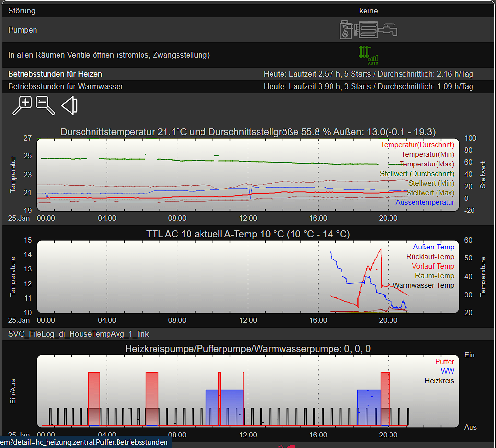
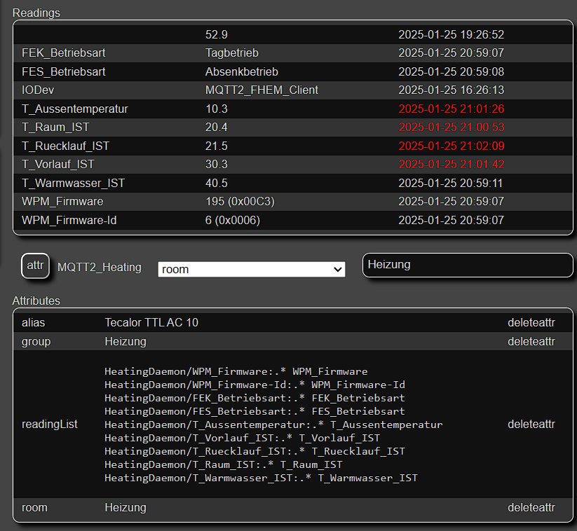

##  Installation und Visualisierung in FHEM

Visualisierung der Heizungsanlage. Eine Mischung aus Strom-Abgriff der verschiedenen Pumpen (Warmwasser, Umweltpumpe und Pufferpumpe), die nun mit der neuen Anbindungsart der Heizung über den CAN-Bus ersetzbar ist. Zudem wird hier die Durchschnittstemperatur aller Räume und die Stellwerte der Einzelraumregler angezeigt. Im Diagramm 'TTL AC 10' sind nun die neuen Werte aus dem CAN-Bus zu sehen.



So sieht das MQTT2_DEVICE unter FHEM aus, als Beispiel für die Konfiguration




Beispiel, um das Logfile anzuschauen und den Service zu stoppen
```
sudo journalctl -u HeatingDaemon.service -b -e
sudo systemctl start HeatingDaemon.service
```

Systemd-Konfiguration auf dem RPi in /etc/systemd/system/HeatingDaemon.service
```
[Unit]
Description=Communication with Tecalor/Stiebel Eltron TTL AC 10 heat pump over CAN bus. The data is exchanged via MQTT message broker.
After=network.target
# This file needs to exist in the /etc/systemd/system/ directory
[Service]
ExecStart=/home/pi/HeatingMqttService/HeatingMqttService
Restart=always
RestartSec=10
SyslogIdentifier=HeatingDaemon
User=root
Environment=ASPNETCORE_ENVIRONMENT=Development
Environment=DOTNET_PRINT_TELEMETRY_MESSAGE=false
Environment=DOTNET_ROOT=/root/.dotnet
Environment=PATH=/root/.dotnet:$PATH
[Install]
WantedBy=multi-user.target
```

Script, der den Service auf dem RaspPI aktualisiert, indem er den Service stoppt, die neueste Version herunterlädt und den Service startet. /home/pi/renew_HeatingMqttService
```
# Ins Home-Verzeichnis wechseln
cd /home/pi
# Zielverzeichnis erstellen, falls noch nicht vorhanden
mkdir -p HeatingMqttService
# Ins Zielverzeichnis wechseln
cd HeatingMqttService
# Datei herunterladen
wget https://github.com/homeIoTDev/ElsterHeatingBridge/releases/download/latest/HeatingMqttService-linux-arm.zip
#Service beenden
systemctl stop HeatingDaemon.service
# Datei entpacken
unzip -o HeatingMqttService-linux-arm.zip
# Optional: Lösche die heruntergeladene ZIP-Datei
rm HeatingMqttService-linux-arm.zip
#Service starten
systemctl start HeatingDaemon.service
```
